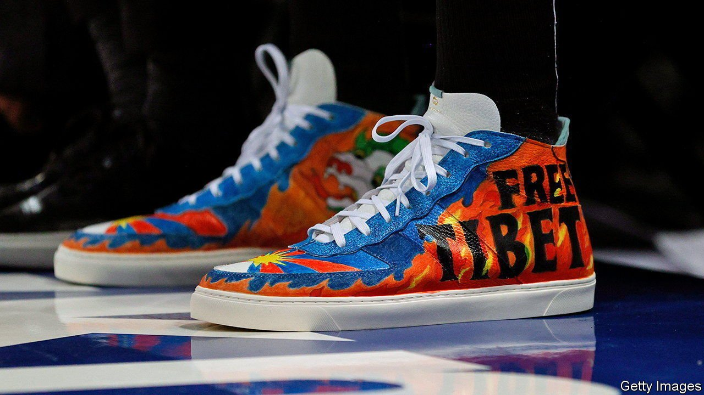

###### The audacity of hoops

# American basketball’s tricky relations with China 

##### Human-rights protests threaten profits 

 

> Nov 6th 2021 

ENES KANTER’S campaign against China’s Communist Party has been unrelenting. The basketball star has recently walked into professional games sporting custom shoes that read “Free Tibet”, a slogan that has long raised hackles in Beijing. He has invited the co-founder of Nike, a sportswear firm, to visit “slave labour camps” in China’s north-west (Nike says it does not source products from the region). On November 2nd Mr Kanter, who plays for the Boston Celtics, posted a message for China’s president on Twitter: “Ruthless Dictator XI JINPING...hear me loud and clear: Hong Kong will be FREE!”.

The slam-dunk on China, America’s National Basketball Association (NBA) and clothing brands such as Nike has the potential to do extraordinary damage. Tencent, the Chinese internet giant contracted to stream NBA games, has already blocked the Celtics. The league relies heavily on Chinese sponsors and has already had a taste of what cancellation means. The airing of NBA games was halted for more than a year in China starting in October 2019 after the general manager of the Houston Rockets voiced support for anti-government protesters in Hong Kong. The embargo was painful. Nearly all Chinese corporate partners cancelled or suspended their arrangements at the time. The league’s commissioner estimated as much as $400m in lost revenue. It has projected income of $10bn for the current season.


Mr Kanter has also brought more unwanted attention to clothing brands caught in a controversy over sourcing cotton from China’s Xinjiang region, homeland of the Uyghurs and where human-rights groups say forced labour is common. Multinationals are being forced to take a side on free-speech issues, says Badiucao, the Chinese artist who designed Mr Kanter’s evocative shoes (he goes by a pseudonym). Some are doing just that. Yahoo, an American internet giant, said on November 2nd that it would pull out of China, citing challenging business conditions. Weeks earlier LinkedIn, a professional-networking group, announced it would shut down its main China operations after it was forced to comply with increasingly tough censorship rules.

The NBA is wildly popular in China. Many fans disavowed the league in 2019 but were eager to resume watching it last year. Communist Party authorities must balance the popularity of the sport with their instinct to punish critics, says David Bach of the Institute for Management Development, a Swiss business school. Instead of stirring up sentiment against the NBA and announcing an all-out ban on broadcasts, as in 2019, so far only Celtics games have been blocked. The NBA has neither criticised Mr Kanter nor affirmed his rights to such speech. The stand-off amounts to a form of bargaining between the NBA and the Communist Party, says Mr Bach. ■

For more expert analysis of the biggest stories in economics, business and markets, , our weekly newsletter.

