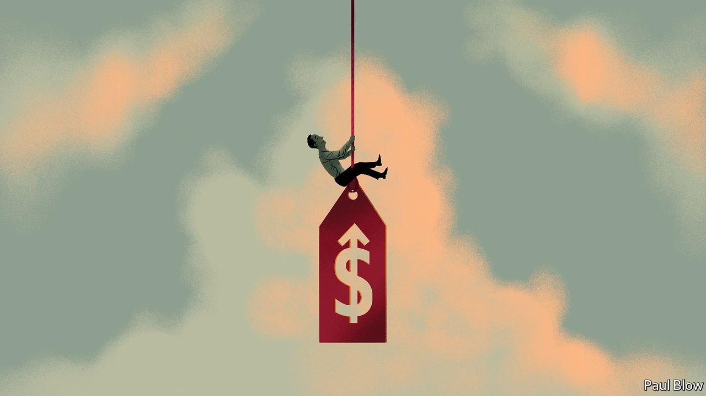
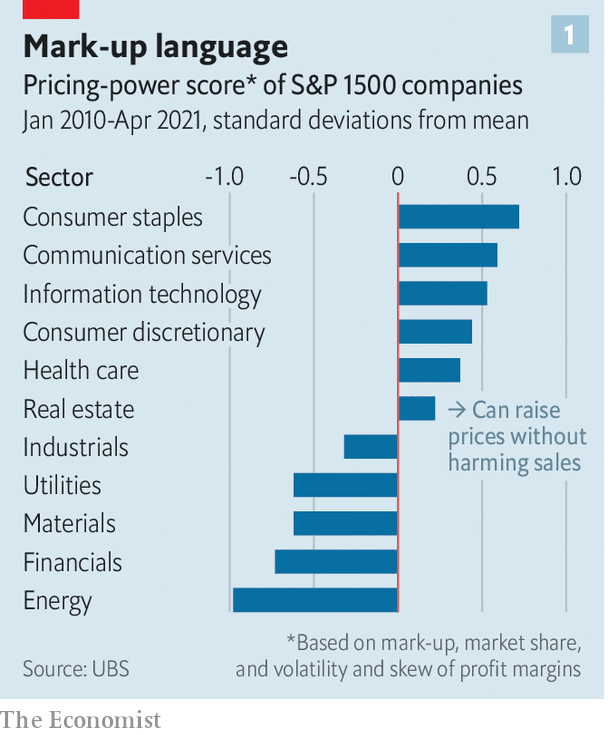
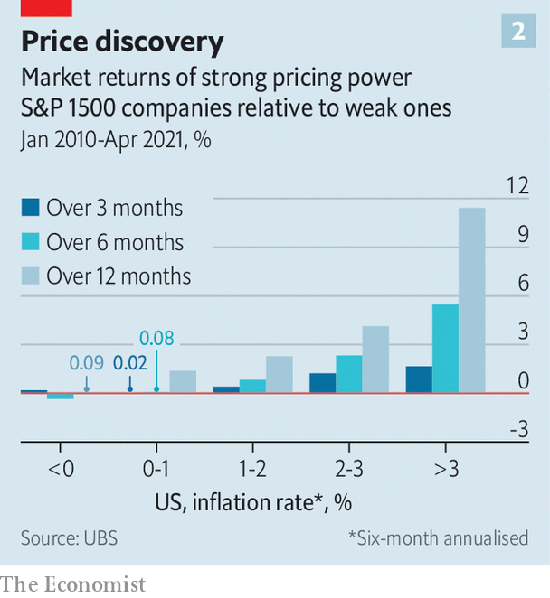

###### Passing the buck

# Pricing power is highly prized on Wall Street 

##### At the moment there is a glut 

 

> Nov 6th 2021 

MCDONALD’S HAS employed a “barbell” pricing strategy for decades, luring customers with low-cost items in the hope that they will then splurge on pricier fare. This balancing act is now at risk. On October 27th the fast-food giant said that, due to rising costs, prices at its American restaurants will increase by 6% this year compared with 2020. The burger chain says labour expenses have risen by 10% at its franchised restaurants and 15% at its company-owned locations. Add the rising cost of ingredients and the result is higher prices for burgers and fries. For now, it seems, customers can stomach it. Chris Kempczinski, McDonald’s boss, said the increase “has been pretty well received”. After digesting the news, investors have sent shares in the fast-food firm up by 6%.

A growing number of companies are raising prices as costs for labour and raw materials rise, often with no ill effects. This summer PepsiCo, an American food giant, lifted prices for its fizzy drinks and snacks to offset higher commodity and transport costs; it plans further increases early next year. Ramon Laguarta, the firm’s boss, suggested in an earnings call in October that customers do not seem bothered. “Across the world consumers seem to be looking at pricing a little bit differently than before,” he said. In September Procter &amp; Gamble, a multinational consumer-goods giant, raised prices for many of its products. The effect on demand was minimal. “We have not seen any material reaction from consumers,” Andre Schulten, the firm’s chief financial officer (CFO), told analysts last month.


“Pricing power”, the ability to pass costs to customers without harming sales, has long been prized by investors. Warren Buffett has described it as “the single most important decision in evaluating a business”. It is easy to see why. When hit with an unexpected expense, firms without pricing power are forced to cut costs, boost productivity or simply absorb the costs through lower profit margins. Those with pricing power can push costs onto customers, keeping margins steady.

Today, firms are eager to flaunt their price-setting clout. “We can reprice our product every second of every day,” Christopher Nassetta, boss of Hilton Worldwide, a hotel operator, told investors last month. “We believe we’ve got pricing power really better than almost anybody if not everybody in the industry,” boasted John Hartung, CFO of Chipotle, a restaurant chain, in October. Companies such as Starbucks, Levi Strauss and GlaxoSmithKline make similar claims. “We are a luxury company, so we do have pricing power,” bragged Tracey Travis, CFO of Estée Lauder, a cosmetics firm, on November 2nd.

They are not alone. Of the S&amp;P 500 companies that have reported third-quarter results, over three-quarters beat projections, according to Bank of America Merrill Lynch. “This earnings season there was a lot of angst on the part of investors that higher input costs would erode margins,” says Patrick Palfrey of Credit Suisse, a bank. “In fact, what we have seen is another spectacular quarter on behalf of corporations so far in spite of input cost pressures.” According to Savita Subramanian and Ohsung Kwon of Bank of America mentions of “price” or “pricing” in American earnings calls—a proxy measure for pricing power—increased by 79% in the third quarter from a year earlier. In the second quarter, such mentions were up by 52% year on year.

If costs spiral out of control, the power to raise prices will become ever more important. On November 2nd JPMorgan Chase’s global purchasing-managers index, a measure of manufacturing activity, showed that input prices in the sector increased in October at the highest rate in more than 13 years. But the prices of manufactured goods and services also rose at the fastest pace since records began in 2009. A gap between input and output price inflation is typically interpreted as a sign that firms are struggling to raise prices and that margins are being squeezed. That isn’t happening yet.

Identifying firms with pricing power is crucial for investors. Analysts tend to look for three things. The first is a big mark-up—the difference between the price of a good and its marginal cost—which only firms with market power can get away with. Big and steady profit margins are another sign of pricing power. “If you are a firm that is dominant in your market, you are much more resilient to shocks,” explains Jan Eeckhout, an economist and the author of “The Profit Paradox”, a book published earlier this year.

Size is another factor. All else equal, bigger companies with greater market share have more pricing power than smaller ones. A recent survey of American CFOs conducted by Duke University and the Federal Reserve Banks of Richmond and Atlanta found that 85% of large firms reported passing on cost increases to customers, compared with 72% of small firms.

 


A “pricing-power score” for companies in the S&amp;P 1500 compiled by UBS is based on four indicators: mark-up, market share, and the volatility and skew of profit margins. The bank found that firms providing consumer staples, communication services and IT have the most pricing power and that energy, financial and materials companies have the least (see chart 1). When UBS compared the financial performance of companies with strong and weak pricing power, they found that the former have delivered more profit growth since 2010 and generated better stock returns, particularly during periods of high inflation (see chart 2).

 


Firms that score well on this index have lagged in the past year, notes UBS. This may be explained by cyclical factors. When profit margins are expanding, the argument goes, firms with pricing power tend to generate relatively low returns; when margins are shrinking, they produce high returns. At the moment, profits are still healthy.

For now, demand is robust and consumers seem relatively insensitive to price changes. But companies are planning more price increases. A survey by America’s National Federation of Independent Business, a trade group, found that the margin of small-business owners planning to raise prices in the next three months over those planning to lower them grew to 46%, the biggest gap since October 1979.This is a concern for some central bankers such as James Bullard, president of the Federal Reserve Bank of St Louis. In October he noted that for years companies have worried that if they raised prices, they would lose market share. “That may be breaking down,” he says. ■


