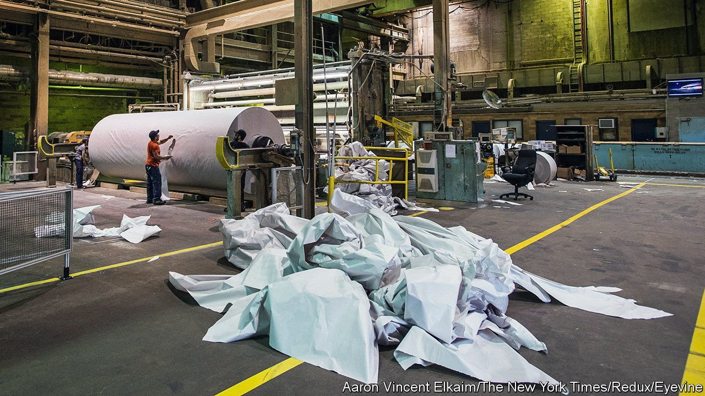

###### Paperchase

# Soaring newsprint costs make life even harder for newspapers 

##### It may accelerate the move online 

 

> Nov 6th 2021 

“IT’S LIKE TASERING an elderly person who’s already on a pacemaker,” says a British newspaper boss of the newsprint market, where prices have risen by over 50% in a matter of months. The cost of paper that feeds into presses around the world is rising to record highs, pushing up expenses for newspapers from Mumbai to Sydney. When times were good, before ads shifted online, newspapers had a supportive partnership with paper mills. As ads departed and circulations fell, relations became more transactional. They are now at the shouting stage.

Paper mills had the worst of it for years as newspapers reduced pagination, went wholly digital or shut for good. The papers were able to hammer down the cost of newsprint from firms fighting for business as demand declined.Price-taking paper mills suffered in silence. Many hesitated to shut massive machines costing hundreds of millions of dollars.


That hesitance has disappeared; mills are taking out newsprint capacity and diversifying. Norske Skog, a Norwegian pulp and paper firm, said in June it would close its 66-year-old Tasman Mill in New Zealand, for example. Many mills are converting machines to make packaging for e-commerce. UPM, a Finnish firm, announced this year the sale of its Shotton newsprint mill in Wales to a Turkish maker of containerboard and packaging. For JCS Volga, a Russian mill, newsprint used to account for 70% of production; now half of what it makes is packaging. The mills “moved from being price takers to being capable co-participants in a declining market,” says Tim Woods of IndustryEdge, a research firm for Australia and New Zealand’s forestry and paper industries.

The pandemic, with people working from home, meant even fewer newspaper purchases, which depressed demand for newsprint again and increased the pain for paper suppliers. In the past 24 months European mills have responded by shutting almost a fifth of their newsprint capacity, says a buyer for a large British newspaper group.

Then economies reopened. Newsprint demand shot up. That, combined with much reduced capacity and coupled with soaring energy prices, has resulted in a price shock. Particularly controversial are energy surcharges that some paper suppliers are seeking to pass on. Newspaper firms reckon this amounts to breaking contracts. European newspapers will have to pay newsprint prices that are 50-70% higher in the first quarter of 2022 compared with the year before. As for their counterparts in Asia and Oceania, they are facing prices around 25% to 45% above their usual level. Kenya’s Nation Media Group is paying around $840 per tonne, compared with $600 at most in the past, says Dorine Ogolo, a procurement manager at the firm. North American prices went up earlier, and more gradually; contracts are fixed monthly rather than half-yearly. But there, too, newsprint prices are 20-30% higher in 2021 than in 2020.

Germany’s print and media industry association has warned that mills are going to force newspapers to dump paper editions, hurting each other in the process. “It’s about the famous branch that both of them are sitting on,” it said recently. But mills can sell packaging instead. “We’re not going to save the publishing industry by being unprofitable ourselves,” says a mill executive in North America.

For some publishers, price rises will wipe out profits. They will need to do further restructuring involving axing titles and layoffs. Iwan Le Moine of EMGE, a British paper-industry consultancy, expects a big increase in 2022 of the number of papers that shut compared with a typical year. That will lower demand and nudge the market back towards equilibrium. But newspapers will have more hard conversations about paper, full stop, says Douglas McCabe of Enders Analysis, a research firm. More digital adrenaline is one possible riposte to the paper mills’ tasers. ■

For more expert analysis of the biggest stories in economics, business and markets, , our weekly newsletter.

