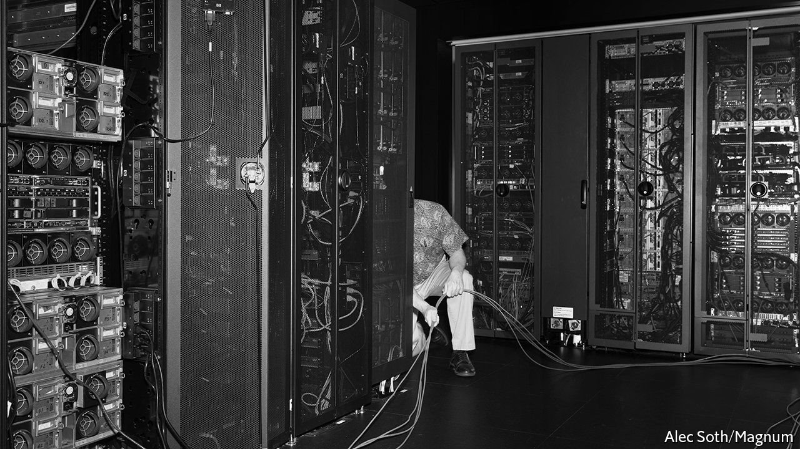
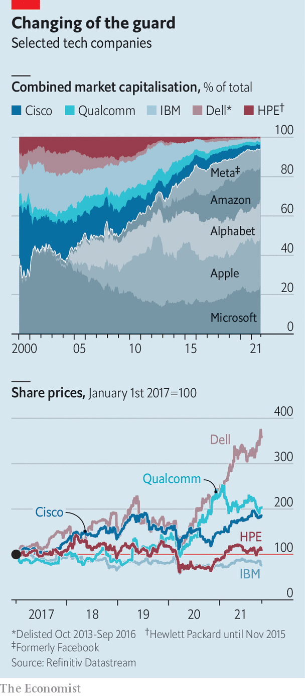

###### Reinvention as a service

# The IT establishment is dressing in new clothes 

##### But taking on the big tech firms will be hard 

 

> Nov 4th 2021 

“WE ARE A different company now. We are no longer focused just on mobile. And we have the numbers to back it up.” Cristiano Amon, the boss of Qualcomm, which makes chips mostly for smartphones, is emphatic when he describes what he will tell Wall Street at the firm’s investor day on November 16th. He is in good company. Some of the other famous members of a previous generation of big-tech firms (Cisco, Dell Technologies, Hewlett Packard Enterprise and IBM) have recently met investors to explain how they intend to stay relevant in the age of cloud computing and artificial intelligence (AI).

There is action as well as words. On November 1st Dell spun off VMware, a big software-maker; later in the week IBM floated much of its professional-services business. The tech old guard hope to reinvent themselves, much as Microsoft has done in recent years in spectacular fashion.

 


Although dwarfed by the current big-tech generation (see chart 1), this handful of IT veterans still has clout. There is hardly any business that does not use some of their products and services. In the past 12 months they cranked out a huge $284bn in revenues collectively and $56bn in gross operating profits. And they employ 690,000 people worldwide. Each firm has its own specialisms. Qualcomm designs its chips, but outsources manufacturing. Both Cisco and IBM, mainly regarded as hardware-makers, have become largely software firms. As for Dell and Hewlett Packard Enterprise (HPE), their reputation is rooted in personal computers (PCs), even though they now sell other hardware, from storage devices to supercomputers (the PC business stayed with HP’s other branch when the company split in 2015).


Yet all face similar challenges. For a start, they mostly used to sell wares, be they hard or soft. In recent years, however, delivering IT in big distinct chunks has moved to providing it “as-a-service”, or “AAS,” in the parlance—a business that is now dominated by startups and big cloud-computing providers such as Amazon Web Services (AWS) and Google Cloud Platform (GCP). The internet allowed such things as number-crunching and data storage to be served up online. AI is part of this story, too: the more data are collected in the cloud, the more they can be mined and turned into algorithms, which then become the engines of new services, such as detecting hacking attacks.

The quest to escape commoditisation is pushing the industry towards services. IT has always been a lumpy business, with customers paying large sums of money for new wares once every few years. At the same time hardware and even some software have become low-margin businesses. Subscriptions to services, by contrast, bring more predictable revenues and higher profits. Services are good for buyers, too, argues Pierre Ferragu of New Street, an equity-research firm. In the past a customer might have had to buy an oversized network switch for $10,000. Now it can be had for $3,000, plus $2,000 a year for services. “Everybody is happier,” he explains.

That means taking on cloud operators that offer similar subscriptions, such as AWS. The pandemic has accelerated the cloud’s rise but it has become apparent that not all number-crunching can be done in big data centres. Firms have many reasons to keep some computing in-house, including regulations preventing others processing their data and the risk of depending on a big cloud provider. Then there are “edge” devices, from smartphones to intelligent sensors, which connect to the cloud and extend it, generating ever more data. It is often more efficient to bring computing to the data than the other way around.

The tech veterans want to help firms manage this world of many clouds (“hybrid” or “multi” in the lingo). Red Hat Hybrid Cloud Platform, now at the centre of IBM’s software offerings, is an uber-cloud of sorts that runs on top of many systems, including IBM’s own machines, public clouds and edge ones. It is supposed to allow customers to stay independent of any one system. HPE offers something similar called GreenLake. Cisco boasts several more specialised platforms, including one to optimise a firm’s many applications.

Dell and Qualcomm are different. By floating VMware, which sells software similar to IBM’s platform, Dell appears to be moving against the stream. But the spin-off mainly serves to get rid of a conglomerate discount. Dell has negotiated a detailed agreement to continue to benefit from VMware’s products. It has also launched an as-a-service effort of its own, called APEX, which is supposed to offer cloud computing in Dell’s trademark “pragmatic and predictable way”, in the words of Allison Dew, the firm’s chief marketing officer, who is also in charge of APEX.

As for Qualcomm, it sees the cloud not as a threat but an opportunity. As growth slows in its main market, smartphones, it hopes that the cloud will create new demand for its chips from makers of other devices, from connected cars to intelligent sensors. “If you believe in the cloud, you have to believe in the edge,” says Mr Amon. “You can’t have one without the other.”

As well as developing new lines of business, deals large and small have been part of the metamorphosis. IBM’s hybrid cloud platform owes its name and underlying technology to Red Hat, an open-source software maker it acquired for $34bn in 2019. The creation of Kyndryl, the name given to the business that that IBM has spun off,allows it to hive off its army of IT workers and consultants in favour of selling tools and digital services to automate customers’ businesses. “We are a technology firm again,” says Rob Thomas, a senior executive at the company.

What are the results so far of the tech incumbents’ transformation dreams? Cisco was the first to react, promising in 2017 that more than half of its revenue would come from software and subscriptions within three years. HPE announced an even more ambitious goal in 2019, saying that it will offer its entire portfolio of products as a service by 2022. IBM, mainly thanks to its mainframe business, has always had a healthy stream of subscription revenues, but wants to grow these further.

Taken at face value, the numbers are impressive. Cisco announced that it had reached its targets set in 2017: software and services now generate 53% of revenue. HPE boasted services revenues of $1.2bn and after the Kyndryl spin-off IBM’s software sales will leap to 65% of revenues. Mr Amon will hammer home the point that Qualcomm’s non-handset businesses, such as cars and the internet of things, already have revenues of $10bn, about a third of the total, and are growing 1.6 times faster than its handset ones.

But so far, investors do not seem to be convinced that old IT’s new clothes are a good fit: the group’s collective market capitalisation, now amounting to about $600bn, has only barely budged from where it was before the charm offensive aimed at Wall Street. Much will depend on whether they will be able to attract top technical talent. Without it, they will have a hard time competing with both the big cloud providers and hot startups. Antonio Neri, HPE’s chief executive, says he recently moved the firm’s headquarters from Silicon Valley to Houston, Texas, in part because recruitment is easier there.

Do these firms still have what it takes? Most have new ranks of hungry executives but even the veterans still have fire in the belly. Michael Dell has remained at the wheel of the firm he founded in 1984, except for a hiatus in 2004-07. Asked about his future, he replies: “I love what we do: It’s fun, it’s interesting, it’s exciting. I have no plans to change my involvement.”■

For more expert analysis of the biggest stories in economics, business and markets, , our weekly newsletter.

An early version of this article was published online on November 1st 2021

