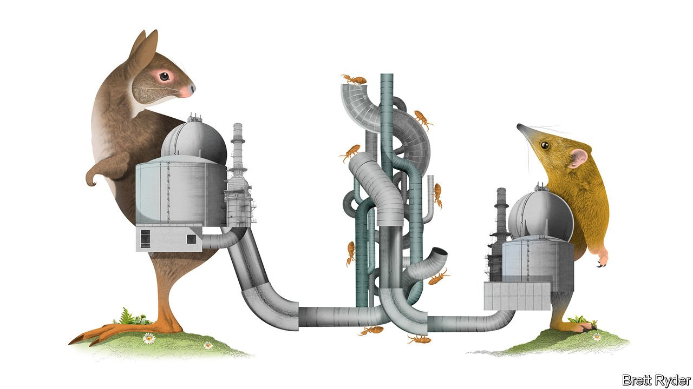

###### Schumpeter

# The supermajors have an LNG problem 

##### State-owned giants are squeezing them out of megaprojects 

 

> Nov 6th 2021 

BARROW ISLAND, off the coast of Western Australia, is an unlikely place to find what will with luck become the high-water mark of the hubris of the West’s international oil companies (IOCs). It is a nature reserve dotted with termite mounds. Since it was severed from the mainland about 8,000 years ago, its local species, including golden bandicoots and spectacled hare-wallabies, have lived free from predators. Some call it Australia’s Galapagos. Yet a sliver of it is also home to one of the world’s biggest liquefied natural gas (LNG) developments, mostly owned by Chevron (47%), ExxonMobil (25%) and Royal Dutch Shell (25%).

Gorgon, as it is called, has a pockmarked history. It cost $54bn to build, a whopping $20bn over budget. That was partly because the cost of manpower and material soared amid a $200bn Australian LNG investment binge during the past decade. To respect the sanctity of the island’s wildlife, Chevron enforced covid-like quarantining. On arrival, thousands of construction staff had to be inspected at the airport for stray seeds; bulldozers, diggers and trucks were fumigated and shrink-wrapped before shipment. Since production started in 2016, Gorgon has been dogged by unplanned outages. Tax filings suggest it has yet to make a profit. And its failure so far to sequester four-fifths of the carbon dioxide produced from its gas reservoirs has shredded the credibility of its environmental commitments. Carbon capture is considered crucial for the future of LNG on Barrow Island and elsewhere.


For all that, it is emblematic of the belief among IOCs that even if oil demand peaks as the world shifts to cleaner fuels, consumption of LNG will continue to grow for decades to come, especially in Asia. Gorgon alone hopes to produce and ship natural gas until the mid-2050s, one day for considerable profits. A sharp rise in LNG prices in recent months amid a surge in demand from China has fanned those hopes. Yet even as the majors double down on the fuel, they are running up against the reality that it is becoming harder to take controlling stakes in new megaprojects, and even those they can develop have rising risks. LNG is nothing like the relatively safe bet the oil industry portrays it as.

The immediate problem the majors face is a shift in the balance of power. The deep pockets and risk appetite of giants like ExxonMobil, Shell and TotalEnergies used to be essential for coping with the challenges of building frozen gas factories in inhospitable places. Now national champions in Qatar and Russia, home to the most promising resources, say they can largely make do without them. Qatar Energy, a gas giant, has taken the lead in developing the biggest LNG complex in history, a $30bn extension to its North Field site. The IOCs have been relegated to bidding for minority stakes in the project, mostly giving them the right to market a surge of Qatari gas that is expected to hit the market by mid-decade. Chinese oil companies may invest, too. The majors are squeezed, says Giles Farrer of Wood Mackenzie, a consultancy.

Other opportunities have turned into nightmares. A jihadi conflict on the north-eastern coast of Mozambique has at least temporarily halted a $20bn offshore LNG project by Total, which declared force majeure in April. Neil Beveridge of Bernstein, an investment firm, quips that it is “the only LNG project to hit force majeure before it’s even started.” For the same reason, ExxonMobil’s $30bn LNG plan in Mozambique is in limbo. The firm has also been bogged down for years trying to strike a deal with the government of Papua New Guinea on a $13bn expansion. That leaves America’s Gulf Coast as the most likely domain outside Qatar and Russia’s Arctic to supply more LNG in the next five years. But operators there can secure gas to liquefy from producers across America, and engineering skills from domestic construction companies. That leaves the oil majors twiddling their thumbs.

They still have scope to build some projects. But for those a structural change in the LNG market poses a further challenge. As Alastair Syme of Citi, a bank, explains, for decades the majors reduced the risk of long-term investments by striking 20-year-plus contracts with big customers, such as Japanese utilities. However, a slide in the spot price of LNG in the second half of the 2010s caused a rethink. Buyers have shifted to shorter-term contracts (say ten years) or the spot market.

The recent spike in spot prices may change the mood once again. Nonetheless some buyers face such uncertainty about the future of natural gas because of the growth of renewables that they will remain loth to sign long-term contracts. For IOCs, the corollary is that shorter contracts increase the risk of LNG investments with long paybacks. This adds to the arguments for them to focus on short-cycle projects to reduce the danger that, as the world economy decarbonises, they will be left with stranded assets.

Trading places

There is a way out of the bind. The majors, particularly European ones, are turning from megaprojects towards trading cargoes of other producers’ fuel. It reduces the amount of capital they have tied up in heavy assets and dirty fuels. It also helps them keep their promises to become portfolio companies trading all sorts of energy sources in an era of mass electrification. But it’s a different business. The barriers to entry are lower. There is competition from trading houses such as Trafigura, Vitol, Gunvor and Glencore. And Chinese firms like Sinopec, which last month signed two long-term contracts with Venture Global LNG, an American exporter, are emerging as potential rivals.

It all adds up to uncertainty. The big investments, complex engineering and generation-spanning paybacks of projects such as Gorgon have long made the LNG business one of boom and bust. In an era of shorter-term contracts, amid all the question-marks associated with climate change, the future may be no less volatile. The world has changed since Gorgon was conceived. For the IOCs, the big bet on Barrow Island may soon belong to a bygone era. ■


