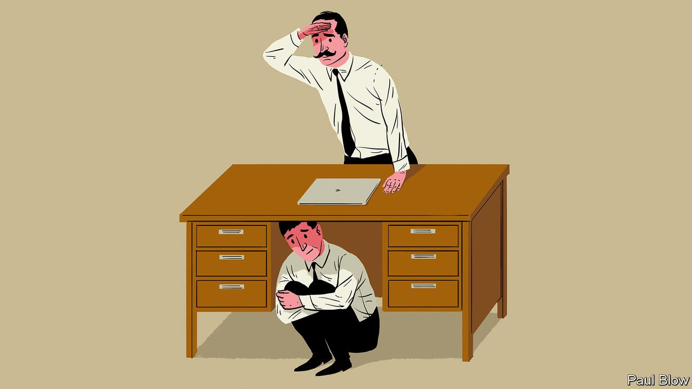

###### Bartleby

# Why executives like the office 

##### Blame a mixture of conditioning, carpets and concrete concerns 

 

> Nov 6th 2021 

AN OFFICE IS meant to bring people together. Instead, it has become a source of division. For some, the post-pandemic return to the workplace is an opportunity to re-establish boundaries between home and job, and to see colleagues in the flesh. For others it represents nothing but pointless travelling and heightened health risks. Many ingredients determine these preferences. But one stands out: seniority.

Slack, a messaging firm, conducts regular surveys of global knowledge workers on the future of work. Its latest poll, released in October, found that executives are far keener to get back to the office than other employees. Of those higher-ups who were working remotely, 75% wanted to be in the office three days a week or more; only 34% of non-executives felt the same way.


The divide has played out publicly at some companies. Earlier this year, employees at Apple wrote an open letter to Tim Cook, the firm’s chief executive, objecting to the assumption that they were thirsting to get back to their desks: “It feels like there is a disconnect between how the executive team thinks about remote/location-flexible work and the lived experiences of many of Apple’s employees.” Why are bigwigs so much keener on the office?

Three explanations come to mind: the cynical, the kind and the subconscious. The cynical one is that executives like the status that the office confers. They sit in nicer rooms on higher floors with plusher carpets. Access to them is guarded, politely but ferociously. When they walk the floors, it is an event. When they sit in meeting rooms, they get the best chairs. On Zoom the signals of status are weaker. No one gets a bigger tile. Their biggest privilege is not muting themselves, which isn't quite the same power rush as using the executive dining room.

The kind explanation is that executives believe that in-person interactions are better for the institutions they lead. Working from home “doesn’t work for people who want to hustle, doesn’t work for culture, doesn’t work for idea generation," was the verdict of Jamie Dimon, the chief executive of JPMorgan Chase, earlier this year. Ken Griffin, the boss of Citadel, a hedge fund, has warned young people not to work from home: “It’s incredibly difficult to have the managerial experiences and interpersonal experiences that you need to have to take your career forward in a work-remotely environment.”

These concerns have substance. Virtual work risks entrenching silos: people are more likely to spend time with colleagues they already know. Corporate culture can be easier to absorb in three dimensions. Deep relationships are harder to form with a laggy internet connection. A study from 2010 found that physical proximity between co-authors was a good predictor of the impact of scientific papers: the greater the distance between them, the less likely they were to be cited. Even evangelists for remote work make time for physical gatherings. "Digital first does not mean never in person," says Brian Elliott, who runs Slack's research into the future of work.

But the advantages of the office can also be exaggerated. The Allen curve, which shows how frequency of communication goes down the farther away colleagues sit from each other, was formulated in the 1970s but still rings true today. Every workplace has corners that people never visit; no gulf is greater than that between floors. And the disadvantages of remote working can be overcome with a bit of thought. Research by a trio of professors at Harvard Business School found that lockdown-era interns who got to spend time with senior managers at a "virtual watercooler" were much likelier to receive full-time job offers than those who did not.

If physical workspaces have drawbacks, and remote working can be improved upon, why are executives clear in their preferences? The subconscious supplies a third explanation. As Gianpiero Petriglieri of INSEAD, a French business school, observes: “people advising youngsters to go into the office are those who made their way in that environment.” Executives who have achieved success by working in an office are the least likely to question its efficacy.

That is a problem, especially since a majority of executives say that they have designed return-to-work policies with scant input from employees. A hybrid future beckons, in which workers divide their time between home and office. Managers need to improve both environments, not assume that one is obviously superior to the other.

For more expert analysis of the biggest stories in economics, business and markets, , our weekly newsletter.

