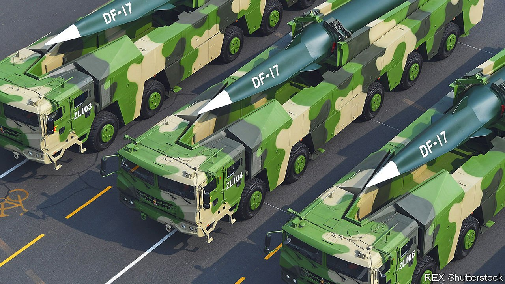

###### Unpacific

# China seeks to join the nuclear big league 

##### The Pentagon warns that China is fast building up its nukes, as well as its conventional forces, to confront America 

 

> Nov 3rd 2021 

WHEN AMERICA and the Soviet Union raced each other to build ever-larger nuclear arsenals during the cold war, China ambled disdainfully. It did not detonate its first nuclear weapon until 1964, kept only a few hundred warheads compared with the tens of thousands piled up by the superpowers, and to this day maintains it will never be the first to use nukes in a war. Now China is sprinting to catch up.

In its latest annual assessment, the Pentagon says China’s stockpile of nuclear warheads, which last year it reckoned to be in the “low-200s”, could triple to about 700 by 2027 and will probably quintuple to about 1,000 or more by 2030. That is sharply higher than America’s previous forecast that the arsenal would double in size by then. Even so, it would still be smaller than America’s or Russia’s. Those countries each have about 4,000 warheads.


The report’s conclusions explain America’s alarm about China’s rapid military modernisation. Hitherto the greatest worry has been about its conventional arms, notably its growing ability to overwhelm and invade Taiwan, and stop America from coming to the rescue. Now the anxiety is spreading to the nuclear domain.

Speculation about the build-up mounted in June and July, when researchers spotted that China was building hundreds of missile silos in Gansu, a western province, and in Xinjiang, its neighbour. Then the generals were stunned by China’s testing of a new weapon—a hypersonic glide vehicle mounted on a large rocket—that could deliver a nuclear warhead at high speed while evading anti-missile defences. The chairman of the joint chiefs of staff, General Mark Milley, said it was close to being a “Sputnik moment”—the shock America felt when the Soviet Union sent the first satellite into orbit in 1957.

The Pentagon believes China is building fast-breeder reactors to make the necessary plutonium; may already have created a full “triad”, ie, the ability to launch nuclear weapons from the land, sea and air; and is expanding its early-warning systems, with help from Russia.

All told, China is shifting to a “launch on warning” doctrine. Rather than rely on a minimal nuclear deterrent to retaliate after an initial nuclear attack, China would henceforth fire at the first sign of an incoming nuclear strike, even before the enemy warheads have landed. This posture is akin to that of America and Russia, notes James Acton of the Carnegie Endowment, a think-tank in Washington, “but increases the risk of inadvertent launch, such as a response to a false warning”.

Some Chinese strategists have debated moving to “mutual assured destruction”—the doctrine that animated both superpowers in the cold war—and even discussed when it would make sense to be first to use nuclear weapons. They have also considered low-yield weapons that could be used in a limited manner, without initiating all-out nuclear war.

The nuclear expansion casts a new light on China’s island-building in the South China Sea, where it has constructed military bases on disputed reefs and atolls. Its current submarine-launched missiles need to sail far into the Pacific if the JL-2 missiles they carry are to reach the east coast of the United States. But the JL-3 missiles in development, intended for a new generation of “boomer” submarines, could fire from waters close to China. That would encourage China to create maritime “bastions” in the Gulf of Bohai and the South China Sea, modelled on those the Soviet Union established in the Barents Sea and the Sea of Okhotsk, whose waters were thickly defended by submarines, surface ships and aircraft.

Why is China building up its nukes at a time when America and Russia have extended the New START treaty, which limits their arsenals, and when America is thinking of reducing the role of nuclear weapons by declaring that their “sole purpose” is to deter or retaliate against nuclear attack?

One reason is China’s worry that its arsenal is too small to survive an American first strike. Many could be destroyed by nuclear weapons or accurate conventional missiles; remaining ones might then be taken out by America’s anti-missile systems.

China is modernising its land-based missiles by building mobile launchers with solid-fuel rockets, which are easier to hide and quicker to fire than older models. It is also working on its triad. As well deploying more nuclear submarines with ballistic missiles, China has brought into service the H6-N bomber, which can carry an air-launched ballistic missile. And it has also deployed an earlier version of a hypersonic weapon, the DF-17 (pictured).

Xi Jinping, China’s leader, wants to build a “world-class” military force by 2049, the centenary of the Communist Party’s takeover, as part of the “great rejuvenation of the Chinese nation”. A powerful nation, it seems, must have powerful nuclear forces—especially if it is going to stand up to America.

As though China’s nuclear build-up were not enough to worry about, this year’s Pentagon report says that China’s work on “dual-use applications” call into question its compliance with the Biological and Toxins Weapons Convention. Moreover, it says America “cannot certify” that China is meeting its obligations under the Chemical Weapons Convention.

All this can only feed America’s anxiety about the rise of China, and reinforce the sense that it is in a new cold war. It also increases the risk of errors, or of an incident turning into a large confrontation—say, over America’s “freedom of navigation” patrols in the South China Sea. Perhaps most worrying is that China has thus far eschewed nuclear arms-control deals, and has shown little interest in hotlines and other risk-reduction mechanisms that helped to manage the contest between America and the Soviet Union.

Tellingly, the Pentagon report confirms the purpose of a telephone call that senior American defence officials and General Milley made to the PLA in October 2020 to reassure the Chinese that America was not about to attack them. As the report puts it, “these events highlighted the potential for misunderstanding and miscalculation.”

