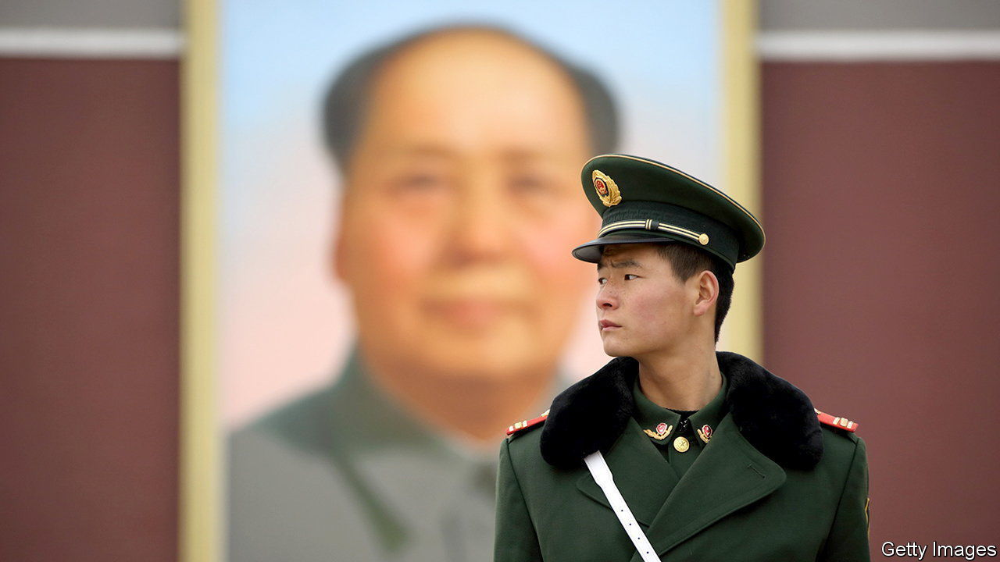

###### Orwellian and proud

# Xi Jinping is rewriting history to justify his rule for years to come 

##### Who controls the present controls the past 

 

> Nov 6th 2021 

IN PREPARATION FOR a third five-year term as the Communist Party’s leader, Xi Jinping has been changing the rules of politics, business and society. He has also been pursuing another project that he sees as essential to his continued grip on power: rewriting the history of the party itself. Mr Xi wants to show his country that he is indispensable, a political giant on a par with Mao Zedong and Deng Xiaoping who is turning China into a global power by building on their legacy.

On November 8th about 370 members of the political and military elite will gather in Beijing for an annual four-day meeting of the party’s Central Committee. The only advertised topic on their agenda is a resolution on the party’s history. It will be the third in the party’s 100-year existence. The first, in 1945, and the second, in 1981, were triumphs for Mao and Deng respectively, consolidating their grip on power at crucial junctures. Mr Xi’s ability to secure one of his own suggests that he has quelled any meaningful opposition to extending his rule at a party congress that is due to be held late in 2022. The resolution will be “an extraordinary demonstration of power”, says Jude Blanchette of the Centre for Strategic and International Studies, a think-tank in Washington.


The plenum is the second-to-last conclave of the Central Committee before the five-yearly congress, and a crucial one for setting its tone. Next year’s event will mark a decade of Mr Xi’s leadership. By loosely established convention, it would be his political farewell. But he is all but certain to secure another term. In the past year, once again, he has been working hard to silence critics and crush potential rivals, purging the security apparatus, promoting political allies and showing the party’s muscle by unleashing regulators on big private firms. Before the congress he will probably make his choice (in secret) of replacements for senior officials who are expected to retire at a meeting of the national legislature in March 2023. They include a new prime minister and domestic-security chief.

The resolution on history has been circulated among senior officials, but its contents will not be made public until after the plenum ends on November 11th. Speeches by Mr Xi and the writings of official commentators offer clues. It is expected to celebrate the party’s achievements, minimise the horrors unleashed by Mao and suggest that Mao, Deng and Mr Xi have shared the same vision. The reigns of Mao and Deng will be presented as essential preliminary phases before the start of Mr Xi’s “new era”. Mao helped the Chinese people “stand up” after a century of humiliation by foreign powers. Deng set China on a path to “get rich” after centuries of poverty. Now Mr Xi is helping China to “get strong”. The resolution will hail Mr Xi’s judicious leadership in managing social, economic and national-security challenges, and suggest a continuing need for his wisdom.

Mr Xi’s predecessors used history differently in their resolutions. In 1945 Mao justified a purge of his enemies, blaming them for past mistakes so he could position himself as the unquestioned leader. In 1981 Deng’s resolution said that Mao had made serious mistakes and that the Cultural Revolution of 1966-76 had been a “grave blunder”, causing chaos. By criticising Mao, albeit cautiously, Deng rebuilt public support for the party and freed his hand to pursue free-market reforms.

But history presents a different challenge to Mr Xi. On the party’s left wing are neo-Maoists who have long agitated for a restoration of their hero, and have criticised Deng, whom they blame for such problems as corruption and inequality. On the right are those who worry (very privately) that China is sliding back towards a Mao-style dictatorship and losing its commitment to Deng’s reforms.

Mr Xi has declared that neither Mao nor Deng should be used to “negate” the other. He does not want a history filled with mistakes and contradictions, nor one that raises questions about one-man rule. He believes the collapse of the Soviet Union was hastened by a failure to protect the legacies of Lenin and Stalin. He has campaigned vigorously against “historical nihilism”—essentially anything that casts the party’s past in an unfavourable light. Tomes that excavate Mao’s worst mistakes, once tolerated, are now strongly discouraged.

A new official history of the party, published in February, gives a glimpse of Mr Xi’s preferred approach. It touches only briefly on the Cultural Revolution. It does not mention the famine caused by the Great Leap Forward that killed tens of millions, nor any casualties in the crushing of the pro-democracy protests at Tiananmen Square in 1989. The section on Mr Xi’s tenure takes up more than a quarter of the book. Mr Xi’s predecessors, Hu Jintao and Jiang Zemin, are given much less space.

The new resolution will suggest that China needs Mr Xi in order to fulfil long-term goals such as turning the country into a “modern socialist nation” by 2035 and a “prosperous” and “strong” one by 2049, the 100th anniversary of the People’s Republic. It will probably mention his “common prosperity” campaign to reduce inequality and his “dual circulation” strategy to make the economy more resilient to external shocks like the pandemic and trade disputes with America. It is expected to describe a grim international environment, though America and its allies may not be named. And it will probably repeat the party’s ritual language about Taiwan, saying it must be reunited with the mainland. China’s failure to retake Taiwan has been a sore point for every leader since Mao. The resolution is sure to mention Mr Xi’s call for the “great revival of the Chinese nation” by 2049, which suggests that he aims to secure reunification before then. A specific promise is unlikely.

In anticipation of the plenum, the propaganda apparatus has begun cranking out fawning articles about Mr Xi’s wisdom, hoping, it would seem, to foster enthusiasm for the idea that he will carry on ruling. On November 1st People’s Daily, the party’s mouthpiece, began publishing a series of editorials under the title “Crucial decisions in the new era”. They hail the party’s achievements since it was founded in 1921, and praise Mr Xi’s contributions to them. From Mr Xi’s perspective, the resolution “not only has to look back over the past, but it has to look to the future”, says Joseph Fewsmith of Boston University. And according to Mr Fewsmith, Mr Xi thinks, “The future, c’est moi.”■

