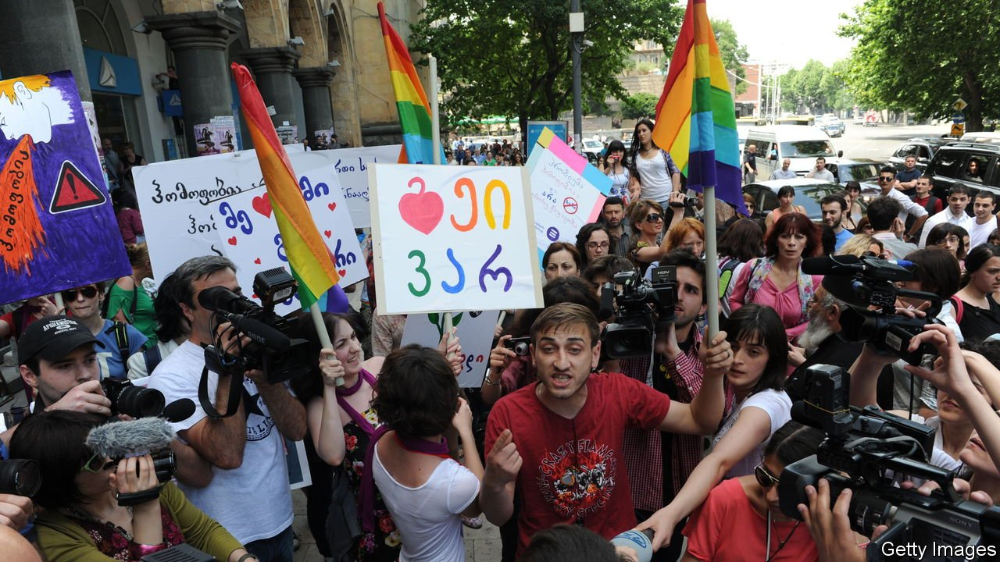

###### Heavy vetting

# Bouncers at gay clubs in Georgia screen patrons for bigotry 

##### It is not easy to spot 

 

> Nov 4th 2021 

QUEEN YULIA spends her nights lip-synching in a cheap wig and a disco-ball bra. Sometimes she does so on a plastic horse. She is one of a handful of professional drag queens in Georgia. She is also a co-owner of Success Bar, the country’s only avowedly gay pub. (Some other clubs in Georgia run occasional gay nights.) Before she made a living on stage, she was in charge of “face control” for the bar. For bouncers at most other venues, that means maintaining an air of exclusivity by letting in only stylish folk. For Queen Yulia and security guards at other LGBT events in Georgia, it means screening out bigots who might turn violent.

This is hard. Hatred, unlike a cool outfit, is not instantly visible. Partygoers hoping to attend a gay night at Bassiani, a nearby club, must submit their names, dates of birth, links to their Facebook profiles and even passport numbers days in advance. The party’s security team then screen for signs of prejudice before allowing anyone to hit the dance floor. Nomadic Boys, a travel blog catering to gay tourists, advises clubgoers in Tbilisi to “avoid entering in big groups” and “keep silent as the bouncer scans you”, lest innocent punters be taken for violent homophobes. Such scrutiny is needed in Georgia, where violence against gay people is alarmingly common.


On July 5th anti-gay rioters ransacked the headquarters of gay-rights groups that had planned a pride march that day. The thugs injured dozens of journalists covering the attack. One cameraman who was beaten later died, though the cause of his death remains unclear. Irakli Garibashvili, Georgia’s prime minister, called the pride march a “propagandistic parade”. He said it ought to have been cancelled, since 95% of Georgians oppose its message. The march planned for Tbilisi wasn’t like pride celebrations in other European capitals where revellers throw condoms around, says Nia Gvatua, another co-owner of Success Bar. We were just trying to walk down “one fucking street”, she says.

Gay Georgians are used to having their events disrupted. In 2019 bigots threw smoke bombs at a screening of a gay romance film. In 2013, as activists marked May 17th, a day on which activists worldwide decry homophobia and transphobia, rioters threw stones at pro-gay demonstrators and tried to lynch a man they thought was gay, says Amnesty International, an NGO. The next year, the head of Georgia’s Orthodox church chose to designate the same day as an annual celebration of family values.

Most Georgians think gay sex is immoral. In a survey in 2018 by the International Social Survey Programme, 84% said it was always wrong. That was a higher share than in the Philippines, Russia or Turkey.

Success Bar thus offers an island of tolerance. Gay people can mingle, dance and have sex in the Dark Room, a dimly lit section of the bar. That is handy. More than 40% of Georgians live in multigenerational households. Grandma’s watchful eye makes sex at home awkward for anyone, but especially for gay couples.

Tight security keeps clubgoers safe, for the most part. According to Queen Yulia, gay-bashers sometimes create fake Facebook profiles, posing as gay, to get into her bar. Once inside, they figure out who is gay or trans so that they can attack them later, outside. They tend to avoid fights inside the bar, where they are outnumbered.

Covid-19 restrictions and the fear of violence left Georgia’s gay nightlife shuttered for months. Success Bar reopened in October. On its first day back, two gay activists were arrested outside the bar, supposedly for breaking a covid curfew.

Queen Yulia no longer feels safe in Georgia. Since the attack on July 5th, life for LGBT people has become worse, she says. She takes taxis everywhere now because she “can’t take two steps” on the street without getting yelled at or beaten. She is saving money to leave the country. Others are leaving, too. For those who remain, the party goes on, but so does the struggle for acceptance. ■

