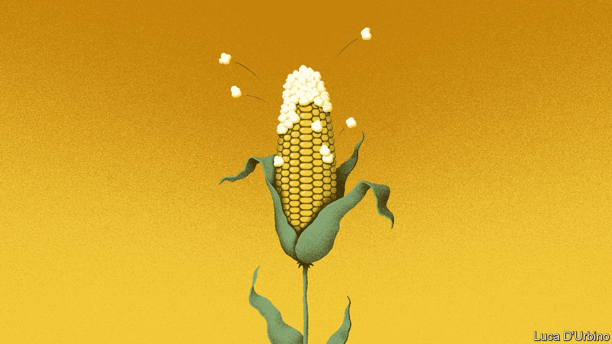

###### Hot cuisine

# How might climate change affect European gastronomy? 

##### Say hello to pan-fried rabbitfish 

 

> Nov 6th 2021 

FARMERS IN SOUTHERN Italy are cultivating avocados and mangos. Tropical creatures such as the rabbitfish are turning up in Mediterranean nets. And Bordeaux winemakers fret that their Merlot grapes may become extinct. Fifty years ago all this would have been unthinkable. But since the early 1980s rising temperatures have forced some farmers to swap grapes for passion fruit.

Italy and France have long been proud of their cuisines. Both countries jealously guard the rules that say only ham made in Parma can be called “Prosciutto di Parma”, and only fizzy wine made in Champagne can be called champagne. Roquefort, that most celebrated of blue cheeses, was given special protection by the parliament of Toulouse in 1550.


The fact of having been grown somewhere famous has traditionally been seen as a guarantee of quality. But climate change could upset that. Take polenta, a popular Italian dish consisting almost entirely of ground maize. High temperatures and drier weather have already reduced maize yields in southern Italy. If this pattern continues and spreads northwards, will Italian polenta-makers have to order their maize from elsewhere? And what about durum wheat, which grows abundantly in Mediterranean lands and is used to make pasta, flatbreads and couscous? Modelling suggests that durum yields will sharply fall there if the temperature keeps on rising.

So should gourmands worry about the future of spaghetti? Gabriele Cola, a researcher at Milan University, is optimistic about the short term. “I don’t see crops at serious risk, because farming is more informed and technologically capable, so it can always respond to changes,” he says. Increased irrigation can counter the effects of drought. Scientists may also breed more resistant varieties of crops.

But in the long run deeper change seems likely. If temperatures rise unabated, farmers in northern Europe may find they can grow southern staples; polenta may invade Germany. And southern locavores may have to adapt. If tropical fruit continue to thrive in Sicily, could ham and pineapple pizza one day be considered authentically Italian?

For more coverage of climate change, register for , our fortnightly newsletter, or visit our 

