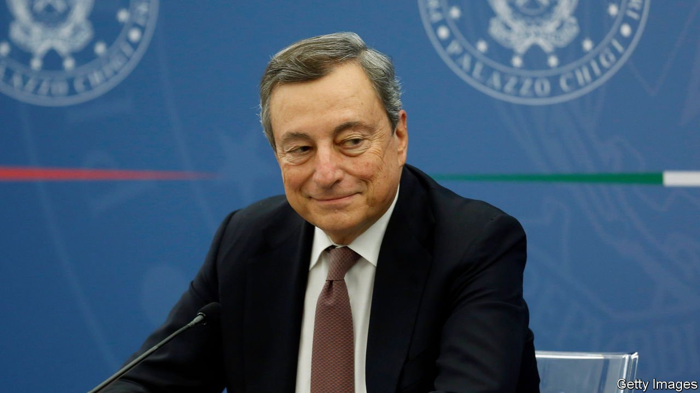
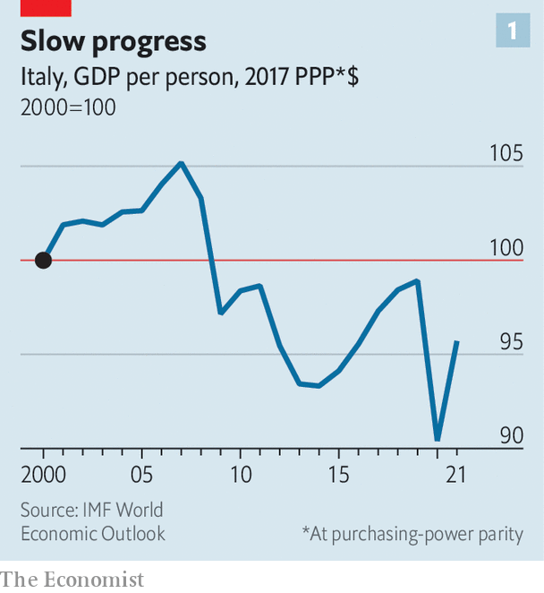
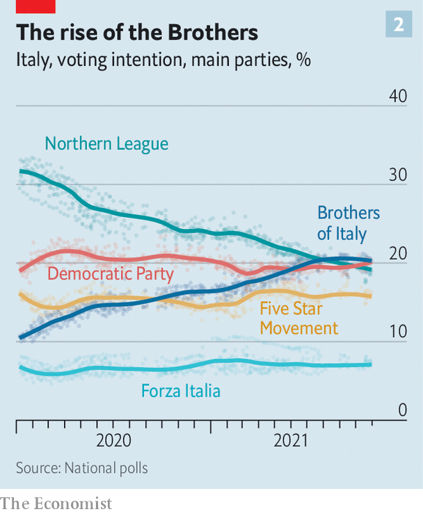

###### The Mario magic

# Italy’s new prime minister has had a good first nine months 

##### But there is a lot left to do, and not much time to do it in 

 

> Nov 4th 2021 

FOR THE past six months Italians have been floating from triumph to triumph. It began in May when an Italian band, Maneskin, won the Eurovision song contest. In July their men’s football team became Europe’s champions and in August, at the Olympics, their male sprinters astonished the sporting world, claiming gold in the 100 metres and 4 x 100 metres relay. In October an Italian scientist, Giorgio Parisi, shared the Nobel prize for physics.

Italy has meanwhile had what is, for it, the novel experience of being governed by an internationally respected prime minister, Mario Draghi, with a huge parliamentary majority that allows him to turn his projects swiftly into law. Supported by an effective vaccination campaign, the economy is recovering strongly. On October 28th Mr Draghi, a former president of the European Central Bank, forecast economic growth this year of “probably well over 6%”, though few expect Italy’s GDP to regain its pre-pandemic level until 2022, well behind America and Britain, among others. But Standard &amp; Poor’s, a rating agency, has revised its outlook for Italian debt from stable to positive, and Italians can look forward to a period in which their government will be in a position—under an obligation, indeed—to spend liberally for the first time since the days of the post-war, American-funded Marshall Plan.

 


Italy stands to be the biggest beneficiary in absolute terms of the EU’s post-pandemic recovery project. From the core Recovery and Resilience Facility alone, it is due to receive €191.5bn in grants and loans. Such an influx of cash cannot help but have an impact on an economy that, even before covid-19, had barely grown this century: in real terms, Italy’s GDP in 2019 was only 4% above its level in 2000, thanks to a combination of slow growth in even the best years and big declines in the bad ones. Real GDP per person was 1% lower over the period, compared with increases of 16% in France and 24% in Germany. Oxford Economics estimates that over the next three to four years the EU’s recovery project will add on average a helpful annual 0.5 percentage points to Italian GDP growth.


Enzo Moavero, a professor at LUISS university in Rome who has served as a non-party minister in three recent governments, warns that the real challenge for Mr Draghi will be to deliver sustainable growth at or preferably above the European average. This, he reckons, will require “effective reforms that lead to thoroughgoing structural change.”

The EU’s recovery project is designed to address that issue. It makes the allocation of funds contingent on specific reforms and investments aimed at improving the growth prospects of member states. Italy has so far been given an initial €25bn with no strings attached. But it will have to satisfy a daunting 51 requirements by the end of the year to qualify for the next tranche. And it could struggle to meet the target. A report to the cabinet on September 23rd revealed that at that point only 13 of the 51 objectives had been reached.

Italy’s reform programme is not the problem; that is ahead of schedule. In May a package was approved that simplified a wide range of bureaucratic procedures. And a shake-up of the criminal-justice system is about to be implemented. A further reform, focusing on civil justice, is in the pipeline. Officials say that legislation to promote competition is also coming soon.

The problem is with investment. The outstanding foot-draggers appear to be the ministry of tourism, which at the time of the report had yet to implement any of the six investments for which it is responsible; and the department for ecological transition, which had implemented only one.

Looking beyond the end of this year, two doubts arise. The first concerns the fate of legislation after it is handed out for implementation at the sub-national level. “In Italy, the intention of policies is all too often lost in translation,” says Paolo Graziano, who teaches political science at the University of Padua. There is a shortage of the necessary project-management skills among officials charged with implementing complex programmes—a shortcoming the Draghi government says it has begun to address. But another reason, says Fabrizio Tassinari of the European University Institute in Florence, is that “secondary legislation becomes hostage to vested interests, from local authorities to trade unions.”

A further doubt centres on Mr Draghi himself. He is known to want the presidency, which becomes vacant in February, and if he were chosen he would have to resign as prime minister. Even if he does not become head of state, he is unlikely to remain in government after a general election that has to be held by the spring of 2023, and may well come sooner.

On October 18th mayoral candidates from the Democratic Party (PD) were elected in Rome and Turin, completing a clean sweep of Italy’s biggest cities by the centre-left. But the PD and its allies are weaker in the provinces. Polls continue to suggest that Italy’s next government will be a coalition dominated by two parties that have long been critical of the European Commission: the Brothers of Italy (FdI) party, which has links to neo-fascism, and the hard-right Northern League.

 


Those close to Mr Draghi argue that his departure need not lead to a radical break. His government has established bureaucratic mechanisms for steering and controlling the flow of the recovery money that will, with luck, outlive it. And future governments will be just as constrained by the deadlines the commission imposes and loth to forfeit the flow of cash from Brussels by failing to meet them.

Perhaps. But the League, which is a part of the coalition underpinning Mr Draghi, and the FdI, which is not, are both wedded to policies and interests that are at odds with the reforming thrust of the recovery plan. The League has already succeeded in parrying it in one important area. A significant weakness of the Italian economy is that, while taxes on labour are too high, those on property are too low. Mr Draghi’s government moved to adjust the balance by changing the criteria used in the land registry in a way that would have boosted the revenue from property. But he ran into determined opposition from the League’s leader, Matteo Salvini. As a result, the changes will not now come into effect until 2026; and even then they will not be used to calculate tax liability.

“I am more positive now than I was a year ago,” says Nicola Nobile of Oxford Economics. “But I still consider a permanent improvement in Italy’s economic prospects to be an upside scenario rather than a base case.” ■

An early version of this article was published online on November 2nd 2021

