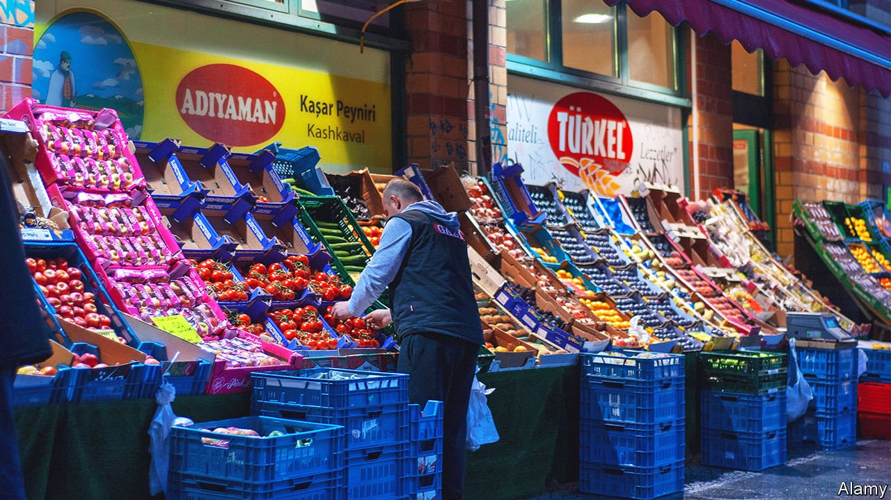
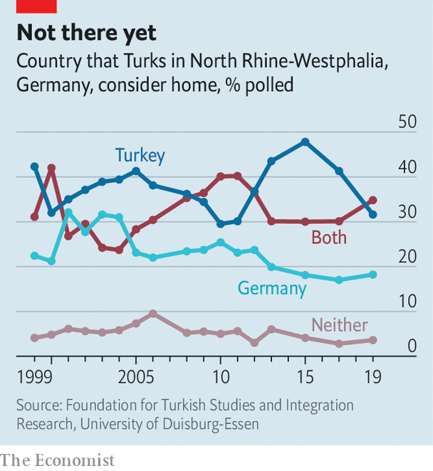

###### Passports postponed

# Sixty years of Turkish “guest workers” in Germany 

##### More are integrated, but two-thirds of adults are not German citizens 

 

> Nov 6th 2021 

IT WAS NOT poverty or ambition that drew Irfan Demirbilek to Germany from Turkey in 1968, but the lure of its splendid cars. Spotting a queue outside an employment office in Istanbul one day, Mr Demirbilek, an electrician who had long dreamed of having his own wheels, decided to join them in applying to work in West Germany. The countries had signed a “guest-worker” deal in 1961, and a brief spell earning Deutschmarks would suffice for an Opel or VW Beetle. A few months later Mr Demirbilek was on a three-day train to Cologne, his head full of excitement and apprehension.

As with so many Turkish guest workers, his brief German sojourn turned out to last a lifetime (and several cars, he chuckles). Now 84, he is sitting with his wife at a theatre in Düsseldorf, where the pair have just been garlanded with flowers in a ceremony to mark the 60th anniversary of the guest-worker treaty. The moment has offered Germany a chance to reflect on the complex history of what is now a 2.75m-strong Turkish minority, its largest by a distance.


Three-quarters of a million poor and largely unskilled Turks came to West Germany during the 12 years the agreement was in force. (Family reunification, and later waves of political exiles, boosted the numbers further.) Talk to guest workers and their descendants and you hear complex family histories: of immigrants vacillating between return and staying; women struggling to make sense of a place to which they had no economic or cultural link; and “suitcase children” tossed back and forth between the two countries.

Germany, too, went through agonies, as its Gastarbeiter became a permanent minority in a country with little understanding of itself as a land of immigration. Integration policy came late, and was halting. First-generation Turks often lived in dormitories in enclaves where encounters with Germans were rare. Learning German was seldom needed for the manual work most performed. Children could be placed in migrant-only classes on the assumption they would one day go “home”; the gifted were often held back from the best schools.

 


Public distrust found expression in government policy. In 1983 Chancellor Helmut Kohl, who wanted to halve Germany’s Turkish population, offered guest workers repatriation payments. It was not until 2014 that Turkish-Germans born in the country could retain dual citizenship into adulthood. Today some 1.5m residents, including nearly two-thirds of adults, do not have a German passport. (The incoming coalition is discussing reform of Germany’s citizenship laws.) Xenophobic violence, common in the 1990s, is still a threat: four Turkish- and Kurdish-Germans were among the ten victims of a mass shooting in Hanau last year.

The reality for most is more prosaic. Germany’s Turks own some 90,000 businesses, employing half a million people. They have spread beyond well-known neighbourhoods such as Marxloh in Duisburg or Mülheim in Cologne to suburbs and rural areas. Turkish-Germans are familiar faces from football to film. Eighteen won seats in the Bundestag in September’s election. But difficulties persist. Children with a Turkish background are likelier to drop out of school and earn less at work than other Germans, even when family background is accounted for. Zerrin Salikutluk, an expert on integration at Humboldt University in Berlin, describes studies suggesting that teachers’ low expectations for Turkish pupils tend to reduce their grades. Germans with Turkish-sounding names still face discrimination in housing and hiring.

Such problems should dwindle over time, though others have emerged. Recep Tayyip Erdogan, Turkey’s autocratic president, has directly appealed to Turkish-Germans who struggle to find a place in Germany—and has exported his own country’s turbulent politics. At times of strain between the two governments, surveys find that a growing number of young Turks say they feel drawn to Turkey. Hakan Demir, a newly elected Turkish-German MP for Neukölln, a diverse district in Berlin, says local children enjoy provoking him by calling themselves Ausländer (foreigners), something he does not hear from older constituents. Well-integrated Turks bristle at having their loyalties questioned.

Even Germany’s belated recognition of the achievements of its migrants often comes wrapped in well-meaning condescension. “The labels have changed,” says Meral Sahin, a wedding-shop proprietor in Cologne, reeling off half a dozen of them, from “guest worker” to “foreign resident”. But, she adds, they always said more about the Germans using them than the people to whom they were applied. Ugur Sahin and Özlem Türeci, the Turkish-German scientists behind the BioNTech covid-19 vaccine, have expressed unease at the politics of being held up as immigrant role models.

Germany has learned from some of its mistakes. It quickly channelled Syrian and other migrants from the 2015-16 wave into language and integration courses. Yet, notes Nesrin Tanç, a Duisburg-based author, for all the commemorations Germany still lacks an overarching story capacious enough to include Germans, Turks and other groups. Such notions can seem eccentric, even dangerous, in a country where patriotism is regarded with queasiness for obvious historical reasons. But since people with a “migrant background”, in the German argot, are more than a quarter of the population, the need for a unifying narrative has only grown.

At a recent ceremony to honour guest workers, Frank-Walter Steinmeier, Germany’s president, urged his compatriots, Germans and Turks alike, to “develop a history together” in which the contribution of all German residents could be acknowledged and celebrated. Germany, now rapidly ageing, is once again crying out for foreign labour. When the next wave of recruitment from abroad takes place, previous episodes will provide valuable lessons. ■

