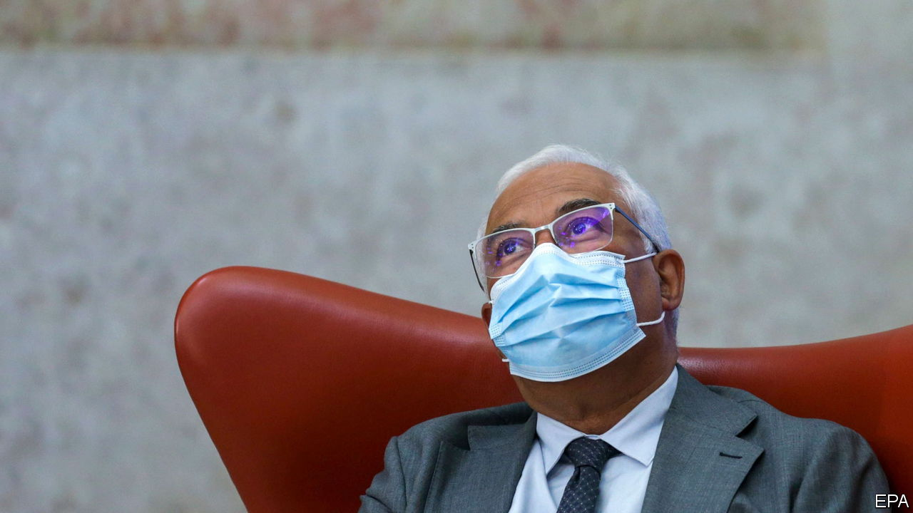

###### The contraption crashes

# Snap elections are called after Portugal’s government collapses 

##### Prime Minister António Costa struggled to govern with the hard left 

 

> Nov 6th 2021 

A GERINGONÇA IS pleasing to say, but difficult to operate. The Portuguese term, sometimes translated as “contraption”, refers to a device patched together from oddly fitting parts. Although the governing arrangement that António Costa, Portugal’s prime minister, assembled in 2015 was dubbed the geringonça, it proved surprisingly durable. But on October 27th it finally fell apart, as two left-wing partners voted down his budget, triggering elections two years early—a rare occurrence in Portugal.

Though the budget was expansive, splashing out on free kindergarten and other goodies and increasing the minimum wage, it was not lavish enough for Mr Costa’s radical allies, the Portuguese Communist Party (PCP) and the Left Bloc (BE). Marcelo Rebelo de Sousa, the president, had announced in advance that if it failed, he would call elections. If he was hoping to put pressure on the parties to seal the deal, the gamble failed.


The parties are scrambling to influence the electoral timetable. Most want elections on January 16th, to avoid prolonged instability. But the calendar is complicated by the plans of the biggest opposition party, the Social Democrats (PSD), a centre-right outfit despite its name, to hold leadership elections on December 4th. That would leave the winner scant time to pick candidates for the general elections. One PSD candidate, Paulo Rangel, is lobbying Mr Rebelo de Sousa (who hails from the PSD himself) to hold the elections later, to allow the party time to regroup. The current leader, Rui Rio, wants to postpone the primary instead. The president was due to announce the date on November 4th.

After an inauspicious start Mr Costa has won respect, not least in neighbouring Spain (where the centre-left Socialists also depend on a far-left party, Podemos). His Socialists came second in 2015’s election, then toppled the short-lived minority PSD government, cobbling together a majority with the BE and PCP, previously considered untouchable by the moderate Socialists.

The then-president required a written agreement between the parties: the BE and PCP never joined the government but made clear commitments of support. But Mr Costa increased his party’s seat count in 2019’s elections. Mr Rebelo de Sousa decided not to insist on a formal agreement before blessing the second geringonça. The Bloc and the Communists, weakened and unbound by any deal, were sure to flounce out at some point.

Some think Mr Costa might have been happy for them to do so now. Portugal’s covid-19 vaccination rate, 87%, is one of the world’s highest. He can point to decent GDP growth and falling unemployment until the pandemic (which in 2020 caused GDP to plunge further than in any year since the 1930s). He has kept the deficit, which made Portugal a ward of the European Union and the IMF after the financial crisis, low enough to win international respect.

But this has come at the cost of public investment: Portugal’s is thought to be the lowest in the EU in 2020 and 2021. Salaries are low by Western European standards: the minimum wage, at €775 ($900) a month, is around €300 less than Spain’s. Many Portuguese head abroad to work.

If Mr Costa nonetheless does well, he might be able to govern with smaller, more tractable allies than the ones that have just let him down. Miguel Maduro, an ally of Mr Rangel in the PSD leadership contest, wants to return to an informal arrangement where whichever of the two biggest parties ends up with the second-largest tally of seats agrees not to try immediately to topple a minority government led by the other one.

But all the moderate parties are warily watching Chega, a far-right party with just one deputy now, but worryingly strong support in the polls. Mr Rangel refuses to govern with Chega. (Mr Rio has been more equivocal.) If Chega squeezes the other parties, any new government will be tricky. Portugal may be joining a new European normal: shrinking established parties, growing extremes and complex coalitions, a kind of permanent geringonça. ■

