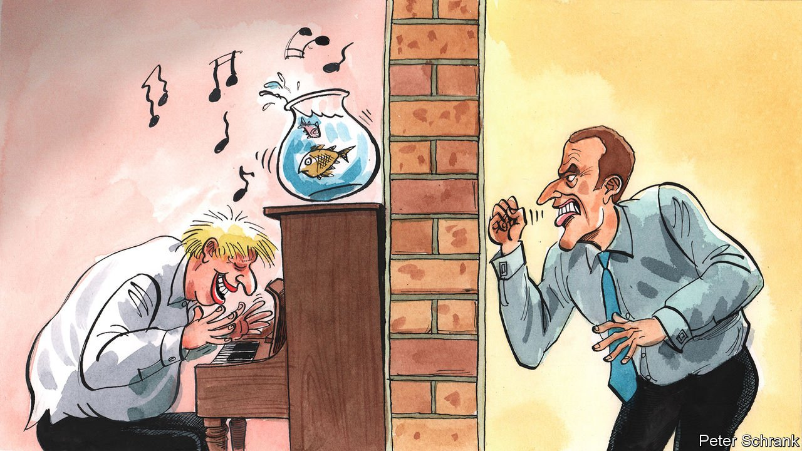

###### Charlemagne

# Why Britain is such a noisy neighbour 

##### Post-Brexit rows with the EU are inevitable. They are not always serious 

 

> Nov 6th 2021 

THE BRITISH government is easily distracted. At the G7, it was sausages that knocked its concentration. Leaders gathered in Carbis Bay in June to discuss the pandemic and climate change. Instead they found Boris Johnson, their British host, embroiled in an argument with the EU about the export of chilled meats to Northern Ireland. At COP26, the environmental jamboree in Glasgow in Scotland, it was fish. Mr Johnson argued with France over the fate of a few dozen fishing licences in the Channel Islands.

Britain’s relationship with the EU has a habit of interfering with set-piece events. France threatened to ban British boats from its ports, as well as jam up freight heading to and from Britain with extra checks. In turn Britain threatened to sue France for breaching the terms of a trade deal between the EU and Britain, agreed on with a mixture of stress and haste at the end of 2020. Two NATO allies, nuclear powers and partners on the UN Security Council with a combined GDP larger than Japan’s, issued threats over a fishing industry worth only about 0.1% of it—though they managed to park the issue for a few days while the bigwigs were in town.


Fishing illustrates the Richard Scarry rule: politicians are terrified to mess with workers whose jobs are often depicted in children’s books, since voters have a romantic view of farmers, firefighters, cops, etc. So fights between national fishing fleets can swiftly escalate, until prime ministers and presidents are slapping each other with figurative flounders. The EU keeps such squabbles in check between its members, but Britain has left the club. Dull meetings of a fisheries council have been replaced by a British minister dashing across the Channel for talks to avert a trade war.

Franco-British ties have often frayed. When all went well, it led to good things such as jointly developing Concorde, the world’s first supersonic passenger jet. When things went poorly, it led to bad stuff, like the operational performance of Concorde, which lost lots of money and then fizzled out. When both countries were in the EU, it took larger disputes, such as Iraq, to strain the relationship. Now, even scallops can blow things off course.

Take away bodies like the EU, which tie governments together in ceaseless dialogue, and friction is inevitable. Neighbours row, no matter how well-tempered they usually are. Across the Atlantic, local hegemon America frequently squares up against Canada, the most placid neighbour imaginable, over everything from timber to milk. Japan and South Korea are both rich democracies fearful of authoritarian neighbours and allied to America, but they do not let that get in the way of a reliably spiky relationship.

Although the EU is skilled at soothing things between its members, that can make things more complex for its neighbours. Ottawa can speak to Washington directly, without having to worry much about bilateral relations between Canada and Montana. When Britain tries to deal with its EU neighbours, it now faces an overlapping matrix of legal and political authority, between the EU and national governments. At times, the British government still clings to the false hope that convincing a few big countries is enough to sway the EU. The opposite is the case: those that are most affected by an issue hold the pen on controversial files, whether they are large or small. Other governments back them, building up favours that can be repaid. The EU is complicated. Dealing with it is complicated, too.

Britain is hardly alone in enduring a rocky relationship with the EU. So do most of the club’s neighbours and allies. Turkey, ostensibly an ally but more usually an annoyance, is a constant thorn. The club often clashes with America, another economic power used to having its way. Switzerland’s relationship (the most similar to Britain’s) is often barbed. For an example of somewhere that usually has a calm relationship with the EU, the best options are Norway or Liechtenstein, which is less a country than the answer to a pub-quiz question. Britain is too large to accept being pushed around but too small to force its way.

Perpetual arguments beckon, says Samuel Lowe of the Centre for European Reform, a think-tank. When the row over fish passes, attention will turn to Northern Ireland, a more serious problem. The British government wants to overhaul the Northern Ireland protocol, which oversees trade involving the province. Depending on how it does it, this could trigger an all-out trade war between Britain and the EU, or, at best, months of negotiations. When that issue passes, others will flare up, whether on data protection, financial regulation or British exporters facing a carbon border-tax.

The threat is not the rows themselves, but the opportunity costs of dealing with them. Britain and France will remain strong military allies. In the midst of the row, a French sub popped up in Faslane, which is home to Britain’s nuclear subs. The Lancaster House treaties, in which the two countries tied their armed forces together, still stand. Such agreements do not collapse overnight. But they can wither if there is little political desire to keep them watered. Amid the noise, the longer-term damage being done can be silent. Don’t worry about the bang; fear the whimper.

We need to talk

After Brexit, officials in Britain and the EU come together almost only in crisis or confrontation. Rather than regular meetings aimed at solving problems before they appear, diplomats talk when things have already gone wrong. Politicians will always scrap, whether inside or outside the EU. But there are now fewer forums for diplomats to heal the wounds. Even America and the Soviet Union had a red phone.European history is one of grumpy relations between neighbours. The EU did not exist, so they had to invent it. Over 60 years, an apparatus emerged to stop small technical arguments becoming big political headaches. Brexit means having to reinvent a space for arcane policy discussion between Britain and its European neighbours. Until it does, public fights over scallops or sausages will be too tempting to resist. ■

For more coverage of matters relating to Brexit, visit our 

