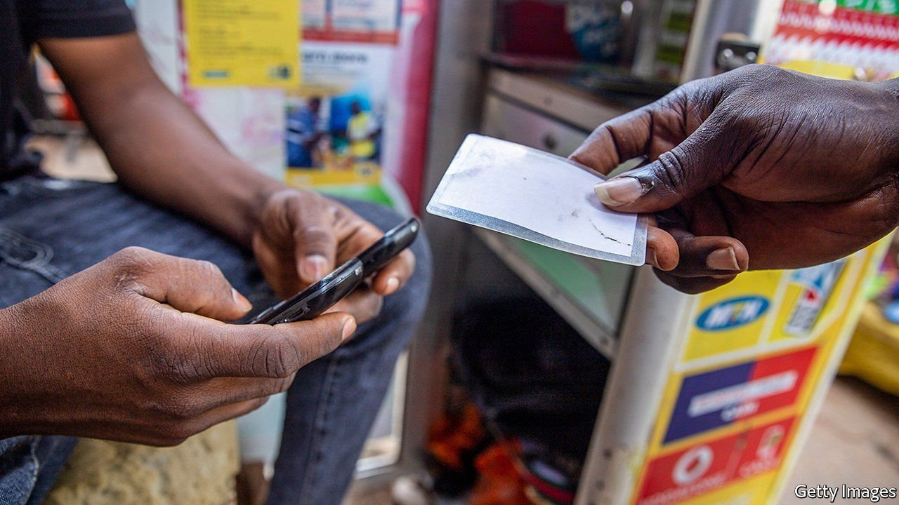

###### Turf wars

# Africa’s fintech firms vie for domination 

##### As investment pours in, they are expanding across the continent and into new services 

 

> Nov 6th 2021 

THE PAYMENTS frenzy is going global, and Africa is catching the bug. So far this year four of the continent’s financial-technology firms have reached or exceeded billion-dollar valuations, more than doubling Africa’s population of “unicorns”. OPay, a mobile-payments company, acquired its horn in August, after raising funding from investors including SoftBank, a Japanese firm. Other recent unicorns include Wave, a Senegal-based startup that runs a mobile-money network; Chipper Cash, which offers peer-to-peer payments; and Flutterwave, which simplifies payments for businesses. As foreign investment pours in, Africa’s fintech firms are expanding both across the continent and into new services.

Africa is an obvious choice for fintech investors. They are betting that young African talent can innovate its way out of the region’s most pressing financial problems faster than legacy firms can. By 2025 the continent will be home to 1.5bn people, most of whom will have grown up in the era of the internet. Nigeria, which has received almost two-thirds of Africa’s fintech investments this year, has a young and entrepreneurial population. But more than half of Nigerians do not have a bank account. Across the continent, digitally literate unbanked (and underbanked) people, who have long been largely ignored by conventional lenders, are instead turning to the upstarts. In Ivory Coast, for example, 94% of pupils’ school fees were being paid using mobile money by 2014. This makes it fertile territory for companies like Wave, which moved into the country in April.


One reason for firms to expand geographically stems from the African Continental Free Trade Area, a deal that was first agreed on in 2018 and which has now been ratified by 38 countries. The Pan-African Payment and Settlement System was launched in September as part of the deal, in order to make the region’s many systems work better together. As a consequence, investors are backing firms with ambitions that extend beyond their home countries. Flutterwave had reached more than 33 African countries by the time of its latest funding round this year; those taking part included Tiger Global, an investment firm based in New York.

For the biggest African fintechs, simple payments are only an entry point. OPay was founded three years ago and was once a ride-hailing app. It now offers interest-free credit that is easier for workers in informal jobs to get than bank loans. The firm, now worth around $2bn, is about as valuable as Nigeria’s biggest bank. Chipper Cash, which is backed by Jeff Bezos, the founder of Amazon, is taking its vision beyond Africa. It lets Nigerians in Britain send money home instantly, and could revolutionise transfers in sub-Saharan Africa, which has some of the highest remittance costs in the world.

Banks may not be the only incumbents feeling threatened by the newcomers. In some cases telecoms providers, which also provide mobile money, are drastically lowering their fees as competition in payments hots up. The battle leaves regulators struggling to control an industry that is rapidly evolving. Wave is moving through the continent at pace, and is now available in four countries.

Despite a bumper year, Africa’s biggest startups are still relatively young compared with those in the rest of the emerging world. Getting payments right in such a large market could unlock a wealth of opportunity. Iyin Aboyeji, a co-founder of Flutterwave and an investor, says international venture capitalists are realising that Africa “looks a little bit like China in the 1970s. Folks are hoping to get in early and do some good deals.” The emergence of rigorous cross-continental competition this year shows that African fintech is nonetheless maturing, and that the world is at last beginning to pay attention. ■


