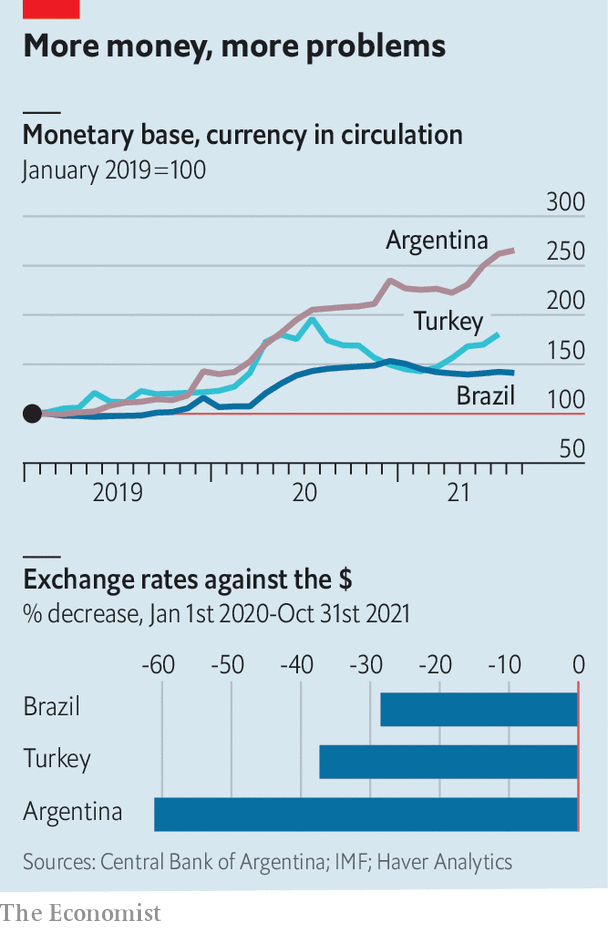

###### Living the high life

# Cautionary tales from high-inflation emerging economies 

##### What Brazil, Argentina and Turkey say about the importance of fiscal and monetary policy 

 

> Nov 6th 2021 

IN RECENT MONTHS the world economy has come to resemble a badly microwaved dinner: generally hot, but with some bits merely lukewarm and others positively scorching. Consumer prices globally are likely to rise by 4.8% this year, according to the IMF, which would be the fastest increase since 2007. But price rises in emerging markets are running ahead of those in the rich world, and a few unfortunates, such as Argentina, Brazil and Turkey, are feeling particular pain. Their experience helps illustrate how and when inflation can get out of hand.

Although inflation rates in emerging markets tend to be higher and more volatile than those in advanced economies, they did generally decline between the 1970s and the 2010s, much like those in the rich world. The median inflation rate among emerging economies fell from 10.6% in 1995 to 5.4% in 2005 and 2.7% in 2015, thanks to efficiency-boosting developments like globalisation and improved macroeconomic policymaking. The IMF expects consumer prices in emerging economies to rise by 5.8% this year, which is not a huge departure from recent trends; prices rose at a similar pace as recently as 2012. But some economies have strayed well above the mean. Inflation stands at 10.2% in Brazil, 19.9% in Turkey, and 52.5% in Argentina.


Such high inflation reflects more than soaring food and energy prices. In advanced economies and many emerging ones, a jump in prices usually triggers a restraining response from the central bank. That response is more powerful when central banks are credible, say because inflation has been low in the past, and the fiscal picture benign. Then people behave as if a price spike will not last—by moderating wage demands, for instance—which reduces inflationary pressure.

 


This happy state can be disturbed in a number of ways. Compromising the independence of the central bank is sometimes enough to make the temperature rise. Recep Tayyip Erdogan, Turkey’s president, has declared himself an enemy of interest earnings and leant on the central bank to reduce its benchmark rate, a step he claims will bring down inflation. Over the years he has sacked a number of central-bank officials, most recently three members of the bank’s monetary-policy committee in October. Such antics have contributed to capital outflows and a tumbling lira (see chart). The sinking currency, by raising the cost of imports, has helped push up inflation by about eight percentage points over the past year, to a rate around four times the central bank’s target.

Brazil demonstrates how inflation can get out of hand despite the best efforts of a central bank, because of fiscal woes. After suffering hyperinflation in the early 1990s, when the annual inflation rate approached 3,000%, Brazil placed itself on a firmer macroeconomic footing by adopting budget reforms and enhancing the central bank’s independence. But from 2014 to 2016, and again over the past year, the ability of the central bank to fight inflation has been threatened by an erosion of confidence in the public finances.

Government spending in Brazil has surged since the onset of the pandemic. Jair Bolsonaro, the president, plans to extend relief payments despite roaring inflation. Worries about debt sustainability have reduced investors’ confidence, leading to falling asset prices and a weaker currency. Despite booming foreign demand for Brazil’s commodity exports, the real has tumbled by nearly 30% since the beginning of 2020.

Higher import prices have contributed to stubbornly high inflation, forcing the central bank to raise its benchmark interest rate by nearly six percentage points since March. Yet interest rates may be approaching levels at which the additional fiscal cost they impose on the government exacerbates debt-sustainability worries and further weakens the currency, leaving the central bank in a no-win situation. The real has dropped by nearly 2.5% since late October alone—after the central bank raised interest rates by a full 1.5 percentage points and promised to do the same again at its next meeting in December.

What happens if neither monetary nor fiscal policy can be counted upon for economic discipline? Here Argentina provides an illustration. The government has long relied on the printing press to cover budget deficits, and has been in particular need of monetary financing since defaulting on its debt, for the ninth time in its history, in May 2020. Over the past two years the amount of money in circulation has risen at an average annual rate of more than 50%. The peso has fallen by over 60% against the dollar since the beginning of last year.

Argentina, like Brazil, has experienced hyperinflation in recent times. Its economic situation may yet be salvaged. But as policymakers in rich and poor countries alike confront the enormous economic and budgetary costs of covid-19, some may be tempted to depart from norms around monetary and fiscal policy. The result, in some unhappy places, could be inflation that is too hot to handle. ■

For more expert analysis of the biggest stories in economics, business and markets, , our weekly newsletter.

