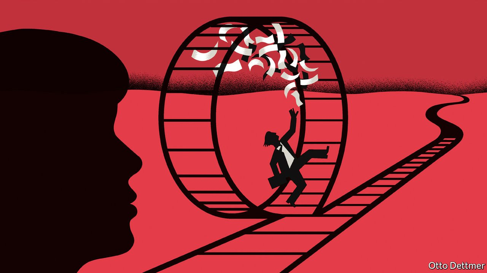

###### Free exchange

# Do “greedy jobs” cause the gender pay gap? 

##### Mothers’ careers suffer when parents maximise their combined income, says a new book 

 

> Nov 6th 2021 

RADICAL AND liberal feminists, as defined by philosophers, differ on the extent to which women’s freely made choices matter. A liberal feminist desires maximum autonomy for women, demanding equal rights and an end to sex discrimination. A radical feminist sees in society patriarchal forces that are bigger than any one person, and which oppress women in part by influencing their choices. Economic differences between the sexes—such as the gender pay gap—are always a sign of injustice.

A new book by Claudia Goldin of Harvard University, an expert on women and work, is a study both of American women’s choices and of the context in which they are made. “Career and Family: Women’s Century-Long Journey Toward Equity” traces the history of work and family for college-educated women, and diagnoses what still troubles their careers today.


A caricature of history might involve a journey from home to the workplace. In fact, the first generation Ms Goldin studies, born in 1878-97, contained plenty of working women. But a successful career typically required forgoing children and sometimes marriage. Among those listed in “Notable American Women”, a collection of biographies, no more than three in ten had a child, she writes. The choice women faced was “family or career”.

By the third generation, those born between 1924 and 1943, college-educated women had a more uniform life experience: “family then job”. The typical woman worked after graduation, but soon married, had children and dropped out of the workforce. She returned once her children were in school, and the gradual removal of formal discriminatory barriers opened up opportunities for her. But her prolonged absence from work meant she did not have the skills and experience necessary to thrive in the workplace.

It is only by the fifth group, born after 1958, that many women aspired to achieve “career and family”. The shift was aided by the contraceptive pill, which helped women delay marriage; improved fertility treatments, which helped them delay child-bearing; and more liberal social norms. Yet, despite the staggering extent of the change Ms Goldin documents, a clear gender gap still exists for these women, most notably with respect to pay. American women earn on average 20% less per hour worked. For college graduates, the gap is larger, at 26%.

It is at this point that the book becomes provocative. Drawing on reams of research Ms Goldin argues that most women no longer suffer much labour-market discrimination in the sense of unequal pay for equal performance, as is often claimed by the left. Nor is the gender pay gap driven primarily by women’s choice of occupation, an explanation sometimes favoured by the right. Even if the distribution of women’s occupations matched that of men—“if women were the doctors and men were the nurses”—she calculates that at most a third of the pay gap would disappear.

The most important cause is that women curtail their careers as a part of a rational household response to labour markets, which generously reward anyone, male or female, who is willing to hold down what Ms Goldin calls a “greedy job”. These are roles, such as those in law, accountancy and finance, that demand long and unpredictable hours. Parents need somebody to be on-call at home in case a child falls ill and needs picking up from school, or needs cheering on at a concert or football match. That is incompatible with a greedy job, which requires being available for last-minute demands from a client or boss. No one person can do both. The rational response is for one parent to specialise in lucrative greedy work, and for the other—typically the mother—to prioritise the children. Ms Goldin writes that “couple equity has been, and will continue to be, jettisoned for increased family income.”

A gender pay gap resulting primarily from the choices of households is a thorny problem for liberals who prize freedom of choice. It is also tricky territory for economists, who often emphasise the “revealed preference” of those they study, and the resulting efficiency of market outcomes. True to her membership of the Chicago school of conservative-leaning economists, Ms Goldin does not offer the confident prescriptions for the expansion of government that could have easily followed her compelling diagnosis of the problem. Some parts of her book suggest she supports more subsidies for child care, like those proposed by President Joe Biden. But speaking to The Economist she was more circumspect, pointing out that among Mr Biden’s proposals she would prioritise cash transfers to parents (a policy that makes no attempt to change households’ choices). The book is about “what happened and why”, she says, rather than solutions.

For love or money

Another theme of the book, however, is just how much progress for women is a result of technological change and innovation. Could similar forces disrupt greediness? For some jobs it is hard to see how; little can stop the self-employed pouring hours into their businesses, say. But firms have an incentive to make jobs less greedy, because hiring and promoting mothers means drawing from a bigger pool of talent. Ms Goldin points to pharmacy as an example of an industry that has made the transition. Many pharmacists used to be self-employed, with customers expecting personal service. But computers and consolidation have led to pharmacists becoming more substitutable for each other, making the job less greedy without a loss of status or pay. Perhaps remote work or artificial intelligence will do the same for other professions.

Like a radical, Ms Goldin has identified a structural feature of the economy: “It isn’t you, it’s the system,” she reassures the reader. But she has the liberal’s hesitancy about disrupting a system that is built on choice. ■

