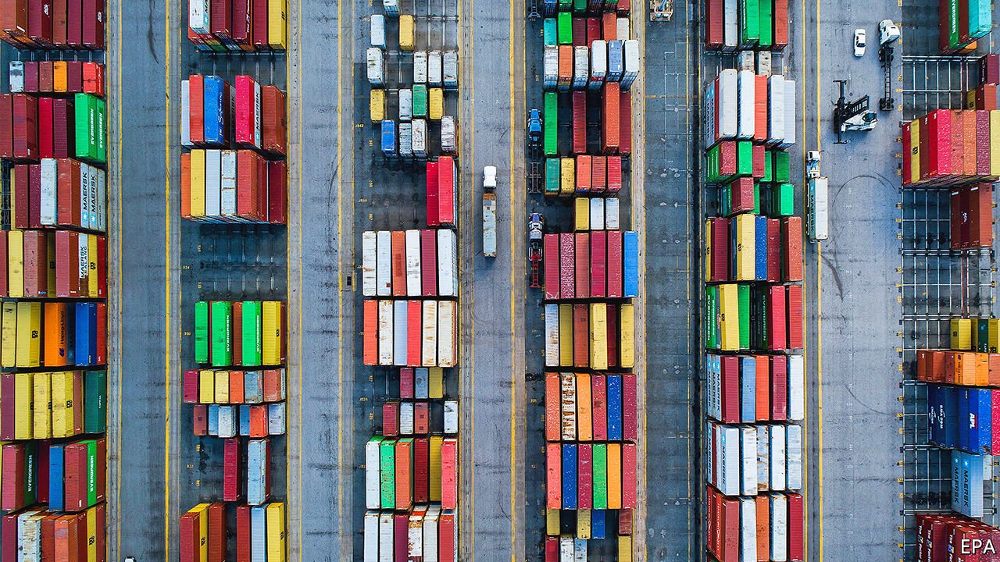
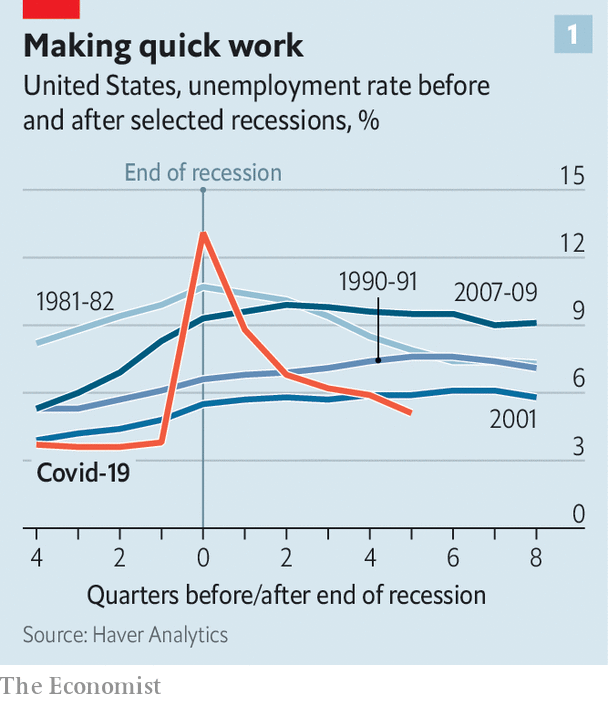
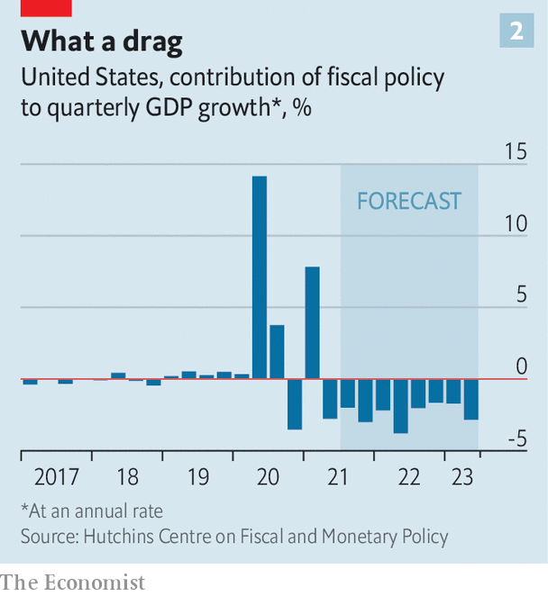
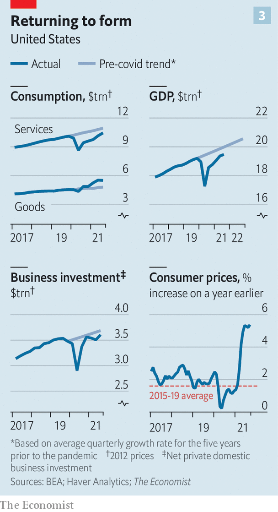
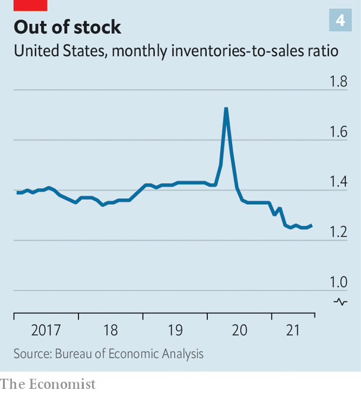

###### Inner strength

# Even after a weak patch, America’s economy is still in high gear 

##### High inflation, supply snarls—and strong growth momentum 

 

> Nov 4th 2021 

MANAGERS AT HUB GROUP, a transport company, used to be able to click a few buttons at their headquarters in Illinois and, eight weeks later, receive a new shipping container from China, ready for use in America. Recently, though, Phillip Yeager, the firm’s president, faced a headache. After a long wait at the congested port of Long Beach, its container was at last next in line to go ashore. But the ship in front did not have a chassis for moving its freight and was blocking the landing berth. Mr Yeager’s team scrambled to find a chassis for it. Only then could Hub get its container, a full month late.

Multiply by thousands of containers, and the tale helps explain how supply chains have become so snarled, particularly in America, the world’s biggest consumer market. And this is just one of the cross-cutting forces buffeting the economy. Demand for goods is incredibly strong, but companies are struggling to find workers and supplies, which in turn is pushing up wages and prices, all against a backdrop in which the pandemic—the original cause of the distortions—is fading but not gone. And officials, poised to withdraw the extraordinary fiscal and monetary stimulus of the past 18 months, are throwing another element into the fray. At the end of its policy meeting on November 3rd, the Federal Reserve said that it would start paring back its $120bn monthly bond-buying programme, putting it on track to halt all purchases by June next year.


All this makes for a volatile mix, as was illustrated by third-quarter GDP, published on October 28th. The economy grew at an annual rate of 2% compared with the previous three months. That, depending on your frame of reference, was either most impressive or very disappointing. Compared with forecasts made in late 2020, growth during the first three quarters of this year has been more than a third faster than projected. But forecasts had zoomed higher since: at one point economists expected third-quarter growth to be more than three times as fast as it actually was.

The fourth quarter may bring a bounce-back. Consumer confidence fell precipitously as the summer wore on and the Delta variant took hold. Now Delta is receding and confidence rebounding, which bodes well for shopping and travelling during the holiday season. Supply chains, though still far from normal, may be improving a bit. Mr Yeager talks of better “network fluidity”, with more trains arriving on time and warehouses running more efficiently. Analysts at Bank of America reckon that growth could pick up to an annual rate of 6% over the final three months of the year.

Any near-term rebound aside, however, how much longer before the recovery runs out of air? Three big factors suggest that it may be nearing its end: a tight labour market, stubbornly high inflation and a rapid unwinding of stimulus. Yet there is also cause to think that each will not undercut the recovery, and that growth momentum may remain strong.

 


Easily the most positive economic development of the past year has been the remarkable decline in unemployment. After a recession the labour market usually takes years to heal. Things looked grim at the height of the pandemic, when unemployment soared to 14.7%, the highest rate since the Depression. Yet the return to work, albeit not to offices, has been astonishingly strong. The unemployment rate, 4.8% in September, is low for this point in a recovery (see chart 1).

Indeed, the focus now is on how hard it is for companies to hire workers, especially for blue-collar jobs. That might suggest that the recovery is nearing an end, with the economy straining at its limits. Yet some slack remains. About 3m people, 2% of the pre-pandemic labour force, have still to return to work. Some may have retired early, but many are on the sidelines, concerned about child care and catching covid-19. As those concerns diminish—the return to school has gone well so far and vaccines are proving effective against severe illness—such people are, little by little, resuming work.

 


The surge in inflation presents another big worry about the recovery (see chart 2). The personal consumption expenditures price index, the Fed’s preferred gauge, increased by 4.4% in September from a year earlier, the most in more than three decades. For much of the past year officials at the Fed and many other economists, too, have argued that inflation is transitory, an outgrowth of gummed-up supply chains.

The tight job market, however, complicates the picture. Wages rose by 1.5% in the third quarter compared with the second, the biggest gain in at least two decades. Welcome as it is to see nurses and waiters get pay bumps, the fear is that rising wages will lead to yet more upward pressure on prices and ultimately to a dreaded wage-price spiral, as experienced in the 1970s. But conditions are very different. Far fewer workers are represented by unions today, and far fewer contracts have cost-of-living adjustments baked into them. That should weaken the link between inflation and pay. The Fed may have been unduly optimistic in thinking that price pressures would quickly subside, but its logic remains persuasive. As supply chains slowly return to normal and as people re-enter the labour force, inflation should ebb without the need for forceful interest-rate rises.

 


Related to that is the final big concern: the withdrawal of stimulus. With the fiscal deficit hitting 15% of GDP in 2020, the highest level since the second world war, the comedown was bound to be painful. The shift to smaller deficits will deduct about 2.5 percentage points from growth over the next year, easily the biggest fiscal drag of the past two decades, according to the Hutchins Centre on Fiscal and Monetary Policy in Washington (see chart 3).

The monetary cliff will not be as steep, but it now looms over the economy. The next question after tapering is when the Fed will raise interest rates. On October 29th Goldman Sachs, a bank, said that the first rate rise could come as soon as July, a full year earlier than it had previously forecast, because of its expectation that inflation will remain elevated.

An end to stimulus would usually augur poorly for growth. Yet other factors could insulate the economy. The consumption of goods is about 15% higher than its trend level, partly because people have spent much less money than usual on holidays and restaurants and much more on furniture, exercise bikes and stay-at-home essentials. But with the pandemic now apparently petering out, people are buying experiences again—a fillip for growth, given that services account for nearly 80% of output.

 


Even without any more stimulus cheques, momentum for spending is strong. Jay Bryson of Wells Fargo, another bank, says that the strength of household balance-sheets should be the starting point in any analysis of America’s growth prospects. Personal debt obligations as a share of disposable income are near their lowest on record. Business inventories are also near all-time lows, implying substantial need for restocking, if only companies can get the goods they need on time. “Knowing what I know today, I would say that we are still in the early stages of this recovery,” says Mr Bryson.

Mr Yeager has reached a similar conclusion. As retailers rush to restock their shelves, Hub’s order books are filling up fast. It has even had to turn some prospective clients away. “We think the strength really does carry through to the end of next year and potentially beyond,” he says. ■

For more expert analysis of the biggest stories in economics, business and markets, , our weekly newsletter.

An early version of this article was published online on October 31st 2021

