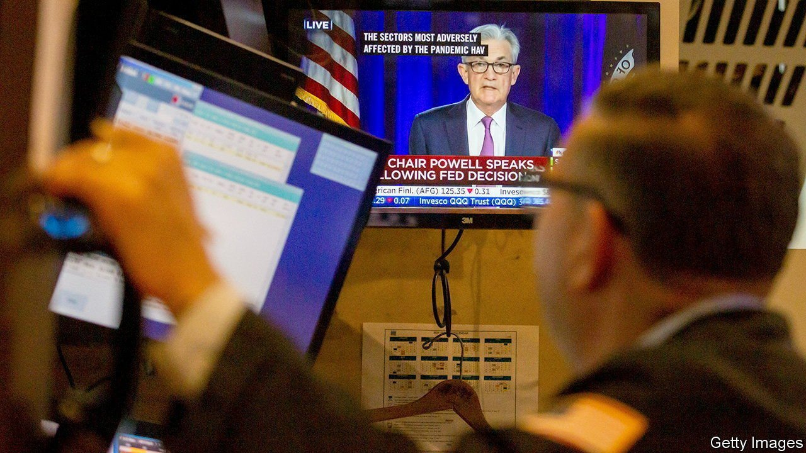
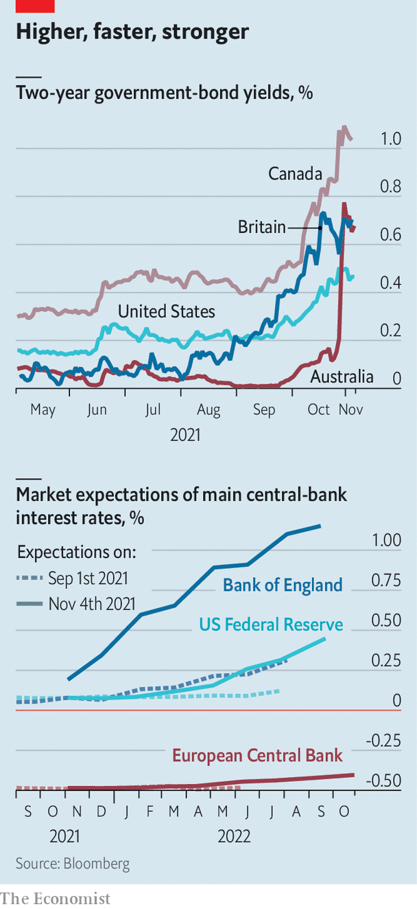

###### Yield curveball

# The bond markets v central banks 

##### Investors bet that policymakers will have to break their promises 

 

> Nov 4th 2021 

FOR MUCH of the past two years, central bankers have found themselves playing second fiddle to governments. With interest rates in the rich world near or below zero even before the pandemic, surges in public spending were needed to see economies through lockdowns. Now central bankers are firmly in the limelight. During the past month, as inflation has soared, investors have rapidly brought forward their expectations for the date at which interest rates will rise, testing policymakers’ promises to keep rates low.

The expected date of lift-off in some countries is now years earlier. In the last days of October Australia’s two-year government-bond yield jumped from around 0.1% to nearly 0.8%, roughly the level at which five-year bonds had traded as recently as September, prompting the central bank to throw in the towel on its pledge to keep three-year yields ultra-low. The bank formally ditched its policy of yield-curve control on November 2nd, though it said it would wait for sustained inflation to emerge before raising interest rates.


On October 27th the Bank of Canada announced the end of its bond-buying scheme (though it will still reinvest the proceeds of maturing securities). The bond market had already reached the same conclusion before the announcement, and is pricing in a small interest-rate increase over the next year. Investors’ expectations for rate rises in Britain have ratcheted up dramatically (see chart). As we wrote this, the Bank of England was due to decide whether to raise its policy rate.

Such moves have been mirrored in America and the euro area, albeit on a smaller scale. The Federal Reserve announced a tapering of its asset purchases on November 3rd. That had been widely expected, but the MOVE index, which tracks the volatility of American interest rates, has this month hit its highest level since the early days of the pandemic. On October 28th Christine Lagarde, the head of the European Central Bank, pressed back against market expectations that interest-rate increases could begin as soon as the second half of 2022, noting that an early rise would be inconsistent with the bank’s guidance. That failed to stop two-year German bond yields inching up the day after, to their highest level since January 2020.

 


The movements so far are not large enough to constitute a bond-market tantrum on the scale of that seen in 2013, when the Fed also announced a taper. But the fact that the mood is much more febrile than it has been for most of this year reflects the uncertainty over the economic outlook, particularly that for inflation.

Whether the markets prove to be right on the timing of interest-rate rises or whether central bankers instead keep their original promises will depend on how persistent inflation looks likely to be. Central bankers have said that price rises so far are transient, reflecting an intense supply crunch. But some onlookers believe that a new inflationary era may be on the way, in which more powerful workers and faster wage growth place sustained pressure on prices. “Instead of decades in which labour has been coming out of people’s ears it’s going to be quite hard to find it, and that’s going to raise bargaining power,” says Charles Goodhart, a former rate-setter at the Bank of England.

Recent moves also highlight the sometimes-complex relationship between financial markets and monetary policy. In normal times central bankers set short-term interest rates, and markets try to forecast where those rates could go. But bond markets might also contain information on investors’ expectations about the economy and inflation, which central bankers, for their part, try to parse. Ben Bernanke, a former chairman of the Fed, once referred to the risk of a “hall of mirrors” dynamic, in which policymakers feel the need to respond to rising bond yields, while yields in turn respond to central banks’ actions.

All this makes central bankers’ lives even harder as they try to penetrate a fog of economic uncertainty. Yet there is some small relief to be had, too. If investors thought inflation had become sustained, instead of being driven largely by commodity prices and supply-chain snarls, yields on long-dated government bonds would have begun to move significantly. So far, however, investors have dragged interest-rate increases forward rather than baking in the expectation of permanently tighter monetary policy. The ten-year American Treasury yield, for instance, is still not back to its recent highs in March.

Furthermore, some bond markets are still calm. In Japan, consumer prices were just 0.2% higher in September than a year ago, and are still in deflationary territory once energy and fresh food are stripped out. The Bank of Japan’s yield-curve-control policy remains in place, contrasting with the collapse in Australia. Setting policy is a little easier when investors are more certain of the outlook. That, sadly, is not a luxury many central bankers have. ■

For more expert analysis of the biggest stories in economics, business and markets, , our weekly newsletter.

An early version of this article was published online on November 2nd 2021

