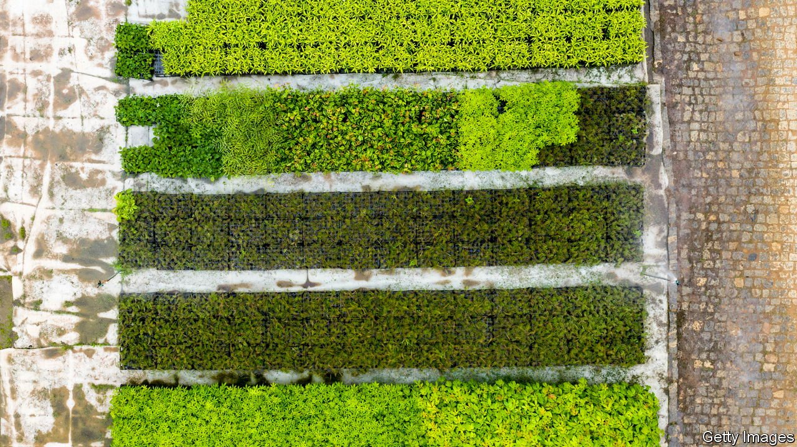
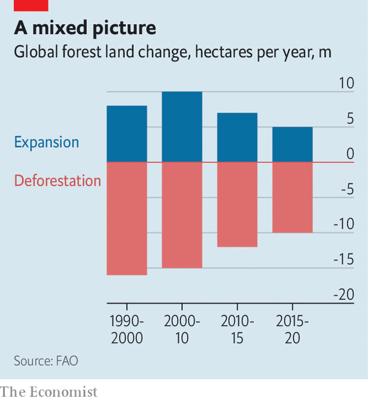
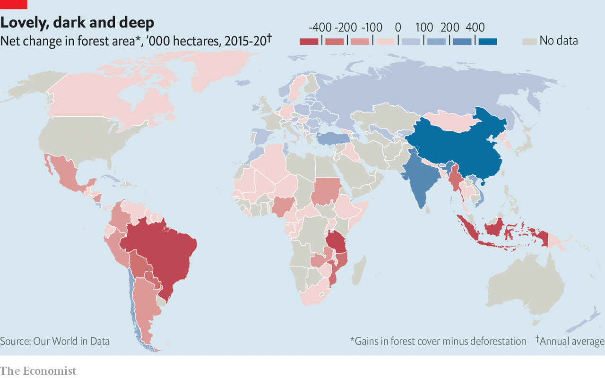

###### Up a tree

# If the world loves forests, it should put a price on their carbon 

##### Without that, more trees may not mean less climate change 

 

> Nov 4th 2021 

THE WORLD'S leaders may quail at extinguishing coal-fired plants or raising petrol prices, but they can be relied upon to embrace one ally in the fight against climate change: the tree. For all his claims that climate change was a hoax, even Donald Trump, as president, championed an initiative to plant a trillion trees. So there is cause for scepticism about the pact, announced at the Glasgow climate summit this week, to put an end to deforestation before the decade is out.

The world has seen similar non-binding declarations before. In 2014, governments, companies and non-governmental organisations committed to halving deforestation by 2020 and ending it by 2030, under the New York declaration on forests. The first target was missed, the second looks to be a stretch. And those trillion trees remain an achievement chiefly of alliteration. Nevertheless, this week’s announcements significantly improve on previous efforts.


This time, Brazil and Indonesia have signed on (though India has not). States have promised to stump up cash to protect and restore forests, including in the Congo basin, and recognised that indigenous people are best-placed to care for the forests they live in. At least as significant is the commitment from the private sector, including large financial institutions, to root deforestation out of their supply chains and portfolios.

 


Forests serve as carbon “sinks”, sponging up a net 7.6bn tonnes of carbon dioxide each year. Slashing, burning or thinning trees or otherwise degrading ecosystems accounts for 11% of emissions. So programmes to plant and protect forests will be essential to meeting the Paris agreement’s targets of limiting the rise in global average temperatures to between 1.5°C and “well below 2°C” above pre-industrial levels. The text of the Paris agreement envisions a balance between anthropogenic emissions and sinks “in the second half of this century”. This has already led to a flurry of national and corporate strategies for hitting net-zero emissions through forestry, from restoring carbon-rich peatlands to developing agroforestry.

The problem is that the world lacks a shared, sensible system for valuing the contribution of trees to sequestering carbon. This is an accounting puzzle of great complexity. Depending on whether and how it is solved, trees could wind up being either part of the solution to global warming or part of the problem.

The accounting tricks and standards now in use, and new standards for a carbon market to price offsets for protecting or planting trees, among other initiatives, are on the agenda at the United Nations conference in Glasgow. As parties to the Paris agreement reckon with how to achieve the goals they have set for themselves, transparency and accountability are high on the agenda.

Many countries list forestry as essential to reaching net-zero. China and India have vast tree-planting programmes. Russia wants to take advantage of the fact it is home to 20% of the world’s forests, to offset its greenhouse-gas emissions. Bhutan, one of the few countries to plausibly claim to have reached net-zero, can do so only by taking credit for a heavy dose of forestry. Myanmar is in a similar situation.

At the heart of the issue is that the natural carbon cycle in which trees and other plants play an ancient role is being thrown out of whack by human activity. The cycle is normally slow and self-regulating. Trees soak up CO2 from the atmosphere, then return some of it when they decompose or burn in natural wildfires. Over time, that CO2 cycles back into new plants. In the absence of human intervention, sources and sinks of carbon achieve balance.

Humans are distorting things in two ways. Deforestation and forest degradation increase greenhouse-gas emissions because they accelerate the release of stored carbon, defying any equilibrium. And the 1.1-1.3°C of global warming that has come with the 2.5trn tonnes of CO2 already added to the atmosphere further increases emissions of carbon: more warming leads to more decay and wildfires.

At the same time, putting carbon dioxide from fossil fuels into the atmosphere gives plants more to work with, increasing the effectiveness of some sinks. But this is not an unqualified benefit: trees migrating north into the Arctic circle thanks to this “carbon-dioxide fertilisation” are darkening land that would previously have been snow-covered and white. Darker lands absorb more energy from the sun, amplifying the warming of the polar region.

 


All of these ways humans affect forests, and with them the atmosphere, are devilishly complicated to disentangle from one another—and from what would have happened in their absence. Some standards and methods are in place. Independent scientists and the bean-counters of the United Nations Framework Convention on Climate Change have devised shorthand to help countries measure their exhalation and inhalation of carbon. In annual greenhouse-gas inventories that countries submit to the UN, changes in emissions in land labelled as “managed” are deemed to be anthropogenic. What falls under the label of “managed” varies by country; it can include everything from pastures on deforested land to protected forests that, while not actively managed, would be defended by firefighters if spark came to flame. The changes in emissions from managed land therefore include natural, background carbon cycling not directly affected by human activity.

In addition to enabling some fuzziness around what counts as human emissions and sinks, this accounting system allows countries to offset their industrial emissions against existing forests. For example, Myanmar’s latest greenhouse-gas inventory shows that it emits 8m tonnes of greenhouse gases each year from industry and burning fossil fuels, while its managed forests soak up 96m tonnes. Although the country is still burning fossil fuels, it can claim carbon neutrality under the agreed accounting rules.

Myanmar’s industrial emissions are a tiny fraction of the global annual total of 52bn tonnes, so any fudging would not matter much. The same cannot be said of Russia, the world’s fourth-largest emitter. For years Russia has viewed its vast forests as central to its efforts against climate change. Russia’s commitment to the Paris goals states that by 2030 it will reduce its emissions by 70% relative to 1990 levels, “taking into account the maximum possible absorptive capacity of forests and other ecosystems”. In 2019 Russia could claim its forests absorbed the equivalent of 25% of its industrial emissions.

That effect is declining, as ageing trees soak up smaller and smaller amounts of CO2. According to Russia’s Ministry of Environment and Natural Resources, the sink will drop to zero—absorbing as much carbon as it emits—within four decades. It was a boon, then, when last year Russia’s first inventory of its forests since the mid-1990s found that the volume of its forests had increased by 25%. Earlier this year, an independent study published in Nature calculated that this carbon sink is 47% greater than previously understood. Much of the increase is due to natural growth, as forests reclaim abandoned agricultural land, or as trees creep north. Such revisions are worth hundreds of millions of tonnes of carbon emissions, and should show up in Russia’s future inventories.

To add to this windfall, the Russian government recently announced it would include unmanaged “reserve” forests alongside managed forests in its greenhouse-gas inventory. That could immediately improve Russia’s annual reports, if not the climate, by helping to add hundreds of millions of tonnes of CO2 to its forest sink.

Shared, enforceable standards for measuring the contribution of trees to national emissions would make it easier to compare progress, country by country, toward climate goals. But ecologists have warned that a disconnect between national greenhouse-gas inventories and the estimates made by independent scientists make this impossible. Because official greenhouse-gas inventories count emissions from “managed” ecosystems, and global climate models use another method, the two systems yield different results. According to climate models, Earth’s land masses emit 5.5bn tonnes more CO2 each year than the inventories account for. Neither count is better, say the researchers, but because the climate models are used to map out pathways to a stable climate, and the inventories track progress along those pathways, they are comparing apples and oranges.

Improved standards would also create a sounder basis for the growing market in carbon offsets, a key to marshalling the private sector against climate change. For example, activists in Brazil see global trading in carbon credits, envisioned in article 6 of the Paris agreement, as a silver bullet for reducing deforestation, the cause of roughly half of Brazil’s emissions. Their thinking is that a global carbon market will turn forests into a tradable commodity, making land in the Amazon more valuable with trees than without.

But to be effective in stabilising the climate, projects that receive carbon credits for stopping deforestation, or promoting reforestation, must be able to demonstrate they are decreasing emissions that would otherwise have taken place—in carbon offset jargon, this is known as additionality. It is possible, for instance, to buy carbon offsets for protecting trees in the Amazonian state of Pará. But the vast majority of land there is already federally protected, and so should not be seen as a basis for carbon credits.

When it comes to forests, the carbon-offset market is also unable now to factor in what is known as permanence. Replacing a diesel bus with an electric one probably removes emissions forever—with any luck there will be no diesel buses left to buy when the electric one reaches the end of its life—but a patch of forest can be cleared or burnt in the next decade, or even the next week. How can the market ensure that offsets purchased today have enduring effects? And in Brazil and elsewhere, programmes to reforest or plant new forests also come with a leakage problem: protecting one patch of land might simply encourage deforestation elsewhere.

All these problems apply to the existing, voluntary carbon markets. An economy ticket on a flight from London to New York generates approximately 600kg of CO2; offsets for that carbon can be purchased for as little as a few dollars through commercial tree-planting schemes. That may ease a traveller’s conscience, but whether it will protect the climate is far from certain. Over the coming fortnight, delegates at COP26 will try to reach agreement on guidelines to assure permanence and account for additionality, in hopes of creating a model that can be emulated in the voluntary markets.

That is all to the good. There is indeed no poem lovely as a tree, and carbon offsets, and the forests they may cause to be planted or protected, can help slow and even stop climate change. But for that to happen the world’s leaders will need to demand far less popular measures as well, like ending the use of fossil fuels and transforming farming. Climate models show that ecosystem sinks will be most effective at absorbing CO2 if warming remains in the range of the Paris goals. If temperatures soar, as looks likely, carbon-rich tropical ecosystems will dry out, burn and become carbon sources rather than sinks. Trees cannot solve the climate crisis. Only people can.

For the latest from COP26 see our . For more coverage of climate change, register for , our fortnightly newsletter, or visit our 

An early version of this article was published online on November 2nd 2021

