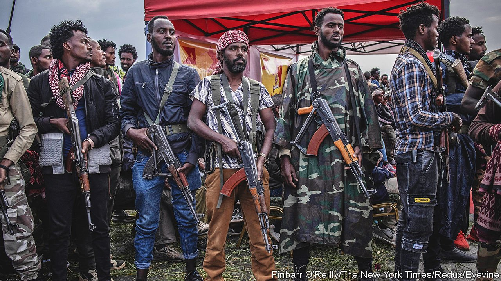

###### Abiy’s abyss

# Act now to avert a bloodbath in Ethiopia 

##### As rebels march on the capital, ethnic persecution accelerates 

 

> Nov 4th 2021 

THE NAME of Ethiopia’s capital, Addis Ababa (New Flower), belies its frequent violent changes of government in recent decades. The Emperor Haile Selassie was overthrown and later strangled. Mengistu Haile Mariam, a Marxist despot, shot his way to power, imposed a “red terror” and was later ousted by a rebel coalition led by Tigrayans. Now history is rhyming.

Once more the federal government is fighting rebels from Tigray. Once more it has deliberately blocked food and medicine from entering this northern region, where 400,000 people are now starving and millions are at risk. Once more the Tigrayan People’s Liberation Front (TPLF) is marching on Addis Ababa. In a rapid offensive it has captured towns straddling the roads north of the capital. An allied band, which claims to represent the Oromos, Ethiopia’s largest ethnic group, threatens to cut roads leading to the city from the south. It says it, too, is .


The last time Addis Ababa fell, in 1991, a bloodbath was somehow averted. Peace talks were held in London. The dictator fled abroad. What fighting there was in the capital lasted only a few hours. This time, however, it is far from clear that the civil war will end so quietly.

The authorities in Addis Ababa have called on its 5m residents to organise themselves in blocks and defend the city. Abiy Ahmed, Ethiopia’s prime minister, shows no sign of agreeing to talks. On November 3rd, at a ceremony marking the start of the war a year ago, Abiy told army officers that “Ethiopia will defeat all her enemies with the blood and bones of her children and live for ever in glory.” He has declared a state of emergency, giving his forces sweeping powers to detain anyone suspected of “terrorist” ties. The police and army are interpreting this as an order to round up all ethnic Tigrayans in the capital. Within hours of the proclamation, Tigrayans were grabbed and shoved in warehouses or old factories. Even doctors and nurses were dragged out of hospitals if they were Tigrayan.

Worse is possible. For months Abiy has used dehumanising language for his foes, calling the TPLF a “cancer” and a “weed” that must be trampled. His office insists that he means only the armed group, not all Tigrayans. But some of his followers may make no such distinction. In other parts of Ethiopia both sides have committed war crimes, some of them ethnically targeted. Now Abiy is urging all citizens to “expose” the agent who “stays in our midst and works for our enemy”. In a post on Facebook that the social-media company has since removed for violating its policies against inciting violence, he urged people to take up “whatever weapon” to “bury the terrorist TPLF”. Ethiopia is a fragile federation of more than 80 ethnic groups. If widespread ethnic killings were to start, it could break up.

Western governments are trying to prevent Africa’s second-most-populous country from going the way of Yugoslavia. Jeffrey Feltman, America’s senior diplomat for the Horn of Africa, is understood to be heading to Addis Ababa to meet Abiy. He may find the conversation difficult. Foreigners who have spoken with Abiy in recent months describe him exuding a messianic zeal. “He can’t understand why the West is not supporting him in fighting the forces of darkness,” says one diplomat, adding that Abiy constantly changed the subject from ending the conflict to “his mission to deliver Ethiopians from the darkness and into the light”.

Abiy has not so far been swayed by sanctions, such as the EU cutting aid or America suspending Ethiopia’s preferential access to its market. The TPLF, which believes its forces are on the brink of victory, has also made little effort to talk. Diplomats believe it may be holding back from an immediate attack on the capital so as to give Abiy a chance to give up and escape.

No one knows whether catastrophe can be averted. But outside powers should try, with a determined mix of pressure and persuasion. The African Union should suspend Ethiopia’s membership until it lifts its embargo on aid entering Tigray, while also making clear that it would not recognise a TPLF government that seized power by force. The UN Security Council should impose an arms embargo, and try to coax both sides to negotiate. Russia and China, which have resisted applying much pressure, should know that they have more to lose than gain from a chaotic break-up of Ethiopia. The fate of a country of 115m people hangs in the balance. The world should not abandon it. ■

