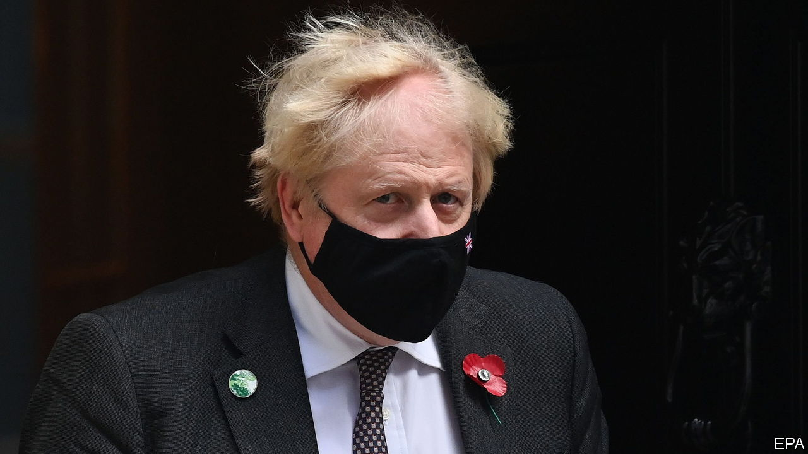

###### Government in Britain

# Boris Johnson treats checks and balances with contempt 

##### He seems to think rules are for losers 

 

> Nov 4th 2021 

THE FACTS are damning. Owen Paterson, a former Tory Cabinet minister now on the backbenches, was paid £9,000 ($12,700) a month for consulting work by two companies, one and a half times his parliamentary salary. And, sure enough, he earned his keep by lobbying ministers and officials on their behalf. The commissioner for standards, an independent officer, concluded that he had brought Parliament into disrepute.

Its cross-party standards committee recommended a 30-day suspension. But on November 3rd, in a scheme cooked up barely 24 hours earlier, Tory MPs voted, under instruction from the government, to sidestep the whole sleazy mess by creating a new committee to examine the way MPs are overseen. Mr Paterson’s case will thus be reconsidered. It was as if an appellate court had found a guilty verdict legally correct but unpalatable, and decided to change the law rather than pass sentence.


Mr Paterson’s defenders argued not on substance but on procedures, which they said were unfair, even though Parliament wrote them and could have changed them at any time in the past. Some said he had been treated more harshly because he was a Conservative and a Brexiteer—the standards committee is chaired by a (respected) Labour MP. Yet Mr Paterson blatantly broke the rules. This week’s vote compounded his offences by also, shamelessly, bringing Parliament into disrepute.

This tawdry episode adds to a pattern set by the government of Boris Johnson. Having strode victorious into Downing Street as one of the architects of Brexit, the prime minister behaves as if laws are for other people. Lord Frost, the government’s Brexit negotiator, is demanding that the EU rewrite aspects of the withdrawal treaty relating to Northern Ireland that Britain signed up to in a push to . In September 2020 Sir Jonathan Jones, the head of the government legal service, advised that the government’s plan to override parts of the Brexit withdrawal deal would break international law. Mr Johnson ignored his advice, so Sir Jonathan felt obliged to resign.

The prime minister is also seeking to undermine Britain’s precarious system of checks and balances. When officials responsible for holding ministers to account have tried to do their job, they are made to suffer. Two months after Sir Jonathan quit, an independent adviser on the ministerial code reported that Priti Patel, the home secretary, had bullied underlings. When Mr Johnson said he would ignore that report, too, the official followed Sir Jonathan out of the door.

The government is neutering independent bodies supposed to hold it to account. It wants to put the Electoral Commission, a watchdog, under the thumb of a Conservative-dominated committee of MPs, and to strip it of the power to initiate criminal prosecutions. It is trying to parachute in Paul Dacre, a former editor of the Daily Mail, a tub-thumping Brexiteer and all-round scourge of liberals, as the boss of Ofcom, the media regulator, even though the appointment panel concluded that his lack of impartiality made him “unappointable”. The MP who leads the parliamentary committee concerned with culture and the media has said publicly that, in choosing its next political editor, the BBC should pick a Brexiteer.

The government is also trying to tame the courts. It wants to tighten rules governing judicial review of public bodies’ decisions. An egregious proposal by the justice secretary, Dominic Raab, would make it easier and quicker to change court rulings that it . Rather than defending judicial independence, the attorney-general, Suella Braverman, has joined the attack, implying that in some cases related to Brexit pro-European sentiment meant judges had entered the political arena.

As we write this, the government was starting to have second thoughts about Mr Paterson. After a furious backlash and opposition threats to boycott the new committee, it pledged to seek cross-party support for changes to the system. It is not too late for Mr Johnson to learn the moral from this sleazy affair. Britain’s constitution grants the executive great latitude. Having brought Britain out of the EU against the wishes of the “liberal elite”—by which they mean everyone from judges to journalists—Brexiteers see themselves as beholden to no one. If the government continues to act as if rules are for losers, it will bring democracy itself into disrepute. ■

Editor’s note: Shortly after this article was published, Owen Paterson announced his resignation as an 

