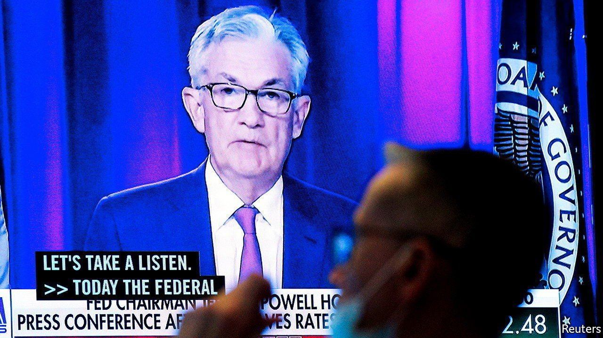
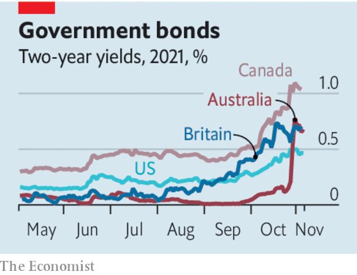

###### Markets and inflation

# Revolt of the bond traders 

##### The message from unruly fixed-income markets 

 

> Nov 6th 2021 

GLOBAL BOND markets are wakening from a long slumber. The Federal Reserve this week said it will wind down its vast bond-buying programme. At the same time, bond investors are reacting to higher inflation: across a group of 35 economies, five-year bond yields have risen by an average of 0.65 percentage points in the past three months. A shakeout is taking place not only in  but also in rich countries such as Australia and Britain. Sudden moves inevitably spark fears of market turmoil, along the lines of the “taper tantrum” in 2013. However, the bond shift taking place today is actually very different.

Before the pandemic interest rates across the world were low, reflecting dormant inflation. When the coronavirus struck almost two years ago, most central banks promised to keep their policy rates lower for longer to help the recovery. Many also agreed to buy bonds, reducing their yields.


The main reason for the sudden shift today is rising inflation. Among the 38 economies that are members of the OECD, a club of rich countries, inflation rose to an uncomfortable 4.6% year on year in September. Soaring energy and food prices are only part of the story: even if you strip those out, the figure was 3.2%, the highest in almost two decades.

For months central banks have said that high inflation is a blip caused by temporary constraints in supply. But the action in bond markets shows that investors reckon central banks are acting too slowly. Some monetary authorities have already tightened policy. Brazil announced a 1.5-percentage-point rate rise last week. Central banks in Canada and Australia have abandoned forecasts that said rates would stay low. As we write, the Bank of England is due to decide whether to raise rates. Some policymakers are standing firm: Christine Lagarde, the boss of the European Central Bank, has insisted that it is “very unlikely” to raise interest rates next year.

 


The spectre of central banks diverging from markets, and of consequent swings in market interest rates, will unsettle those with memories of 2013, when the Fed clumsily revealed its unexpected intention to begin scaling back its programme of bond purchases. The resulting global mini-panic dented growth and clobbered some emerging economies, particularly those with big dollar debts.

Yet this is not 2013. One difference is that the shift in bond markets is more nuanced. The increase so far in nominal five-year government-bond yields in America, for example, is less than half what it was eight years ago. Real bond yields, after accounting for expected inflation, are minus 1%, still within spitting distance of record lows. That will support easy conditions in the real economy. And even as shorter-term government-bond yields rise, there has been much less of a move in longer-term bonds.

The other difference today is the absence of financial panic. A rising cost of debt can cause defaults and capital flight. But many emerging economies have healthy foreign-exchange reserves, making them resilient. Equity markets show no sign of distress—share prices hit a record high this week. Shares in banks are up by 28% this year, because gradually rising interest rates can boost their profits. And bond markets remain open for business. In October emerging markets outside China issued near-record levels of corporate and sovereign debt.

No cause for alarm, then. Markets are betting that central banks need to bring interest-rate rises forward, not that they will lose control of inflation. Still, it is worth bearing in mind the extraordinarily difficult task that central banks face. During the unpredictable tail end of a pandemic, they must try to normalise ultra-loose monetary policy amid sky-high asset prices, heavy debt levels and above-target inflation. Taper tantrum 2.0 is not yet under way. But don’t rule out a bigger bond brawl. ■

