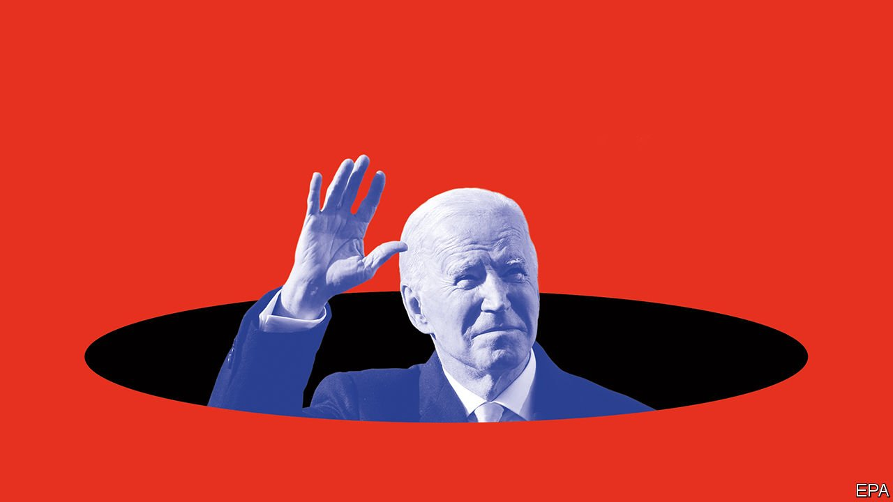

###### One year on

# The calamity facing Joe Biden and the Democrats 

##### The president needs to distance himself from his party’s left fringe 

 

> Nov 6th 2021 

TWO OF THE better books on the job invented for George Washington share a title: “The Impossible Presidency”. Even the most capable presidents are doomed to fail, writes Jeremi Suri in the more recent of them: “Limiting the failure and achieving some good along the way—that is the best we can expect.”

Even by these gloomy standards, Joe Biden is foundering. Having received more votes than any candidate in history, he has seen his approval ratings collapse. At this point in a first term only Donald Trump was more unpopular. The Democrats have  the three top statewide offices in Virginia, which Mr Biden won by ten percentage points a year ago. This augurs poorly for next year’s mid-terms: his party will probably lose its congressional majorities.


Democrats in Congress are riven by factional bickering. Earlier this year they passed a big stimulus, but the rest of Mr Biden’s agenda—a $1trn bipartisan infrastructure package and a social-spending bill worth about $1.7trn over ten years—has stalled. If passed, the legislation will almost certainly include more money for infrastructure, a poverty-cutting child tax credit, funding for pre-school, a reduction in the cost of prescription drugs and a clean-energy tax credit which will encourage private investment in new generating capacity. This spending is likely to be funded by harmful tax changes, but voters may not care.

Indeed, their spirits may lift next year. Covid-19 cases have fallen by half since September. If unemployment drops further, supply-chain blockages ease and inflation ebbs, life will get easier for those who feel that the . Yet, for Mr Biden, that is where the good news ends.

Some of his problems are inbuilt. American politics is subject to patterns more like the laws of physics than the chances of horse-racing. One is that the president’s party loses seats in the mid-terms. Democrats have only a four-seat cushion in the House of Representatives, so their majority is probably doomed. Whatever Mr Biden does, the legislative phase of his presidency is therefore likely to give way to the regulatory phase. Yet, with a conservative majority on the Supreme Court, he will find his room to remake the country with his pen and phone curtailed.

Beyond next year, the Democrats’ prospects are even bleaker. Their unpopularity with non-college-educated whites costs them large tracts of the country outside cities and suburbs. To win the electoral college, the House of Representatives and the Senate they need a greater share of the raw vote than any party in history. Winning under these conditions, while simultaneously repairing national institutions and making progress on America’s problems, from public health to climate to social mobility, is a task for a politician of superhuman talents.

Mr Biden is not that guy. He has dealt admirably with personal misfortune and by most accounts is kind and decent. However, there is a reason why winning the presidency took him more than 30 years of trying. Democratic primary voters picked him not for inspiration, but largely as a defensive measure to block the progressives’ champion, Bernie Sanders.

Mr Biden campaigned on his competence, centrism, experience in foreign policy and a rejection of nerve-jangling Trumpism. But the withdrawal from Afghanistan was a debacle, he has governed to the left and the culture wars rage as fiercely as ever. The fact that no voters seem to have a clue what is in the infrastructure and social-spending bills is partly his fault. Child poverty has fallen by a quarter, thanks to legislation passed by Congress on his watch. This would be news even to most Democrats.

The problem is not just Mr Biden, though. His party’s left-wing, college-educated activist class consistently assumes that the electorate holds the same attitudes on race and on the role of the government as they do. Virginia is the latest example of this folly. America is a young, diverse country. The median age is under 40 and just 60% of the country identifies as white. The electorate is different. Taking an average of the 2018 and 2014 mid-terms as a guide, 75% of voters will be white and their median age next year will be 53. Democrats have a huge lead among the college-educated. But only 36% of Americans completed four-year degrees. That is far too small a base, especially as Republicans make inroads with non-white voters.

When Richard Nixon won in 1972 the new-left Democrats were painted as the party of “acid, amnesty and abortion”. The new, new left is just as easily caricatured as the party of white guilt and cancel culture, of people who say “birthing person” instead of “mother” and want to set the FBI on parents who have the gall to criticise teachers.

These noisy activists, and the small number of radicals they elect from safe Democratic seats, make it hard for the party to win in more moderate areas, even though they do not represent the majority of the party’s voters. Immigration activists are camped outside the vice-president’s residence complaining that Mr Biden has not changed Mr Trump’s border policies. By contrast, Democratic voters in Minneapolis, where George Floyd was murdered, have just voted against replacing the police department with a department of public safety.

Countering the Republican message that he carries out the wishes of the radical left will require Mr Biden to be much tougher on his party’s fringe. That may mean doing things they hate. He could campaign to hire more police officers in cities where the murder rate has spiked (“refund the police”, perhaps), or pick fights with the school board in San Francisco, which thinks that Abraham Lincoln is a symbol of white supremacy.

If Democrats believe that grubby attempts to win power are beneath them, then they should look at what is happening in the Republican Party. Glenn Youngkin’s election as governor of Virginia suggests that Republicans can win in swing states, even with Mr Trump as head of the party, by being cheerful, Reaganesque culture warriors who know how to throw red meat to the base. In a two-candidate race for the presidency, both nearly always have a real chance of winning. Mr Biden and his party need to think hard about what they are prepared to do to limit the risk of another four years of Mr Trump. Because that is where a failed Biden presidency could well lead.

For more coverage of Joe Biden’s presidency, visit our dedicated 

