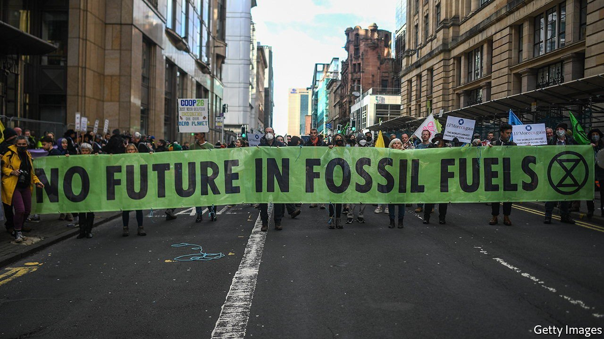
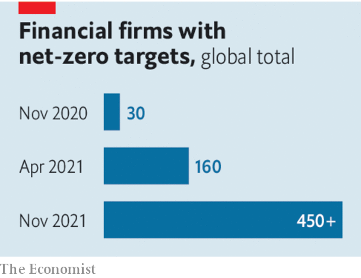

###### Climate change and investing

# The uses and abuses of green finance 

##### Why the net-zero pledges of financial firms won’t save the world 

 

> Nov 4th 2021 

ALAS, THE COP26 summit in Glasgow is shaping up to be a disappointment. The hope that emerging markets, which belch out much of the world’s greenhouse gases, would announce ambitious proposals is being dashed. The plans of China, India and Brazil all underwhelm. There is no sign this will be the COP that kills coal, as Britain, the host, wanted. World leaders have still not agreed to stop subsidising fossil fuels.

But one area where enthusiasm is growing is climate finance. Financial institutions representing nearly $9trn in assets  to uproot deforestation from their investment portfolios. The most striking announcement has come from the Glasgow Financial Alliance for Net Zero (GFANZ), a coalition co-chaired by Mark Carney, a former governor of the Bank of England. Its members, which include asset owners, asset managers, banks and insurers, hold about $130trn of assets. They will try to cut the emissions from their lending and investing to net zero by 2050. Can the financial industry really save the world?


In principle, it has a huge role to play. Shifting the economy from fossil fuels to clean sources of energy requires a vast reallocation of capital. By 2030, around $4trn of investment in clean energy will be needed each year, a tripling of current levels. Spending on fossil fuels must decline. In an ideal world the profit incentive of institutional investors would be aligned with reducing emissions, and these owners and financiers would control the global assets that create emissions. Asset owners would have both the motive and the means to reinvent the economy.

 


The reality of green investing falls short of this ideal. The first problem is coverage. The Economist estimates that listed firms which are not state-controlled account for only 14-32% of the world’s emissions. State-controlled companies, such as Coal India or Saudi Aramco, the world’s biggest oil producer, are a big part of the problem and they do not operate under the sway of institutional fund managers and private-sector bankers.

A second issue is measurement. There is as yet no way to accurately assess the carbon footprint of a portfolio without double counting. Emissions from a barrel of oil could appear in the carbon accounts of the firms that are drilling, refining and burning the stuff. Methodologies behind attributing emissions to financial flows are even sketchier. How should shareholders, lenders and insurers divvy up the emissions from a coal-fired power plant, for instance?

The third problem is incentives. Private financial firms aim to maximise risk-adjusted profits for their clients and owners. This is not well-aligned with cutting carbon. The easiest way to cut the carbon footprint of a diversified portfolio is to sell the part of it invested in dirty assets and put the proceeds in firms that never emitted much, such as, say, Facebook. Together, the five biggest American tech firms have a carbon intensity (emissions per unit of sales) of about 3% of the S&amp;P500 average.

Heavily polluting firms or assets will often find new owners. If you can brush off the stigma, it can be profitable to hold assets that can legally generate untaxed externalities—in this case pollution. As shareholders urge oil majors to clean up, the oilfields they sell are being bought by private-equity firms and hedge funds, away from the public eye. Pledges alone do not alter the fact that firms have little reason to invest trillions in green technologies that still have mediocre risk-adjusted returns.

What should be done? Fine-tuning can help. Measurement should be improved. The EU is rolling out mandatory carbon reporting for businesses; America is considering it. Some accounting bodies want to standardise how climate measures are disclosed. Asset owners, such as pension funds, should hold on to their investments in polluting firms and use them to help bring about change. Institutional investors also need to build up their venture-capital arms to finance new technologies, such as .

Pledges like GFANZ are good as far as they go, but the world needs a widespread price on carbon if finance is to work wonders. That would target all firms, not just those controlled by some institutional investors. The urge to avoid the tax would supercharge efforts to count emissions. Firms and governments would have an incentive to grapple with questions of who is polluting and who should pay. Crucially, a carbon price would align the profit incentive with the goal of reducing greenhouse gases. The job of the financial system would then be to amplify the signal sent by the price of carbon. That combination would be a powerful engine for changing how economies work. ■

For the latest from COP26 see our . For more coverage of climate change, register for , our fortnightly newsletter, or visit our 

An early version of this article was published online on November 3rd 2021

