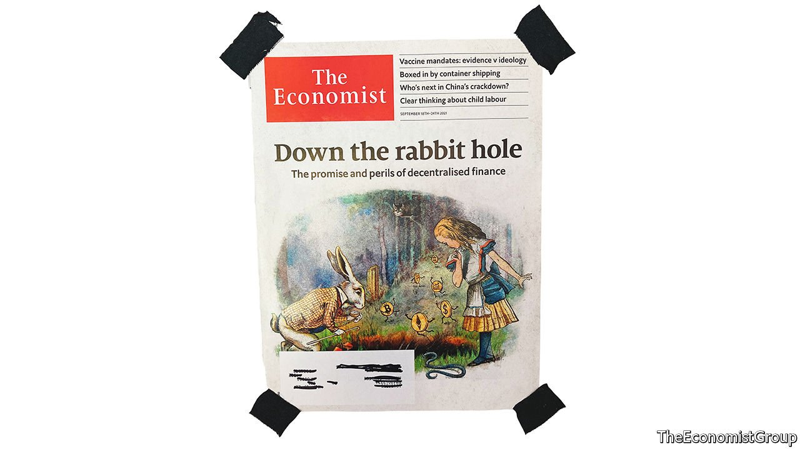

###### On Dave Chappelle, Spain, lorry drivers, carbon taxes, trees, our NFT auction

# Letters to the editor 

##### A selection of correspondence 

 

> Nov 6th 2021 


A comedy of manners

It was unsurprising to watch Dave Chappelle prod the boundaries of American propriety in his latest special on Netflix (, October 16th). Flirting with inflammatory rhetoric is the hallmark of his work. Thus his special, “The Closer”, is peppered with the usual jokes lobbed at African-Americans, Chinese and Jews and, mostly these days, trans people. What was surprising was his support for “team TERF”, a pejorative term applying to those who argue that trans women are fundamentally not women. Some would call this gender realism. But to many trans people, to be “trans-exclusionary” is to deny their right to be themselves, the very right to exist.


Declaring oneself to be a trans-exclusive feminist is surely just a different type of the “group politics” that Lexington describes as “zero-sum and exclusionary”. And it was clear who was being excluded from Mr Chappelle’s compassion. There was no punchline. If he was being sarcastic, the point was lost. Standing ovations don’t make it good, or right, or funny.

Once upon a time, yet not that long ago, a popular position on homosexuality was that same-sex attraction was biologically deviant, domestically pernicious and deserved to be derided. Discrimination against gays isn’t extinct, but thankfully the culture has changed.

JEDD HORVATH

Victoria, Canada

As the parent of a trans young adult, and seeing first-hand the challenge and joy of watching someone I love becoming more and more truly themselves, I watched “The Closer” with a mixture of understanding and dismay. I applauded Mr Chappelle’s emotional story of Daphne Dorman, a trans woman, and his friendship with her. But Sir Terry Pratchett, a more thoughtful and empathetic social observer, got it right when he said, “Satire is meant to ridicule power. If you are laughing at people who are hurting, it’s not satire, it’s bullying.”

SARAH MURPHY

Hillsborough, California

I appreciated Lexington’s take on Mr Chappelle. As a liberal, socially progressive gay person, I have been impressed by The Economist’s clear-headed analysis of topics that are too hot to touch in most other media, such as transgender rights versus women’s rights and the rise of the “illiberal left”. Mr Chappelle’s new show did not receive good reviews, which is surprising because, as the column pointed out, the woke left’s take on transgender issues is a fringe opinion. It makes one wonder why these reviewers felt obliged to pander to this vocal fringe.

JAMES JIANG

New York

 


Spain’s right wing

Not once in your entire article on Isabel Díaz Ayuso (“”, October 23rd) did you mention that she could not have become president of the Madrid region without the support of Vox, a far-right party that is anti-feminist and nostalgic for Franco. Ms Ayuso can’t pass a budget or any of her initiatives without convincing Vox to lend her its votes. She has expressed her comfort with Vox many times and adopted its rhetoric.

COLTON WALWORTH

Naperville, Illinois


Kings of the road

I invite anyone on the staff of The Economist to come to my company and learn to drive a heavy-goods vehicle (“”, October 9th). We may not ask for people with lots of letters after their name or fancy degrees, but the job of being an HGV driver is a lifelong professional learning experience, requiring practical skills, strength of character, emotional intelligence and years of dedicated service. The task of piloting a fully laden 44-tonne HGV on Britain’s roads comes with a huge responsibility for personal and public safety. A momentary slip in concentration can have fatal consequences. Drivers are accountable for every minute of their working day under an overbearing system of regulation and compliance.

I wonder how many of the unquestionably skilled writers at your paper could pass the test as easily as implied by your article?

CHARLES DOWNIE

Managing director

Bacton Transport Services

Woolpit, Suffolk

 


Voters v greens

Ordinary consumers were mostly left out of analysis of introducing a carbon tax to pay for emissions (October 9th). Looking at the negative reaction among consumers to higher fuel prices in Europe and North America I wonder how much support there will be for carbon taxes as they move from a policy concept to pocketbook reality. Consumers are also voters. How will they react when carbon taxes make it harder to afford to travel and enjoy many other things that we take for granted today?

Schumpeter believes consumers will adapt their behaviour. But governments are doing nothing to educate and prepare them for these future changes. I would expect to see a lot of questioning and challenges to carbon taxes, whatever the merits of such a policy in reducing emissions.

ROD DOBSON

Oakville, Canada

 


Tree surgery

“” (October 9th) reported on how the global trade in trees is spreading tree diseases in Britain. The attention in Britain has rightly focused on the threat that infected nursery stock poses to forest biosecurity. In fact, the treedemic is a global public-good dilemma. Without collective action, it will imperil society’s best efforts to sequester carbon through forest conservation and initiatives to plant trillions of trees.

In America alone the annual biomass loss from treedemics easily matches what is lost to fire. Meanwhile, treedemics are poorly studied in the developing world, where more people depend directly on forest resources for their livelihoods and survival. Rules from the World Trade Organisation guard against economic protectionism but do not help shield forest ecosystems from treedemics. As new agreements emerge, scientists must ensure that they give teeth to climate action by empowering partners to protect forest biosecurity.

GEOFFREY WILLIAMS

International sentinel network co-ordinator

US Forest Service

Washington, DC

Your article leaves one feeling a special kind of grief for lost trees: “treef”

JULIAN HABER

Montreal

 


Split cover

I noticed that your auction of a non-fungible token for a recent cover raised $420,000 for charity (“How our NFT auction went”, October 30th). At considerably less expense, I have acquired my own NFT of The Economist’s rabbit-hole cover: a Non-Framed Tear-off.

DON SANCTON

Beaconsfield, Canada

