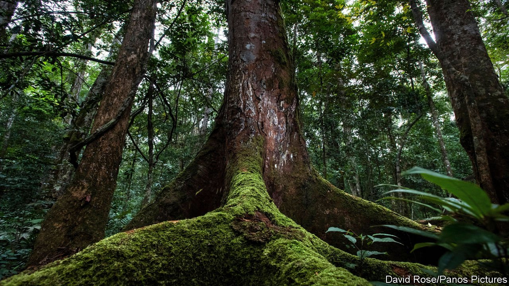
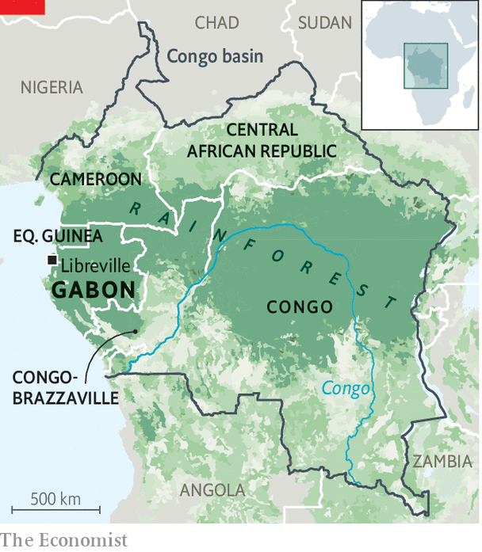

###### Money for old trees

# As leaders pledge to protect forests, Gabon suggests how 

##### Trees in the Congo basin provide a service the world should pay for 

 

> Nov 4th 2021 

GABON, A SMALL, family-run petrostate in west Africa, may seem a rather odd campaigner against global warming. Once Africa’s fifth-largest oil exporter, it profited from the world pumping more carbon dioxide into the atmosphere. Now, however, it hopes to benefit by helping the world to avoid overheating—and by encouraging rich countries to pay African ones to keep their forests standing. Its advocacy got a boost on November 2nd when the leaders of more than 100 countries pledged at the COP26 summit to end deforestation by 2030. To help that happen, rich countries promised to stump up billions of dollars.

At least 85% of Gabon, which lies on the equator at the edge of the Gulf of Guinea, is covered in steaming jungle. It is one of six countries that form the massive forest of the Congo basin—the world’s second-biggest tropical rainforest, after the Amazon—which sucks in carbon dioxide through photosynthesis and turns it into leaves and branches. (Cameroon, the Central African Republic, the two Congos and Equatorial Guinea are the other five.) Gabon is not the largest of this group of carbon sinks, but its president, Ali Bongo, is the most eager to offer to protect his country’s forests in exchange for cash from rich countries.


Gabon’s argument is simple. Large rainforests such as those in the Congo basin provide a service to the world by sucking millions of tonnes of carbon from the air. Since performing this service provides no income, there has been little incentive for poor countries to protect their forests when they could instead profit by chopping them down for timber or clearing them for farming.

 


The potential benefits are large. “The stock of carbon in the Congo basin adds up to six years of total global emissions,” says Lee White, Gabon’s environment minister, adding that Gabon alone absorbs the equivalent of one-third of France’s carbon emissions each year. Although Gabon emits only around 25m tonnes of carbon a year, it sequesters about 140m tonnes, he reckons. Yet the six countries in the Congo basin used to suck far more carbon from the air than they do now. The Democratic Republic of Congo, which has the largest expanse of jungle of the six, is losing 500,000 hectares of it a year through deforestation. It will need some incentive to stop the chop. And countries such as Gabon, which have been protecting their forests, should be rewarded for having done so, argues Mr White.

The consequences of not doing so go beyond emissions. Mr White says the forests cause rain to fall across the Ethiopian highlands, the Nile valley and the southern rim of the Sahel. If these places dry up, waves of hungry people may spread across Africa, making the continent more prone to turmoil. Many will also head to Europe.

The deal struck at COP included a pledge by 12 countries to provide $12bn in public funding to protect and restore forests. The countries, which include America, Germany, Japan and Britain, hope that will also open the taps to private funding. Quite how this money will be spent is not yet clear. But several ideas are gaining ground.

Eats, shoots and LEAFs

One is to pay countries that can show they have reduced emissions by preserving forests. The LEAF Coalition, a partnership of governments and big firms, has raised $1bn for this purpose. Another is that countries or companies may sell “green bonds” to finance climate-related projects. Investors keen to look green may pay a premium for these, allowing issuers to borrow at concessionary rates. “If you stop deforestation, you should be compensated for forgoing other forms of economic development,” says Andrew Mitchell, a climate scientist who founded the Natural Capital Finance Alliance. “Forests should be worth more alive than dead.”

It is not just governments that could raise money using green bonds, but also private firms such as the African Conservation Development Group, a Mauritius-registered company led by a South African, Alan Bernstein, that wants to mix virtue with profit, and help finance its efforts by selling $300m worth of green bonds to companies wishing to offset their own carbon emissions. It has bought a huge concession at Grande Mayumba, on Gabon’s south-west coast, investing $200m in sugar, rubber, fishing, forestry, cattle-ranching, and—for the very rich—eco-tourism.

Mr Mitchell is confident that African green bonds will eventually take off. But for the moment markets are still wary of buying any sort of African bond, let alone newfangled green ones. One worry is politics, as Gabon’s example illustrates. If investors are to pay more for green bonds financing forests, they would have to be certain that the carbon absorbed within the trees would be contained there for many years. Many may wonder what might happen if, for example, Mr Bongo’s regime in Gabon were to fall?

The question is far from academic. The Bongo family has run Gabon as a patronage-ridden fief for 54 years; no one pretends it is a democracy. At its most recent election, in 2016, it was obvious that the main challenger, Jean Ping, had actually won. Moreover, Mr Bongo suffered a serious stroke three years ago and may not be well enough to run again. Should he die, it is unclear if his Eton-educated, half-French son Noureddin, not yet 30, would seek to replace him, presumably using the regime’s usual tricks.

Without the backing of Mr Bongo, it may not be certain that Mr White would be able to continue to protect the forest. As it is, his position is somewhat improbable. A 56-year-old white Briton, he is an expert on biodiversity, gorillas and forest elephants. For nearly ten years he ran Gabon’s national parks, until two years ago, when an illegal-logging scandal was exposed over the illicit export of kevazingo, a reddish hardwood. In the fallout the president fired his vice-president and environment minister, and replaced the latter with Mr White.

He has won widespread admiration for promoting tree-hugging and animal-coddling in Gabon, thereby bolstering Mr Bongo’s claim to be Africa’s green champion. But his policy is far from popular with the many villagers whose crops are routinely trampled by unruly elephants. A standard cry among Gabonese tired of the ruling family runs, “Ali Bongo prefers elephants and trees to people.” It is a sentiment the leaders at the COP will need to get to grips with, if their plans to protect Africa’s forests are to come to fruition. ■

For the latest from COP26 see our . For more coverage of climate change, register for , our fortnightly newsletter, or visit our 

