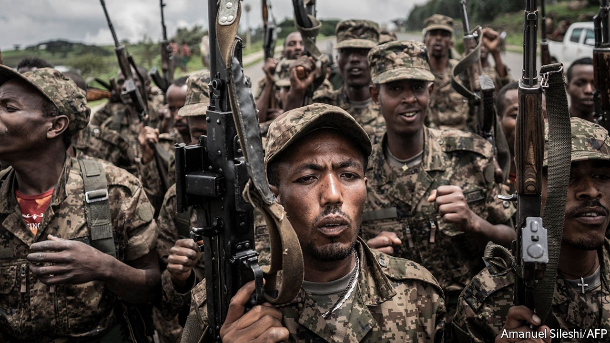
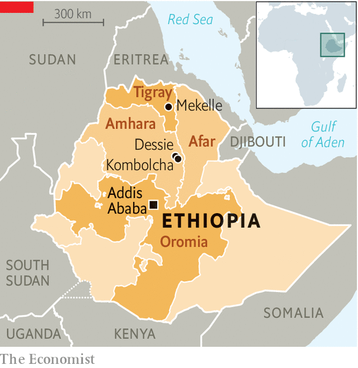

###### The battle for Addis

# Ethiopia’s capital is under threat 

##### Tigray’s rebels are on a roll 

 

> Nov 4th 2021 

FEW COULD have imagined it would come to this. When the civil war began almost a year ago to the day, Abiy Ahmed, Ethiopia’s prime minister, promised a swift military operation to bring to heel the Tigrayan People’s Liberation Front (TPLF), the ruling party of the rebellious Tigray region. The goal, he said, was to bring its leaders to justice for attacking a base that housed federal troops. In less than a month federal Ethiopian forces, backed by paramilitaries from the Amhara region as well as troops from Eritrea, to the north, had captured almost all of Tigray, including Mekelle, its capital. TPLF leaders disappeared into the mountains. Abiy declared victory.

Since then the TPLF has staged such a dramatic comeback that it may now be poised to launch an assault on Addis Ababa, the Ethiopian capital and seat of the African Union. The TPLF’s leaders, who controlled the central government for almost 30 years until they were ousted after massive protests ushered Abiy into power in 2018, claim they are advancing south at a speed reminiscent of the last time they captured the city, as a battle-hardened band of guerrillas three decades ago.


As panic mounted on November 2nd, Abiy declared a nationwide state of emergency and urged ordinary citizens to prepare to fight to defend the city, stirring fears that the capital of Africa’s second-most-populous country could turn into a battleground. America advised its citizens in Ethiopia to pack their bags.

Whether the rebels are indeed capable of advancing that far is unclear. In recent days they have claimed control of Dessie and Kombolcha in Amhara, both strategically important towns, but they are still more than 250km (156 miles) from the capital. The TPLF also says its forces are marching east into the Afar region in what looks like a bid to control the road-and-rail link to Djibouti.

 


Meanwhile another rebel group, the Oromo Liberation Army (OLA), says it has joined forces with the Tigrayans and is preparing to cut the roads into the capital. The federal government has not acknowledged any of this. Communication blackouts in much of the north make it hard to assess competing claims.

What is not in doubt is that the federal army is on the back foot. On November 1st, in a tacit admission that its control of the town was shaky, the government accused Tigrayan forces of massacring a hundred young men in Kombolcha. A day earlier the regional government in Amhara imposed a curfew and shut government offices, saying that all state resources, including government vehicles, should be redirected to the war effort. In Addis Ababa authorities ordered residents to register their guns and organise by neighbourhoods.

Recriminations are already flying. Abiy has alleged that foreign mercenaries were fighting alongside the TPLF in Dessie. Others accuse domestic “traitors” of sharing battlefield intelligence with the enemy. Dawit Mehari, an Amhara activist, says disillusioned Amhara are beginning to point the finger at the federal government itself. “Some think that an interest group inside the government actually wants the national defence force to fail,” he says.

Fearing that ethnic violence could spin out of control, America has urged the rebels to halt their advance. “We oppose any TPLF move to Addis or any TPLF move to besiege Addis,” said Jeffrey Feltman, America’s special envoy for the Horn of Africa. Tigrayans in Addis Ababa are being rounded up. “People are being kidnapped on the street,” frets a part-Tigrayan resident. Some have asked foreign embassies for shelter. Yet many observers also worry about conflict between Oromos and Amharas, the two most populous groups, which could easily erupt if the OLA attacks Addis Ababa. Both groups have competing claims of ownership over the city. “There is a real, palpable sense of fear,” says a Western diplomat in the capital.

Abiy’s emergency decree provides for sweeping powers of arrest as well as draconian restrictions on free assembly, movement and on any media which the government deems to back the TPLF. It also appears to lay the ground for military conscription. For weeks the Amhara regional government has been sending busloads of young men, some armed with machetes and knives, into battle. An adviser to the prime minister told the state broadcaster on October 31st that mass mobilisation would be needed to defeat the rebels.

Foreign governments are scrambling for a peace plan. On November 2nd America announced that it would freeze duty-free access for Ethiopian goods under the African Growth and Opportunity Act. It is also expected to slap sanctions on officials if the warring parties do not negotiate.

Yet such diplomacy may already be too late. Abiy’s government is denouncing calls for talks as an affront to its sovereignty. And as Tigrayan forces have advanced, their appetite for negotiations has waned, too. “What kind of negotiations can there be with such a criminal government?” Tsadkan Gebretensae, one of the TPLF’s top commanders, asked in a recent interview with a Tigrayan broadcaster.

Then there is the problem of the Eritrean forces, which joined Abiy’s troops shortly after the war broke out a year ago. Eritrea’s president, Issaias Afwerki, is a bitter foe of the TPLF. Between 1998 and 2000 the newly independent Eritrea fought a bloody border war against Ethiopia, then dominated by the TPLF, that cost perhaps 100,000 lives. Since the TPLF recaptured most of Tigray in June, the Eritreans have been quiet, seeming to bide their time for a final showdown. “A peaceful settlement is unacceptable for Issaias, because it would legitimise the TPLF,” says a seasoned Ethiopian analyst. So the battle for Addis Ababa inches nearer by the day. ■

An early version of this article was published online on November 3rd 2021

