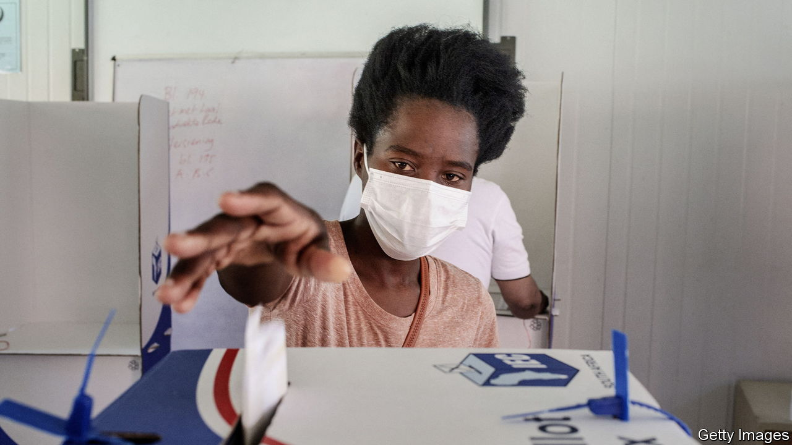
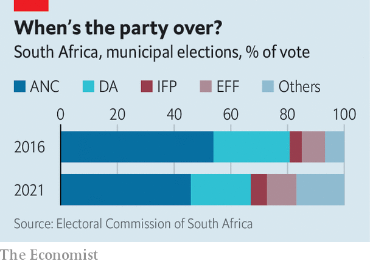

###### Hegemon no more

# South Africa is slowly souring on its ruling party 

##### Local elections suggest the ANC will need coalitions to stay in charge 

 

> Nov 6th 2021 

JACOB ZUMA, South Africa’s former president, was fond of saying that the African National Congress (ANC) would rule until Jesus came back. Given his party’s performance in local elections on November 1st, “Christ alive!” would be an understandable reaction. The ANC won about 46% of the vote—the first time it has dipped under 50% in a nationwide ballot since apartheid ended in 1994. The results suggest that if there is to be a second coming, it is unlikely to be by the party of Nelson Mandela.

The ANC’s slide has two causes. First, black South Africans, who are 80% of the population and constitute the ANC’s base, were more likely to stay at home than minorities, who tend to support other parties. Turnout in townships, which are nearly all black, was 40-45%, estimates Dawie Scholtz, a psephologist. By contrast 55-65% of voters in suburbs, which are more mixed, went to the polls. The second is that more of the black South Africans who voted chose parties other than the ANC.


Most South Africans feel that the ANC is no longer a party that will improve their lot. Polls show that jobs are the most pressing issue. More than a third of the overall labour force—and two-fifths of the black one—is unemployed. Real GDP per person is lower than it was 15 years ago. Food prices are around 10% higher than a year ago. Corruption, endemic under Mr Zuma, endures despite the better intentions of his successor, Cyril Ramaphosa. Public services such as electricity, water, schools and hospitals are crumbling.

A fragmented politics is replacing ANC hegemony. The official opposition, the Democratic Alliance (DA), won a little more than 21% of the vote, a higher share than some in the party feared, but down from its high of 27% in the previous local elections in 2016. It again struggled to woo blacks, many of whom distrust what they see as a “white party”. At the same time it shed some long-standing voters, especially Afrikaners (whites of mainly Dutch descent) and “coloured” (mixed-race) South Africans. Some in these groups voted for identity-based parties such as the Freedom Front Plus, a right-wing Afrikaner outfit. If Mr Ramaphosa’s faction in the ANC and the DA constitute the centre of South African politics, it is not holding.

 


Other identity-based parties and populists also made gains. In parts of KwaZulu-Natal, home to many members of South Africa’s largest ethnic group, the Zulus, the ANC lost ground to the Inkatha Freedom Party, a Zulu nationalist group. Some of this shift partly reflected events in July, when mass unrest broke out after the imprisonment of Mr Zuma, a Zulu, for defying a court order—riots that Mr Ramaphosa denounced as “acts of violence based on ethnic mobilisation”. Mr Zuma was soon released on medical parole, though he certainly seemed sprightly when he turned up to vote with one of his wives.

Elsewhere, including in the city of Durban, the hard-left Economic Freedom Fighters (EFF) under the fiery Julius Malema picked up support. In Johannesburg the ActionSA party, a right-wing populist outfit founded only last year by Herman Mashaba, the former DA mayor of the city, won around 16% of the vote.

All of which means that, under South Africa’s system of proportional representation, coalitions will be required to govern more towns and cities. As in 2016, there was no outright winner in Johannesburg, Port Elizabeth or Pretoria. The same is now true of Durban, once an ANC stronghold. The ANC is increasingly a rural party. Although it usually does better in general elections, these results suggest that there could be a coalition at the national level after the next one, in 2024.

That could mean a pragmatic, moderate alliance between Mr Ramaphosa’s ANC and the DA. But not necessarily. There is a chance Mr Ramaphosa may not make the ballot. His many opponents within the ANC may try to blame him for this week’s poor results, although polls show he is more popular than his party. And his party may prefer to work with smaller rivals like the EFF rather than the DA. If it does, South Africa will be dragged to the investor-scaring populist left.

Southern Africa’s ruling parties can seem immovable. Angola, Botswana, Mozambique, Namibia and Zimbabwe are all governed by the same parties that took over after white rule ended. But not all are popular; some rig elections to stay in office. In Malawi and Zambia voters have recently voted opposition parties into power. The ANC sees itself as exceptional because it negotiated an end to apartheid. But these results show that if it fails to improve people’s lives, its hegemony will end. ■

