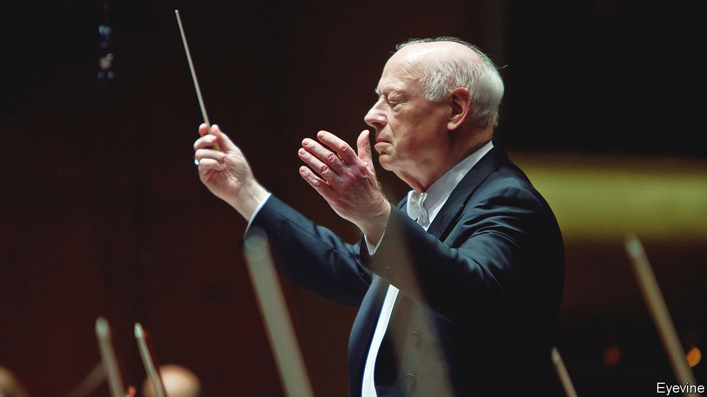

###### Music, not words

# Bernard Haitink believed that genius should speak for itself 

##### The great conductor died on October 21st, aged 92 

 

> Nov 6th 2021 

THE WORDS “great conductor” and “humility” are not often found together. Almost inevitably, given the podium, the magic baton, the formal dress and the commanding drama of the job, conductors abound with ego. Bernard Haitink had no time for that. He was a man of few gestures and even fewer words, humbly performing the mysterious task that had become his life.

On the podium he did nothing showy: a lift of a finger, a meaningful glance, a vestige of a smile. His musical personality, he thought, said everything necessary, and orchestras round Europe and America—especially the Amsterdam Royal Concertgebouw, where he was chief conductor for 27 years, and the London Philharmonic (LPO), where he stayed for 12—learned to read it perfectly, mood for mood. In rehearsals and offstage he said as little as possible, not wanting words to get in the way, and equally afraid of saying some stupid thing. For the same reason he kept out of music politics, unless seriously provoked.


When he did speak, it was often to put himself down. He played the violin as a child, but “badly”. At school he was a “lazy pig”, just not interested. He did not impress the Amsterdam conservatoire and scraped into the Radio Philharmonic Orchestra, in the back desk of the second violins. Sheer luck got him into conducting, when he was asked to fill in for the Cherubini Requiem, but he had no tools for that work at all. When he went to the Concertgebouw in 1961 he was “totally chaotic”, far too young, at 34, to conduct it. His first attempts at opera were “near-disasters”. And so on.

Terribly, cripplingly shy as he was, this was a way of closing down a subject. It also helped keep his feet on the ground, as critics increasingly marvelled at the beauty, pace and clarity of his work. There was no better guide, they said, to the architecture of a Mahler symphony or the spiritual complexities of Bruckner, no better painter of the sea-and-sky colours of Debussy; some of his interpretations approached the supernatural. How was it done? He did not know. As he saw it, he could always be better.

With orchestras he was a team-player; he had been a lowly back-desker, after all. The orchestra and himself were a community, a family, and he took ideas from them as much as vice versa. He gave them freedom to perform the music as they felt it, with only the smallest nudges: “I hope you agree,” he would say, or “If you don’t mind.” As in any family, there were rows; eventually he resigned from both his long-term orchestras and (until he quickly relented) from the Royal Opera House at Covent Garden, where he worked from 1987 to 2002. But the rows were usually with management or government, over funding and cuts, and every time he stood with his players as one of them. At a desperate point in 1998 he appealed to the audience at “Götterdämmerung” to save Covent Garden, and it was saved. Just a few words, but from him they seemed to work. Or maybe the music did it.

When it came to programmes, he did not impose himself. His favourite symphonic repertoire was heavy on Mozart, Beethoven and 19th-century romantics, but also on Stravinsky and Britten, and he championed contemporaries. Opera productions often struck him as odd, but he raised objections only once, when Wagner’s “Ring” at Covent Garden featured Rhine maidens in latex fat-suits and Wotan and Fricka in a battered limousine. He endured it by closing his eyes to live in the music. About opera, too, he had plenty of doubts when in 1978, with limited experience, he was hired for Glyndebourne with the LPO. But in the end it did wonders for him. He learned to be more dramatic, just a little, and could lose his ego even more when he was in the pit, almost unseen, collaborating with sopranos and set-designers and all the rest.

He could focus entirely on the music then, at the service of the genius who had produced it. Both were impenetrable mysteries. Wagner could be horrible, Beethoven irascible, Mozart loved filthy jokes; and then they wrote these sublime works, inexplicably. He was their simple conduit to the world, channelling each composer’s dream like a beautiful flower that unfolded itself. The shape of the piece was the most important thing, the onward drive and flow, knowing just where he was going. Yet the delicate inner discoveries were endless. No matter how often he had performed a piece he would buy a fresh score for each season, and start again.

When he talked about music, fear frequently came into it. This was not just stage-fright, which everyone had. He feared he might be inadequate to the task he had taken on. Almost to the end he shied away from Bach, too great for him, with so much counterpoint and with such religious fervour, when he had none. How was it then that he had been drawn from the age of nine to Bruckner, with his intensely Catholic mysticism? He could not say.

Mysteries of this sort explained much of his humility. But he also lived with another strange and disturbing thought. In his first years of conducting he had been such a lucky young man, seeming to sleep-walk into international fame, not planning anything. There was a dark reason, however, for that. Growing up in Holland in the German occupation, he had seen his Jewish friends gradually disappear from class and Jewish players vanish from the Concertgebouw, where he already spent his leisure time. One day he went to see a young Jewish violinist play Beethoven’s “Kreutzer Sonata” at his house. It was wonderfully done. Then he was gone.

His own family had suffered, too: his father sent for three months to a concentration camp, everyone eating tulips in the Hongerwinter of 1944-45. Yet he was ashamed both of Dutch indifference to the Jews and of the post-liberation outbreaks of violent vengeance, a shame that fed his later conviction that he was not Dutch any more. And he felt that his life had prospered largely because more talented people had lost theirs.

On the podium he was ever-aware of hundreds of eyes on his back. It was the last place, you would think, for someone so shy. But he was there not simply to channel the music, though that was the main point. He was also bound to do his humble best to fill in for an assembly of ghosts. ■

