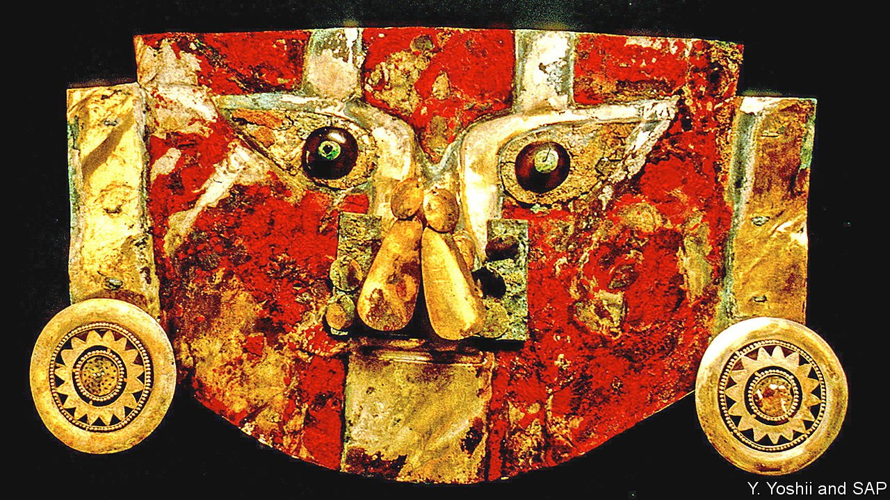

###### Funerary rituals

# A funeral mask painted with human blood 

##### Whether the donor was willing will forever remain unknown 

 

> Nov 4th 2021 

THIS FUNERAL mask, photographed by Yoshii Yutaka of the Sicán Archaeological Project, in Peru, was discovered 30 years ago, 800km to the north of Lima. The Sicán were a group who flourished around 500 years before the arrival, in the 1500s, of Europeans. The red paint adorning the mask is made of cinnabar, a compound of mercury and sulphur. But turning cinnabar into paint requires a binding agent—and in this case it must have been a good one, to keep the paint attached to the mask for so long. Luciana da Costa Carvalho of Oxford University therefore set out to discover what it was.

Initial mass spectroscopy suggested proteins were involved, but shed no light on which. A follow-up study, however, produced the astonishing suggestion that the binder in question was chimpanzee blood—astonishing because chimps are African, not American animals. Further investigation revealed the mistake. The blood was actually from chimps’ close relatives, Homo sapiens.


Human blood is sticky when it clots, and would certainly bind cinnabar to gold for a millennium—but so would that of many other species. This suggests human blood in particular was chosen for another, presumably ritual, reason. Being picked as the donor of this blood may well have been an honour, though that is impossible to tell. But given many pre-Columbian peoples’ proclivity for human sacrifice, rather than mere bloodletting, it might not have been an honour that was highly sought after.

An early version of this article was published online on November 3rd 2021

