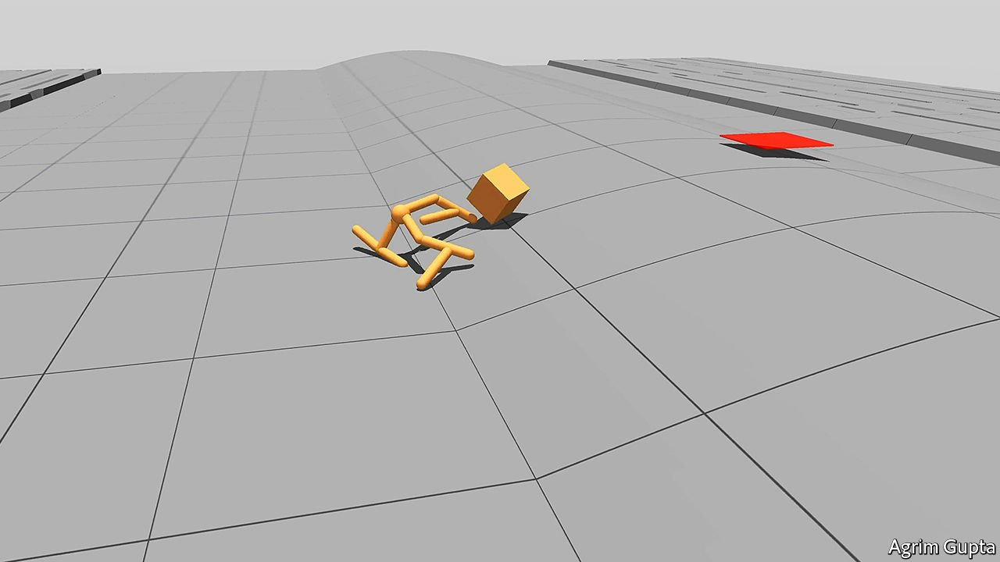

###### Unimals

# A novel way to optimise robots 

##### It harks back to a 19th-century idea about evolution 

 

> Nov 4th 2021 

IT MIGHT SOUND obvious that if you want to improve a robot’s software, you should improve its software. Agrim Gupta of Stanford University, however, begs to differ. He thinks you can also improve a robot’s software by improving its hardware—that is, by letting the hardware adapt itself to the software’s capabilities.

As they describe in Nature Communications, he and his colleagues have devised a way of testing this idea. In doing so, they have brought to robotics the principles of evolution by natural selection. They have also cast the spotlight on an evolutionary idea that dates from the 1890s, but which has hitherto proved hard to demonstrate.


There is a wrinkle. The team’s robots, which they dub “unimals”, are not things of metal and plastic. Rather, they are software entities that interact with a virtual environment in the way that metal-and-plastic devices might interact with a real one. Unimals are pretty simple, having spheres for heads and cylinders for limbs (see picture). The environments through which they roamed were also simple, and came in three varieties: flat arenas, arenas filled with hills, steps and rubble, and ones that had the complexities of the second sort, but with added props like cubes that needed to be moved around.

To begin with, the unimals were given a variety of randomly assigned shapes, but with identical software running each of them. That software was a piece of artificial intelligence called a deep evolutionary reinforcement learning algorithm, or DERL.

Newly created unimals started in a virtual boot camp, in which the DERL learned enough about the world to face the challenges to come. They were then entered into tournaments. In groups of four, Dr Gupta put them through tests of agility, stability and ability to manipulate objects. Each group’s winner was allowed to “breed” by spawning a daughter with one mutation (an extra limb for stability, perhaps, or extra rotation in a joint, for flexibility). This daughter was substituted for the oldest unimal in the pool, assigned to a new group of four, and the process repeated.

Unimals were withdrawn from the fray after ten generations of evolution, and Dr Gupta reckons about 4,000 varieties of them underwent training. The team were surprised by the diversity of shapes that evolved. Some had arms as well as legs. Others had only legs. There were bipeds, tripeds and quadrupeds. Some moved like lizards. Others resembled an octopus walking on land. Crucially, though, the researchers found that the most successful unimals learned tasks in half the time that their oldest ancestors had taken, and that those which evolved in the toughest arenas were the most successful of all.

In this evolution of unimals’ morphology to promote the ability to learn, Dr Gupta sees a version of something called the Baldwin effect. In 1896 James Baldwin, an American psychologist, argued that minds evolve to make optimal use of the morphologies of the bodies they find themselves in. What Dr Gupta has shown, though in software rather than in the real, biological world, is that the obverse can also be true—changes in body morphology can optimise the way minds (or, at least, DERLs) work. Even though he held the software constant from generation to generation, it became more efficient at learning as the unimals’ bodies evolved.

Whether that discovery can be turned to account in the way robots are developed remains to be seen. But it is certainly, in the jargon beloved of some businessfolk, an out-of-the-box idea. ■

An early version of this article was published online on November 3rd 2021

