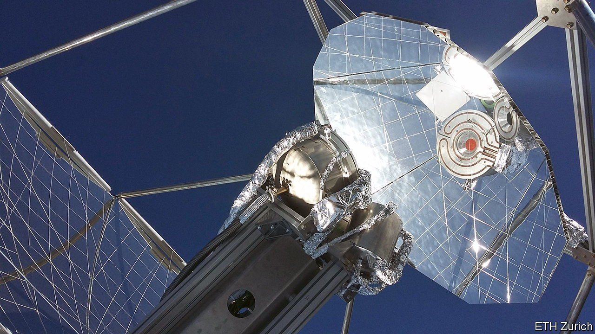

###### Green aviation

# Plucking aircraft fuel from thin air 

##### How to combine atmospheric CO2 and water to power aeroplanes 

 

> Nov 4th 2021 

MOST PEOPLE who think about such things agree that replacing fossil fuels with renewable electricity, either directly or indirectly, is the best way to decarbonise industry, transport and the heating and cooling of buildings. But there are some holdout areas where this is hard. . Aviation is another, because batteries are too heavy and hydrogen (which could be made using renewable electricity) too bulky to do the job easily. Hydrocarbon aviation fuels are thus likely to be around for a while.

But such fuels need not be fossil. They might be synthesised from the CO exhaust of various industrial processes. And a study just published in Nature, by Aldo Steinfeld of ETH Zurich, a technological university in Switzerland, and his colleagues, shows how they might literally be plucked from thin air.


Dr Steinfeld and his team devised and tested a system that, in essence, reimagines the natural process of photosynthesis. Plants take in atmospheric CO and water and, with sunlight providing the energy, turn those raw materials into organic molecules. And that is exactly what Dr Steinfeld has done.

The process has three stages. The first absorbs CO and water from the atmosphere using a so-called direct-air-capture device made by Climeworks, a spin-off of ETH founded by two of Dr Steinfeld’s students that made the news recently by opening a demonstration carbon-capture-and-storage system in Iceland. There, however, the CO is reacted with basalt rock to dispose of it. Dr Steinfeld’s system makes use of it.

The second stage is the clever bit. It employs concentrated sunlight to heat a material called cerium oxide which, when so heated, reacts with both CO and water. The reaction with CO creates carbon monoxide. The one with water creates hydrogen. In both cases the by-product is oxygen, which is vented into the atmosphere. But a mixture of carbon monoxide and hydrogen is a familiar one to industrial chemists. It is called syngas, and is widely used as a raw material to make other things.

The third part of the process is therefore to turn the syngas into organic molecules. For the hydrocarbons that make up aviation fuel an industrial chemist would normally turn to what is known as the Fischer-Tropsch process. For their demonstrator, the team chose another route, which led to methanol rather than hydrocarbons. But the general idea is the same.

The team’s demonstration rig, which they installed on the roof of ETH’s Machine Laboratory Building, had a typical yield of 32ml of pure methanol per seven-hour day—tiny, but a clear proof of principle. A back-of-the-envelope calculation suggests that substituting the world’s aviation-fuel market entirely in this way would need 45,000km of suitably insolated land. That sounds a lot, but is equivalent to about 0.5% of the area of the Sahara Desert.

Air-captured aviation fuel would certainly need its path to market smoothed by appropriate carbon taxes on the fossil variety, and possibly other measures. But Dr Steinfeld’s rig does seem to have demonstrated a credible and potentially scalable way to go about making the stuff.

For more coverage of climate change, register for , our fortnightly newsletter, or visit our 

An early version of this article was published online on November 3rd 2021

