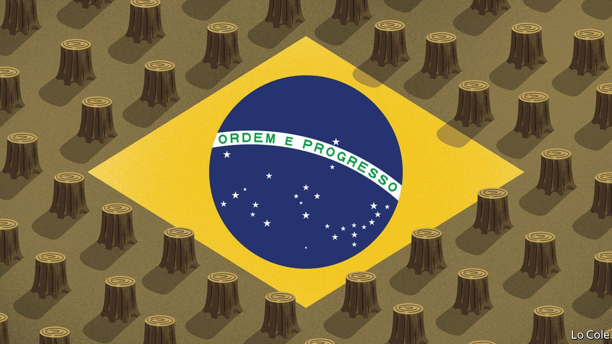
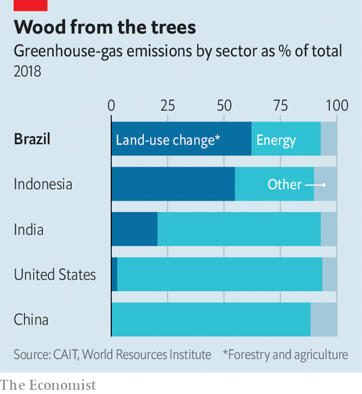

###### From hero to villain

# Brazil wants more from COP26 than it is willing to give 

##### The government’s green rhetoric in Glasgow clashes with inaction at home 

 

> Nov 6th 2021 

BRAZIL USED to be one of the main protagonists in global climate talks, its politicians and wonks proposing all sorts of new-fangled ways to boost greenery. No longer. This week Jair Bolsonaro, the beleaguered president, decided to eat gnocchi with distant relatives in northern Italy rather than attend COP26, the UN climate conference in Glasgow. “Everyone would throw stones at him,” explained Hamilton Mourão, the vice-president.

The country’s record on climate change is indeed dire. Since Mr Bolsonaro took office in 2019, the rate of deforestation is up by 45%. Brazil’s total greenhouse-gas emissions rose 9.5% last year, according to a study sponsored by the Climate Observatory, a network of 70 NGOs and think-tanks, even as emissions fell in the rest of the world. But whereas Mr Bolsonaro once seemed to relish his reputation as a pariah—backing out of hosting COP25 in 2019 and picking a fight with Emmanuel Macron, the French president—he now seems keen to try to improve his reputation. “I’m not as bad as people say,” he told Angela Merkel, the chancellor of Germany, when she approached him at a G20 dinner in Rome on October 30th, at which he was sitting alone. Brazil’s COP26 delegation hopes to convey the same message.


Last month, in an attempt to look greener, the government announced two climate-focused initiatives: a revamp of an existing plan to encourage low-carbon agriculture and a new green growth programme, which is meant to generate jobs in sustainable fields. In addition, on November 1st Joaquim Leite, the environment minister, said that Brazil would increase its target to cut emissions, to 50% by 2030 from their level in 2005, and bring forward the year by which it plans to reach net-zero emissions from 2060 to 2050, as many countries have done. According to Leonardo Cleaver, the top negotiator, Brazil will be “more flexible” on Article 6, a contentious clause of the 2015 Paris agreement that lays out rules for global carbon trading.

Environmentalists are not convinced. Brazil wants all of the benefits and none of the costs from COP26, says Caroline Prolo, a lawyer. Most of the government’s plans for meeting its targets are “vague promises that contain the word ‘green’”, says Stela Herschmann of the Climate Observatory. Last year Brazil’s formal UN pledge to cut emissions (known as a nationally determined contribution, or NDC) put the country among a tiny minority that not only failed to increase their ambition since the Paris agreement in 2015, but did the opposite. The CO baseline was revised upwards, but the pledge remained the same.

Part of the problem is that the government has a tendency to see itself as a victim. “Brazil is owed more than it is getting,” says Mr Cleaver. This stance was established well before Mr Bolsonaro took office. Like other developing countries it chides the rich world for falling short of its pledge, in 2009, of mobilising $100bn per year by 2020 to help poor countries cut emissions and adapt to climate change.

In its NDC last year, Brazil’s government also made previously promised emissions cuts conditional on receiving such payments (other countries have also done this). It wrote that it would need “at least $10bn per year” to reduce deforestation and that its “long-term strategy…will take into account financial transfers to be received”. The Climate Observatory called this “blackmail”.

Now, however, negotiators claim that Brazil’s commitments are “unconditional”. This softer stance may have to do with the absence of the strongest proponent of the “pay-up” strategy, the former environment minister Ricardo Salles, who resigned in June. Mr Cleaver has also signalled that Brazil might be willing to compromise on two thorny debates surrounding Article 6.

The first has to do with carbon credits generated according to the rules of the Kyoto summit in 1997. Brazil has billions of dollars-worth of these credits and believes they should be incorporated into a new international carbon market which Article 6 provides for. Rich countries are wary, as there is debate about whether the verification the Kyoto credits underwent reaches the standards of the Paris accord. Some did, but others are problematic (including ).

And under the Kyoto protocol only rich countries were required to cut their emissions, whereas poorer countries did not have to keep track. If credits Brazil sold abroad in the past are accepted in the new system, it will have to remove these cuts from its mitigation results in order to avoid double-counting. It has resisted this.

The second debate is about what happens when new carbon credits are sold by businesses in one country to businesses or governments in another. Brazil (or any country from which credits are sold) needs to make “corresponding adjustments” to its own mitigation tally in order to exclude these offsets. For the first time, Brazil has said that it would accept such adjustments—perhaps, some experts are speculating, in exchange for the acceptance of some Kyoto credits, maybe with certain criteria or during a transition period.

The Paris agreement contains the elegant if Utopian principle of “common but differentiated responsibilities”, the idea being that countries that historically emitted the most must do more to cut emissions. But Brazil’s chance to benefit from this principle is hindered by its failure to accept much responsibility at all. The government claims that because renewable sources (including hydroelectric dams) account for 45% of total energy use, four times the OECD average, Brazil “already qualifies as a low-carbon economy”. This is misleading. In contrast to other countries, industry and energy are responsible for only around half of Brazil’s emissions; the other half comes from deforestation.

 


If deforestation and farming are taken into account, its emissions look worse (see chart). It is the sixth-biggest emitter globally. In some ways, it should be easier for Brazil to cut emissions than it is for rich countries that have already started to use clean, cost-saving technology, says Carolina Genin of the World Resources Institute, a think-tank. For example, while wind power is now capable of providing nearly 20% of Brazil’s electricity, the country has yet to exploit its huge solar potential. But whereas most countries primarily need to change how they generate and use energy, Brazil needs to change how it uses land.

Mr Leite pledged that Brazil will end illegal deforestation by 2028. It is a worthy goal that seems, at present, utterly unattainable. The new programmes intended to help are rehashes of things that already existed; the Inter-ministerial Committee on Climate Change now has “and Green Growth” at the end. More promisingly, Brazil plans to hire 700 environmental field agents to replace the scores who quit during Mr Salles’s tenure. But like the 3,000 soldiers sent to put out fires in 2020 and 2021, they will struggle to stop slash-and-burn farming when the government all but grants slashers and burners impunity.

Meanwhile, Brazil’s argument about needing cash from the rich world is disingenuous, says Izabella Teixeira, a former environment minister. Germany and Norway paid $1.3bn into Brazil’s Amazon Fund and were poised to donate more before concerns about Mr Bolsonaro’s environmental apathy led them to freeze it.

In the absence of federal leadership, some states are creating their own climate policies, including subsidised loans for low-carbon farmers and concessions of public land for sustainable use. (Eleven governors are going to go to COP26.) Brazil’s Congress is debating a bill that would create a regulated carbon market, which is supported by much of the private sector.

But while Mr Bolsonaro remains in power, it seems unlikely that much will change. Neither he nor members of his inner circle seem to take the climate seriously. Progress may have to wait until after the election in 2022, which Mr Bolsonaro is likely to lose.■

For the latest from COP26 see our . For more coverage of climate change, register for , our fortnightly newsletter, or visit our 

