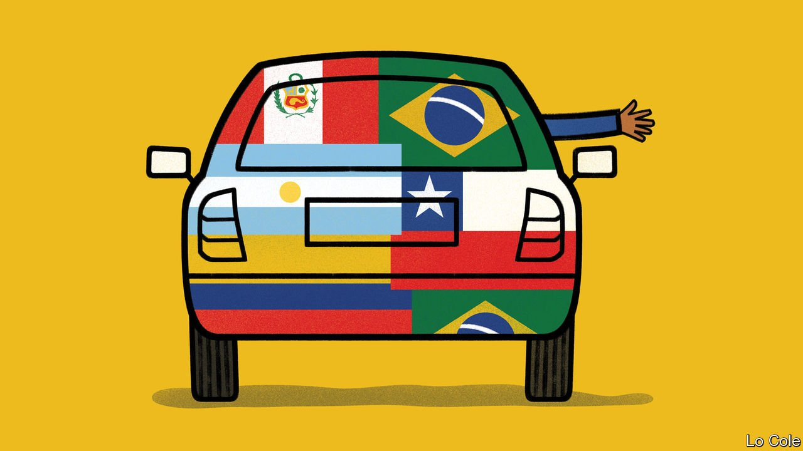

###### Bello

# Revulsion at Venezuela is fuelling the hard right in Latin America 

##### By wrecking a country, a leftist regime inadvertently boosts support for the illiberal right 

 

> Nov 6th 2021 

ONE EVENING last month Francisco Sagasti, who was Peru’s interim president for eight months until July, launched his new book in Barranco, a bohemian district of Lima. Mr Sagasti, an academic, is a centrist who steered the country through a divisive election. The event was disrupted by demonstrators who surrounded the bookshop chanting “corrupt” and “murderer” at the author while punching a journalist. They belonged to “The Resistance”, a group formed in 2018 under the banner of “God, Fatherland and Family” to oppose communism and liberalism. They are one of many facets of a new, more aggressive right wing in Latin America.

Its breakthrough came with the election in 2018 of Jair Bolsonaro as president of Brazil. A former army officer scornful of democracy and nostalgic for his country’s military dictatorship of 1964-85, Mr Bolsonaro marked a break with previous political norms in the region. Since democratisation in the 1980s, with one or two exceptions, conservative political forces were generally moderate, often influenced by Christian Democracy.


Mr Bolsonaro has spawned would-be imitators, of different kinds. They include Guido Manini, a retired army commander who promised to crack down on crime and who as a political outsider won 11% of the vote in Uruguay’s presidential election in 2019. In Peru Rafael López Aliaga, a businessman who is a member of Opus Dei, a Catholic movement, won 12% in an election in April on a platform of social conservatism and extreme economic liberalism. In Argentina Javier Milei, a libertarian economist, is poised to win a seat in Congress in an election this month, running against the main centre-right coalition as well as the ruling Peronists.

Closest to power is José Antonio Kast, a former legislator who in his first presidential campaign in 2017 said that, if he were alive, General Pinochet, Chile’s dictator in 1973-90, would vote for him. For the presidential election later this month he has promised to “restore Chile” with mano dura (“a firm hand”) against crime and violent disorder, a border ditch to stop immigrants, withdrawing from international human-rights bodies and tax cuts to promote economic growth. He also claims to defend Chile’s European heritage and national unity against the left’s espousal of indigenous groups and multiculturalism. Mr Kast looks set to contest a run-off election for the presidency against Gabriel Boric of the hard left.

Mr Kast is not Mr Bolsonaro. Rather, he represents a radical populist right, more in the mould of Álvaro Uribe, Colombia’s president from 2002 to 2010. He insists he is not “extremist” and now doesn’t deny that there were abuses under Pinochet. Not all of the new rightists represent a clear threat to democracy itself. But some do. All of them are less conciliatory than the old conservative parties. Minority groups have reasons to worry.

What explains the rise of the new right? One factor is the formation in recent years of grassroots groups with Catholic and evangelical ties which have campaigned against abortion, gay rights and feminism. Another is a popular demand for protection against crime. As with the radical left, the radical right is benefiting from public disillusionment with economic stagnation and mainstream democratic politicians, who are seen as self-serving if not corrupt. But what unites all these new right-wing forces, says Ariel Goldstein, a political scientist at the University of Buenos Aires, is “the spectre of Venezuela” which has sought to export its poverty-spreading leftist dictatorship. In that sense, the radicalisation of the right is a mirror of the same process on the left. If Mr Kast has a chance of winning, as he does, it is partly because Mr Boric, though himself a democrat, espouses a statist economic programme and has communist allies.

Latin America’s new right is also part of a broader international trend. Donald Trump’s victory in the United States in 2016 paved the way for Mr Bolsonaro. Mr Bolsonaro’s son Eduardo has close links to the nativist fringe of the Republican Party. Now Vox, a Spanish anti-immigrant party, is acting as an agent uniting the new right in Latin America. In September it published a “Letter from Madrid”, denouncing communism in the “Iberosphere” and signed so far by almost 9,000 politicians or activists including Messrs Kast, López Aliaga and Milei, as well as Eduardo Bolsonaro. Liberal democrats in Latin America now have to deal not just with an authoritarian left but with a right that is far more intolerant than in the recent past.

