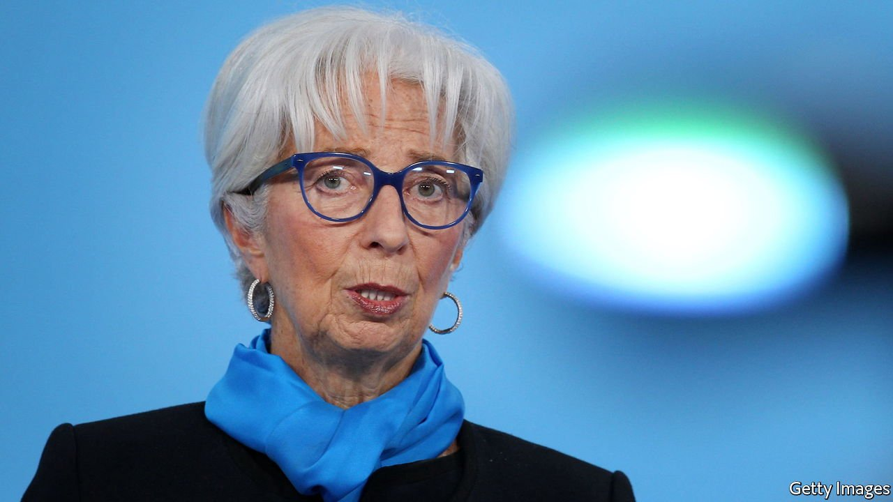
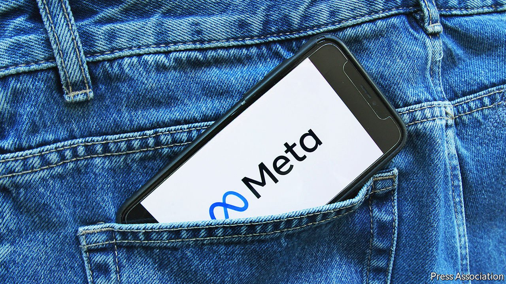

###### The world this week

# Business 

#####  

 

> Nov 6th 2021 

The Federal Reserve said it would start to taper its  this month at a pace that suggests it will end entirely next June. The central bank introduced the scheme at the start of the pandemic, but it is now more concerned about the prospect of enduring inflation.

Christine Lagarde once again tried to play down market expectations of an interest-rate rise in the euro zone next year. The president of the European Central Bank reiterated her view that, although consumer prices have risen fast, .


The euro zone’s economy grew by 3.7% in the third quarter, year on year (America’s GDP expanded by 4.9% on the same basis). Annual inflation in the currency bloc soared to 4.1% in October, a 13-year high, driven by higher energy prices.

Hit by an energy crunch, European gas prices yo-yoed amid conflicting news from Russia, which supplies around two-fifths of the EU’s imported gas. Gazprom appeared to be following an order from Vladimir Putin to start storing gas for Europe, after it had replenished its stocks for Russia. But the state-owned company again declined to book the necessary pipeline capacity to transport the gas.

Microsoft overtook Apple to become America’s most valuable company, reaching a market capitalisation above $2.5trn, after Apple’s quarterly earnings disappointed investors. Tesla’s share price wobbled when Elon Musk said the company had not yet signed an agreement to sell 100,000 electric cars to Hertz. The recent announcement of the deal had pushed Tesla’s market value to over $1trn.

Credit Suisse announced a big restructuring following the hefty losses it incurred through its exposure to Archegos Capital Management, which collapsed in spectacular fashion earlier this year. The Swiss bank is to all but close its prime brokerage business, which provided financing to hedge funds, and will refocus on wealth management.

Jes Staley stepped down as chief executive of Barclays, as British regulators were reportedly ready to question whether he had fully disclosed his links to Jeffrey Epstein. Epstein took his own life in 2019 after he was charged with sex trafficking under-age girls. Mr Staley wants to contest the regulators’ conclusion, which the board thinks would make his job impossible. Barclays noted that the investigation “makes no findings that Mr Staley saw, or was aware of, any of Mr Epstein’s alleged crimes”.

Steely plan

America and the European Union resolved a trade spat over steel and aluminium. Donald Trump introduced tariffs on European steel in 2018 under the guise of protecting America’s national security; the Biden administration will now accept European imports under a quota system. In return the EU will not impose retaliatory tariffs on a wide range of American goods. Both sides are working on arrangements to produce sustainable steel in order to curb what Joe Biden described as “dirty steel” from China.

 


, a rebranding that highlights the company’s other social-media apps, Instagram and WhatsApp, and downplays the Facebook name. One of the new parent company’s first decisions was to cease facial recognition on Facebook’s photos and videos because of the regulatory uncertainty surrounding the technology, though it is to retain the algorithm behind it.

 into a separate software company, a business it acquired in its merger with EMC in 2016. When the spin-off was announced in April, Michael Dell, the eponymous founder of the computer company, said that although revenues from VMware were robust, “the market does not appear to appreciate a hardware software combination.”

Kakao Pay’s IPO in Seoul was a roaring success. South Korea’s biggest provider of mobile-payment services is backed by Ant Group, a Chinese fintech company founded by Jack Ma. It had to delay its stockmarket listing by two months when South Korean regulators, fearful of a bubble, started scrutinising the IPO valuations of tech firms.

A page-turner

America’s Justice Department launched a lawsuit to stop Penguin Random House’s proposed acquisition of Simon &amp; Schuster on antitrust grounds. The suit claims that a merger would give Penguin control of nearly half the market for publishing rights for bestselling books.

On the same day that the COP26 summit started in Glasgow, Saudi Aramco reported quarterly net income of $30.4bn, its biggest three-month profit since its IPO in 2019. BP, Chevron and ExxonMobil also reported solid earnings, as the oil majors reaped the benefits of resurgent oil prices.

