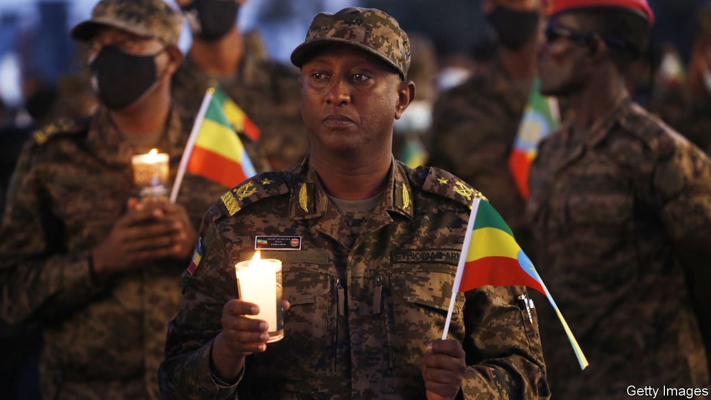
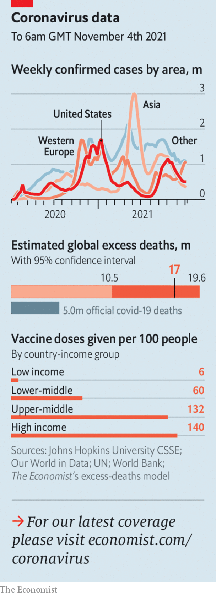

###### The world this week

# Politics 

#####  

 

> Nov 6th 2021 

Rebels from ’s northern Tigray region captured two strategic towns and were poised to march on Addis Ababa, the capital. An allied rebel force, claiming to represent the Oromos, Ethiopia’s biggest ethnic group, said it had cut roads to Addis Ababa from the south. Abiy Ahmed, Ethiopia’s prime minister, declared a state of emergency and said Ethiopia would defeat the rebels with “the bones and blood of her children”. Tigrayans in the capital were rounded up and detained.

, which has ruled South Africa since the end of apartheid in 1994, suffered its biggest-ever electoral defeat, falling below 50% in a nationwide ballot for the first time. The elections were local ones, which typically produce a lower turnout of ANC supporters. But they suggest that the party may struggle to gain a majority at a general election in 2024.


America, Britain, Saudi Arabia and the United Arab Emirates called on the leaders of a military coup in Sudan to reinstate a civilian-led transitional government. The last two were a surprise: the coup leader, Abdel Fattah al-Burhan, was thought to have had the backing of Arab allies, including the UAE.

The Knesset in Israel narrowly approved the government’s budget for 2021, a big victory for the new prime minister, Naftali Bennett. Had it failed, yet another general election would have been called.

Talks between Iran and six world powers, aimed at resurrecting the nuclear deal that Iran signed in 2015, will resume later this month. The discussions were put on hold in June after the election of Iran’s new hardline president, Ebrahim Raisi. America, which walked away from the deal under Donald Trump in 2018, will take part.

At least nine people were killed by a car bomb near the airport in Aden, Yemen’s temporary capital, the deadliest attack in the city since December. No one claimed responsibility. A day later dozens of people were killed or wounded in the province of Marib when missiles launched by the rebel Houthi movement hit a religious school and mosque, said the government.

Talking hot air

The UN Conference on Climate Change, or . Governments pledged to reduce methane emissions and end deforestation by 2030. Vladimir Putin and Xi Jinping did not attend, but the Chinese president wrote to urge more support for developing countries. Some leaders were mocked for their travel arrangements. Joe Biden’s motorcade consisted of 20 vehicles. Boris Johnson flew back to London on a private plane. A spokesman said the aircraft was carbon-efficient.

Narendra Modi, India’s prime minister, said his country aimed to reach net-zero emissions by 2070. Many rich countries have committed to reaching net zero by 2050. , would find that much harder.

As world leaders debated net zero,  called a temporary truce in a furious row over the economically insignificant question of fishing rights in the English Channel. France had seized a British vessel after French fisherfolk complained that post-Brexit Britain was being slow to issue them with licences. The mackerel mêlée is certain to resume.

Opposition leaders in Nicaragua (at least, those who have not fled abroad) called on voters to boycott a presidential election on November 7th. Daniel Ortega, the autocratic president, is set to win another term after locking up plausible opponents. The EU called the election “fake”.

A judge in Florida dismissed most of the charges of money-laundering against Alex Saab, a Colombian who is an ally of Nicolás Maduro, Venezuela’s dictator. Mr Saab, who was extradited to the United States, denies all the charges.

A Chinese tennis star, , posted a message on social media accusing a former deputy prime minister, Zhang Gaoli, of assaulting her sexually. Censors quickly moved to suppress online discussion of the case.

Yahoo became the latest American technology firm to withdraw from China. It cited an “increasingly challenging business and legal environment” there. Microsoft’s LinkedIn has ended its services in China for similar reasons.

How low can it go for Joe?

A Republican won , an office Democrats have held for the past eight years. Glenn Youngkin, a former private-equity executive, won over several exurbs that had enthusiastically plumped for Joe Biden last year. Some swing voters were irked that Mr Youngkin’s opponent had suggested that parents should have no say in what their children are taught in school. Democrats narrowly held on to the governorship in New Jersey, a party stronghold.

In Minneapolis a ballot measure to replace the police force with a Department of Public Safety was easily defeated. The proposal, in a city still traumatised by the murder of George Floyd, would have required the city to treat crime as a public-health problem.

 


Islamic State Khorasan Province killed at least 20 people at a military hospital in Kabul, Afghanistan’s capital. The group has also attacked mosques, mostly targeting minority Shia Muslims, since the Taliban takeover in August.

The World Health Organisation approved for emergency use India’s indigenous vaccine against covid-19, known as Covaxin. Approval of the drug is expected to boost inoculations across the poor world.

Thailand opened its borders to fully vaccinated visitors from more than 60 countries, as it tries to revive its battered, tourism-dependent economy. Strict curbs on serving booze in bars and restaurants remain, however.

Tonga recorded its first-ever case of covid-19, hurling the Pacific nation into a week-long lockdown. The virus was transmitted by a vaccinated traveller from New Zealand.

