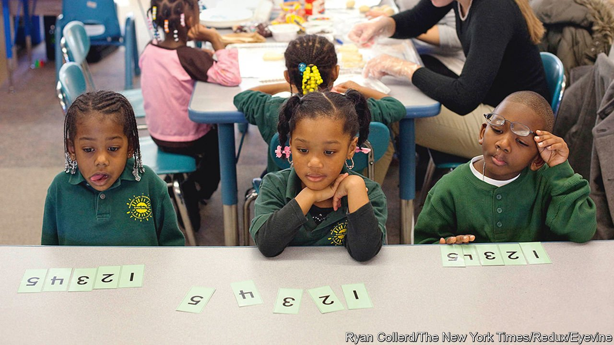

###### Problem-solving

# America’s maths wars 

##### How teaching multiplication tables became another victim of the political divide 

 

> Nov 6th 2021 

AMERICA HAS a maths problem. Its pupils have ranked poorly in international maths exams for decades. In 2018, American 15-year-olds ranked 25th in the OECD, a club of mostly rich countries. American adults ranked fourth-from-last in numeracy when compared with other rich countries. As many as 30% of American adults are comfortable only with simple maths: basic arithmetic, counting, sorting and similar tasks. American employers are desperate for science, technology, engineering and mathematics skills: nuclear engineers, software developers and machinists are in short supply. And while pupils’ maths scores are bad enough now, they could be getting worse. On the National Assessment of Educational Progress (NAEP), a national exam, 13-year-old pupils’ scores dropped five points in 2020 compared with their peers’ in 2012. The status quo does not add up. But teachers and academics cannot agree on where to go next.

The American maths problem is over a century old, says Alan Schoenfeld of the University of California, Berkeley. In 1890 high school was an elite endeavour: less than 7% of 14-year-olds were enrolled and they were educated in rigorous maths. By the beginning of the second world war, by which time army recruits had to be trained in the maths needed for basic bookkeeping and gunnery, nearly three-quarters of children aged 14-17 attended high school. The cold war sparked a second strategic maths panic in the 1950s. A new maths curriculum, focused on conceptual understanding rather than rote memorising, was developed after the launch of the Sputnik satellite by the Soviet Union. Then that new curriculum was rejected in a move back to basics in the 1970s.


Maths teaching became a worry again when America started to fear being overtaken by Japan. In 1981 the secretary of education appointed a commission to evaluate the curriculum. It produced a report called “A Nation at Risk”. “If an unfriendly foreign power had attempted to impose on America the mediocre educational performance that exists today,” the report reported, “we might well have viewed it as an act of war.”

Since the 1990s, though, maths has become more political. Conservatives typically campaign for classical maths: a focus on algorithms (a set of rules to be followed), memorising (of times tables and algorithmic processes) and teacher-led instruction. Pupils in these classrooms focus on the basics, exploring concepts after obtaining traditional skills, explains Bill Evers of the Independent Institute, a think-tank in Oakland. These methods are familiar to many. For two-digit addition, pupils would be taught a paper-and-pencil method. Add 27 + 45 by stacking 27 over 45. Add up the right column (7 + 5 = 12). Write down the 2, and carry the 1 to the left column. Add up the left column (1 + 2 + 4 = 7). Write down the 7. The answer is 72.

Progressives typically favour a conceptual approach to maths based on problem-solving and gaining number-sense, with less emphasis on algorithms and memorising. In contrast to the conservative strategy, pupils would learn several ways to solve a problem, by using objects and by other means, before learning algorithms. To solve 27 + 45, pupils could add up the digits in the ones place (7+5=12), and then the tens place (20+40=60), and then add them together to get 72. Or they could realise that 27 is 3 digits away from 30. They would add 3 to get to 30. Then add 45 and subtract 3 to get 72. Conceptual maths strategies encourage pupils to find many potential solutions for the same problem to gain number-sense, rather than relying on an algorithm.

Although most teachers agree that maths education in America is sub-par, they have not been able to agree on how to improve it. Copying methods used in highly ranked mathematical nations such as Singapore would be one way. But that would require agreement on what is actually being taught in other countries. According to Mr Evers, successful Asian curriculums reflect the classical position. “What country do you think has totally adopted progressive education and has been a big success? China is very teacher-led. Singapore math is the best in the world. It’s not progressive,” explains Mr Evers. But Mr Schoenfeld reckons countries such as Japan and Singapore implement conceptual curriculums.

Part of the confusion stems from the messy implementation of the most recent maths curriculum, the Common Core. Implemented in 2010 under President Barack Obama’s administration, 41 states and the District of Columbia adopted the principles. Texas, Florida and several others opted out. Despite initially being a bipartisan effort (Jeb Bush and other conservatives supported the Obama administration’s effort), it was eventually criticised by both sides. Some view it as an example of progressive education, while others think it was not progressive enough. Now that test results are rolling in, many conservatives claim that the falling scores show the failure of the Common Core and progressive teachers. But supporters of the current curriculum are not prepared to give up. Whereas NAEP scores declined among 13-year-olds, they stayed steady among nine-year-olds, who would have studied Common Core for their whole school lives.

Further muddling the mess, far-left activists have paired conceptual maths methods with more radical concepts. Many opponents of conceptual maths believe that Common Core, and conceptual maths in general, bans teaching of rote-learning, as in multiplication tables. A prominent maths-education scholar at Stanford University, Jo Boaler, claims that memorising times tables is unnecessary. Conservatives have seized on this idea as an example of liberal activism gone wild. But Mr Schoenfeld claims this does not align with progressive maths values.

Some activists have also paired conceptual maths with “social-justice maths”, the concept that maths should be used to help pupils solve real-world issues and appraise the world around them. Dubbed “woke math[s]” and tagged with headlines such as “In California 2+2=4 May Be Thought Racist” (as a letter to the Wall Street Journal harrumphed), it has done conceptual maths few favours by association.

The maths debate in America is polarised and confused. While other countries implement maths curriculums with a balance of rote and conceptual learning, America continues to swing from one pole to another, decade after decade. Just like the country’s politics, in other words.■

