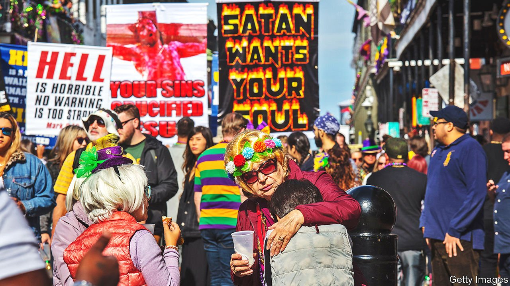

###### The devil made me do it

# Belief in supernatural evil is a strong predictor of pro-gun beliefs 

##### The world seems a more threatening place to those who fear demons and hell 

 

> Nov 6th 2021 

AMERICA’S CLAIM to exceptionalism is undeniable when it comes to gun culture. Its residents own 46% of the world’s 860m civilian-held guns, according to Small Arms Survey, a Geneva-based research outfit. There are 120.5 firearms per 100 American residents—more than twice the number of second-place Yemen, a country at war. In a Gallup poll 40% of gunslingingers said they owned weapons for hunting. But what explains support for less mainstream pro-gun views such as arming teachers and carrying weapons in public? A recent study by Christopher Ellison, Benjamin Dowd-Arrow, Amy Burdette and three other sociologists delves into an important but overlooked motivating factor that highlights the role of religion.

A survey of 1,572 American adults found that, apart from religious denomination or religious conservatism, belief in the devil, demons and hell is a strong predictor of eight pro-gun beliefs, including arming teachers, carrying concealed firearms and bearing high-capacity defensive weapons. A Catholic who believes in supernatural evil is more likely to hold pro-gun views than a Protestant who does not believe that Satan is corrupting souls, and vice versa.


The analysis, which controls for political ideology and other demographic factors, found that each step up on a four-point scale measuring the strength of belief in supernatural evil correlated with 32% more support for arming teachers, and a 38% rise in backing for carrying concealed weapons. The effect of belief in supernatural evil on support for the right to carry concealed guns was roughly the same as having conservative politics or not possessing a college degree, but smaller than the effect of gender.

“The conviction that there is a cosmic battle between ultimate good and ultimate evil being waged on earth as well as in the spiritual realm may make the world seem uncertain, risky and threatening,” the authors suggest, since “individuals may display their propensity for evil at any moment.” Gun restrictions are seen as threatening God-given rights to protect society against agents of evil, a belief the National Rifle Association plays up through its use of religious and civic-duty language in its adverts. Another study has shown that alt-right groups that support militias and profess strident pro-gun views draw on the language of biblical literalists, asserting that they are fighting a devilish government.

Uncertainty stemming from the covid-19 pandemic has added to the moral uncertainty associated with pro-gun beliefs. Background checks run by the FBI, the best national proxy for gun purchases, jumped 40% in 2020 compared with 2019. That is the biggest increase in the last 20 years, and purchases have continued to rise. A preliminary study of a poll of 2,700 American residents done by NORC, a research institute at the University of Chicago, found that Americans who bought a gun during the pandemic were (as has long been the case) mostly white, male, conservative and less educated. But the authors also found that those new gun owners had recently become more religious or become unemployed, and were more likely to be in their late teens, twenties, or thirties—rather than middle-aged.

The Supreme Court heard arguments on November 3rd regarding restrictions on New Yorkers’ ability to carry concealed weapons. It is one of the most important gun-rights cases since Justice Antonin Scalia’s landmark ruling in 2008 supporting the right to keep weapons at home for self-defence. Scalia, too, believed the Devil is a “real person”.

“Peace through superior firepower: Belief in supernatural evil and attitudes toward gun policy in the United States,” by Christopher G. Ellison, Benjamin Dowd-Arrow, Amy M. Burdette, Pablo Gonzalez, Margaret S. Kelley and Paul Froese, Social Science Research.

