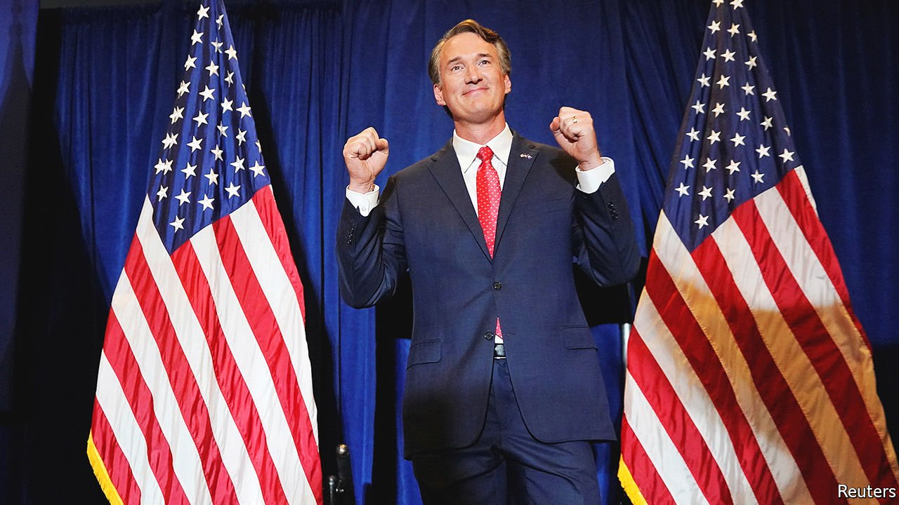

###### Physics for politics

# Democrats suffer a thorough drubbing at the polls 

##### They lost power in Virginia and barely hung on in New Jersey, both Democrat-friendly states 

 

> Nov 6th 2021 

ONE YEAR ago, America’s Democrats were celebrating: Joe Biden had just made Donald Trump a one-term president. This year’s (much smaller) election day left them in a considerably grimmer mood. In Virginia, Glenn Youngkin became the first Republican to win a gubernatorial race since 2009. Democrats are on course to lose the lower chamber of the statehouse, as well as races for lieutenant-governor and attorney-general. In New Jersey, Phil Murphy, the incumbent governor, came within just a percentage point of losing despite winning by 14 points in 2017. The party’s progressive wing fared even worse: voters in Minneapolis rejected a measure to replace the city’s police department with a “Department of Public Safety,” and a socialist mayoral candidate in Buffalo, New York lost to her defeated primary opponent who was running as a write-in candidate. Partly these results simply hew to form: the party in power tends to fare poorly in off-year elections. But the size and shape of the defeat augurs ill for Democrats’ chances of holding their congressional majorities in next year’s midterm races.

A few factors may have exacerbated the Democrats’ poor performance. Mr Biden had hoped to have Democratic candidates boasting about all the party has accomplished so far. But his congressional agenda has stalled amid factional party infighting, which may have depressed the base. Terry McAuliffe, whom Mr Youngkin defeated, ran a flat-footed campaign focused almost entirely on Mr Trump, who was not on the ballot. Moderate Republican voters who supported Mr Biden last year to get Mr Trump out of office may have found their way back home.


Mr Youngkin, by contrast, appeared moderate enough for moderates and Trumpy enough for farther-right voters, running up Belarusian margins in white rural counties. His campaign focused on parents’ rights and education; he vowed to ban critical-race theory from being taught in schools (which it is not). Mr McAuliffe called that tactic a racist dog-whistle, but failed to muster a more persuasive response or present a broader positive vision for the state. New Jersey’s race followed a similar pattern. Jack Ciattarelli, the Republican candidate for governor, ran a moderate campaign focused on cutting taxes, and he avoided mentioning Mr Trump. That may have helped him win independents, while Mr Murphy’s low-key style (perhaps along with some complacency) may have kept Democratic turnout low.

The bigger force at play, however, is the typical backlash against the party that controls the White House. The off-year Virginia governor’s race has swung against a newly elected president in every contest since 1981. The average swing in vote margins against the incumbent party is about ten percentage points, though the penalty can be as high as 17 in rare cases. In comparison, the two Democrats’ margins in New Jersey and Virginia were 14 percentage points lower on average than Mr Biden’s margin against Mr Trump there in 2020. In other words, the merits or detriments of individual candidates notwithstanding, Democrats faced predictable patterns of revolt against the ruling party.

Democracy in America is “thermostatic”, observed Christopher Wlezien, a political scientist, in a 1995 journal article establishing a theory of politics bearing the same name. He used data on preferences and levels of government spending to show they move in a slightly inverse relationship. As the government spends more money, people want it to spend less—and vice versa. And elections are also somewhat thermostatic. Once a party takes power, its members tend to become the target of peoples’ dissatisfactions about whatever grievances they have against their government, and they get voted out. The nationwide swings against Democrats on Tuesday are further evidence of this trend. Covid-19 and supply-chain woes, for instance, may not be Mr Biden’s fault, but the president takes the blame.

Yet this implies Democrats are powerless to combat electoral losses, which they are not. Though results from elsewhere in the country seem to offer hints on the surface, they do not offer a clear answer to the party’s dilemmas. Much has been made of the results of a referendum to replace the police department in Minneapolis, Minnesota with a “Department of Public Safety” that would have been focused less on punishment and traditional law-enforcement tactics and more on addressing social inequities and causes of crime. The failure of such a “woke” pipe-dream in a liberal city could be seen as a rebuke of the Democratic Party’s most left-leaning members and their toxicity to the brand, were it not for the results of a vote in Austin, Texas, where voters rejected a proposition that would have increased the funding and staffing for their own cops. More than anything the mood among America’s voters seemed to be a reflection of the general unpopularity of the Democratic Party and its leader.

The thermostat will probably continue to get colder. Not only have voters tended to side against presidents in off-year governors’ races, they also tend to punish them in mid-term elections to Congress. Since 1934, the party controlling the White House has lost an average of 28 seats in the House and four seats in the Senate. A thermostatic backlash threatens the party’s control of Congress for at least five years, and perhaps the next four after that.

Were Mr Biden or Kamala Harris, his vice-president, to win the presidential election in 2024 but lose in 2028 (presidents usually win two terms), thermostatic dynamics would not favour the Democrats until the first mid-term of a Republican presidency in 2030. But even in the scenario Mr Biden or some other Democrat were to lose in 2024 and Democrats regain control of Congress in 2026, that would still leave them without legislative power for two cycles after next year’s mid-terms. If the results on November 3rd stem largely from the typical patterns of American politics, they portend a dark decade ahead for the Democrats, notwithstanding Mr Biden’s plummeting approval ratings. And this week’s shellacking suggests that the party has no sound strategy for how to combat such trends.

 For more coverage of Joe Biden’s presidency, visit our dedicated 

