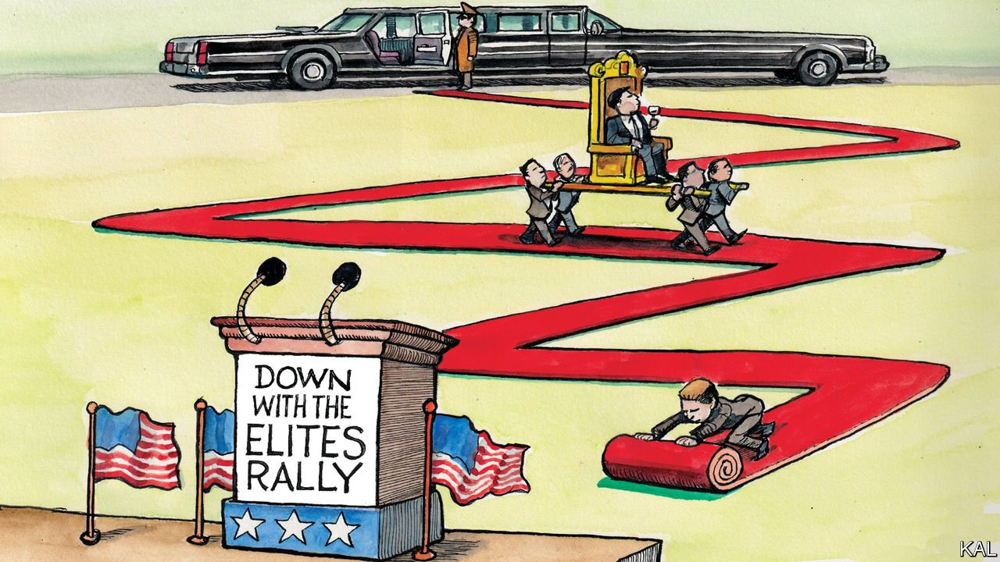

###### Lexington

# Glenn Youngkin and Ivy League populism 

##### Virginia’s governor-elect is the latest Republican culture warrior with an expensive education 

 

> Nov 4th 2021 

VIRGINIA’S SCHOOLS don’t teach critical race theory, but Glenn Youngkin’s old school does. The hypothesis that America is structurally racist, which the victorious Republican candidate for governor falsely claimed was being fed to Virginia’s children, emerged at Harvard in the 1980s and has been taught there ever since. Toni Morrison, a novelist of black America whose book “Beloved” Mr Youngkin’s campaign attacked, also had ties to his alma mater. Yet it is a safe bet that the private-equity baron won’t discourage his four children from following him there.

A visitor from Mars might find Mr Youngkin’s populist scare-tactics at odds with his record of elite institutions (Rice, Harvard, McKinsey, the Carlyle Group) and immense wealth. The Martian should then be challenged to find an up-and-coming Republican with a much humbler résumé. Populist leaders, from Peron to Orban, are more often elite figures than working-class heroes; and so it is in the Republican Party. The anti-elitism fervour that has captured the right is largely a creation of rich Ivy Leaguers.


Donald Trump, a billionaire alumnus of the University of Pennsylvania, won in 2016 with help from Steve Bannon and Jared Kushner (both of Harvard). His media cheerleaders included Ann Coulter (Cornell), Kayleigh McEnany (Oxford and Harvard), Tucker Carlson (Trinity College), Steve Hilton (Oxford) and Laura Ingraham (Dartmouth College). His chief imitators include Ron DeSantis (Yale and Harvard), Ted Cruz (Princeton and Harvard), Josh Hawley (Stanford and Yale) and Tom Cotton, Mike Pompeo and Elise Stefanik (all Harvard). A working-class movement this is not.

To some extent it reflects Ivy Leaguers’ dominance of politics and the media generally. Joe Biden and Kamala Harris are the first presidential duo not to have attended an elite institution for 36 years. And the closure of local newsrooms has seen the Ivies emerge as the main source of journalistic talent. A recent study of 150 interns at leading newspapers found that 65% studied at the country’s most selective universities. Yet, in a way, that makes the hollowness of the MAGA crowd’s populist credentials even more striking. American politics is not witnessing a revolt against the elite so much as a power struggle within it.

To distinguish themselves from their opponents the populists often turn on the institutions that launched them both. As a precocious teenage columnist, Mr Hawley slammed the Ivies for being “elitist” while he was still attending (an expensive private) high school. Such attacks recall a long conservative tradition.

William F. Buckley, father of the conservative movement, made his name by lambasting his former teachers in “God and Man at Yale”. Combining erudition with a willingness to shock, he was kicking the post-New Deal liberal consensus of the early 1950s. The young fogey-ish columns Mr Cotton wrote for the Harvard Crimson in the 1990s, decrying feminism and the “cult of ‘diversity’”, share some of that spirit. “My first end was not to persuade but rather to offend your sensibilities,” read his valedictory piece.

Some Ivy League populists also recall the slightly awkward insiderishness of Buckley, a nouveau-riche Catholic. Mr Trump still seems to consider himself an interloper from Queens. Mr Cotton is a son of Arkansas farmers; Mr Hilton a scholarship boy who attached himself to the British Tories’ most entitled faction. When such figures rail against their former teachers and classmates, some wounded part of them really means it. “It’s much easier to hate people you’ve been around than people you don’t know,” observes Yascha Mounk, a Harvard-educated scholar of populism.

Yet Buckley’s irreverent conservatism was not rooted in resentment but ideas, and firmly within the democratic tradition. He mocked his teachers to assert the superiority of classical liberalism over their progressivism. He did not rubbish the very idea of expertise, as Trump populists do. Their anti-elitism is intellectually unmoored, unrestrained and, as in Mr Youngkin’s populist turn, largely manufactured. It lumps together real gripes—including Buckley’s still-valid critique of the academy—with an ever expanding list of imagined ones: against the FBI, the Senate parliamentarian, voting machines and other shadowy forces deemed to be denying conservatives power. It aims to stir resentment, not solve problems; to weaken institutions, not improve them.

At the heart of this development was a realisation in the 1990s that outrage sells. High-achieving conservatives had previously found refuge in think-tanks, Wall Street and the law. Henceforth they began gravitating to the conservative news-entertainment industry, where owning the libs became a blood sport. The fact that Ms Coulter, Mr Bannon, Ms Ingraham and Ms McEnany left law and finance for the media illustrates the trend. Mr Trump’s success lay in turning that entertainment business—hitherto a slightly discreditable sideshow—into the Republican main act. Inevitably, the handful of conservatives who have resisted him, such as Bill Kristol and David Frum in the media and Liz Cheney and Ben Sasse on the Hill, also tend to be products of elite institutions. But his Ivy League enablers are far more numerous and influential. He could not have remade the right as thoroughly as he has done without them.

Under new management

Conservatives long argued that campus liberalism produces ambitious narcissists, not public servants. It is ironic that the best evidence for that (see the competitively unprincipled Mr Hawley and Ms Stefanik) is on the right. There are still many civic-minded swots on the centre-left: such as Cory Booker and Pete Buttigieg, of Yale, Harvard and Oxford. The conservative critique rests on a misplaced assumption that the Ivies still shape the political culture in both parties. In fact Trump populism is less an elite project than a business venture with elite management. Mr Youngkin, an experienced manager with flexible views and a modest flair for culture warring, looks like a solid recruit.■

