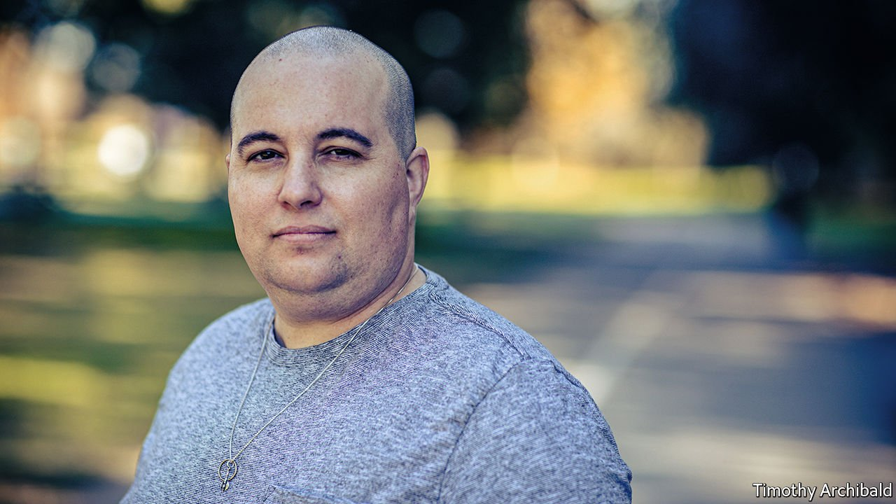
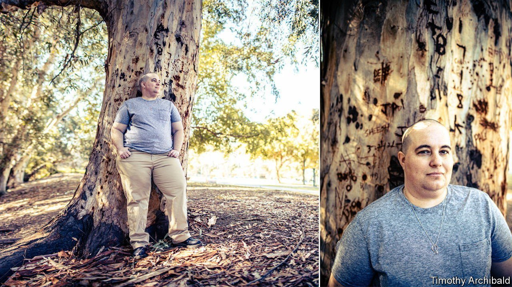

###### Medicine and identity

# Portrait of a detransitioner as a young woman 

##### Carol has been a woman, a man and is a woman again. Her story has lessons for trans medicine 

 

> Nov 6th 2021 

CAROL HAD long suspected her everyday life in rural California would be easier if she were a man. Yet she was stunned by how true this turned out to be. As a “butch” woman (and “not a big smiler”) she was routinely treated with slight contempt, she says. After a double mastectomy and a few months on testosterone—which gave her facial hair and a gravelly voice—“people, cashiers, everyone, suddenly became so goddam friendly”.

Yet Carol soon felt wretched as a trans man. At first, the testosterone she started injecting at 34 lifted her mood and energy levels. But after two years she began to suffer awful side effects. Vaginal and uterine atrophy (which can cause tissue to crack and bleed) was “extremely painful”. Her cholesterol levels rose and she had palpitations. She also became so anxious she started having panic attacks.


So she went on antidepressants, and they worked. “It was a light-bulb moment,” she says. “I was like, I needed the antidepressants; I didn’t need to transition.” She realised her gender dysphoria, the painful feeling she was in the wrong body, did not, in fact, make her a man.

Nearly three years ago, after four years as a trans man, Carol became a “detransitioner”: someone who has taken cross-sex hormones or had surgery, or both, before realising this was a mistake. Her experience illustrates the dangers of a “gender-affirmative” model of care that accepts patients’ self-diagnosis that they are trans, now standard practice in America’s transgender medicine field.

No one knows how many detransitioners there are, but anecdotal evidence, and swelling memberships of online groups, suggests the number is growing fast. A recent survey of 100 detransitioners (69 of whom were female) by Lisa Littman, a doctor and researcher, found a majority felt that they had not received an adequate evaluation before treatment. Nearly a quarter said homophobia or difficulty accepting that they were gay had led them to transition; 38% reckoned their gender dysphoria was caused by trauma, abuse or a mental-health condition.

Carol believes the roots of her gender dysphoria lay in her childhood. An upbringing that was both fanatically religious and abusive rammed home two harmful messages. One was the importance of “rigid gender roles…women were there to serve; they were less than men”. Her mother’s endless fury that Carol would not bow to this notion of womanhood, which included wearing only dresses (“I didn’t even ‘walk like a girl’, whatever that meant”) meant she grew up believing her way of being female was somehow “all wrong”. The other message was that homosexuality was “an abomination”.

Carol’s “oh God moment” came, as she amusingly describes, when she developed a “heavy crush” on her mother’s female estate agent at 16. The realisation prompted a breakdown (though she didn’t call it that at the time). First she “fasted and prayed to God to take this away”. Then she began drinking heavily and having one-night stands with men “in the hope something would click”. When she came out at the age of 20, many of her relatives excluded her from family gatherings.

It was in her early 20s, when many lesbians in her social circle (“almost always the butch ones”) started identifying as trans men that she began to think, “This must be it! This is what is wrong with me!” But she was told she had to live as a man for six months before being approved for treatment and the thought of using the men’s toilet was intolerable. By this point, she had met the woman who would become her wife and found some stability.

 


But she was still deeply unhappy. “I just felt…wrong,” she says. “I was disgusted with myself, and if a nice answer comes along and says, this is going to fix it, guess what you’re going to do?” By her mid-30s, she no longer needed to see a therapist to be prescribed testosterone. (Planned Parenthood uses an “informed consent” model in 35 states, meaning trans patients do not need a therapist’s note.) Yet Carol did see a therapist, because she wanted to “do it right”. The therapist did not explore her childhood trauma, but encouraged her to try testosterone. Months later Carol had her breasts removed.

Detransitioning was the hardest thing she has done, she says. She was so terrified and ashamed that it took a year to come off testosterone. To her relief her cholesterol levels returned to normal in months. She still has some facial hair and a deep voice. Her mastectomy “is like any loss: it dissipates but it never completely goes away”.

She now spends a lot of time campaigning for other detransitioners’ stories to be heard. This is not easy work. Outspoken detransitioners are often maligned. One gender-medicine doctor has criticised the use of the term “detransitioner”, saying, with extraordinary cruelty, “it doesn’t really mean anything”. Dr Littman’s study found that only 24% of detransitioners told their doctors transitioning had not worked out. This may help explain why some dismiss the phenomenon.

Carol worries about girls who are taking puberty blockers to avoid becoming women, something she says she would have leapt at given the chance. And she worries about butch lesbians who are being encouraged to consider that they are in fact straight men. She now considers this homophobic. “My wife told me recently that when I was transitioning she was on board for two months before realising, this is crazy. And she was right. She was being told, your wife is really a man so you are bisexual or straight. It was bullshit.”■

