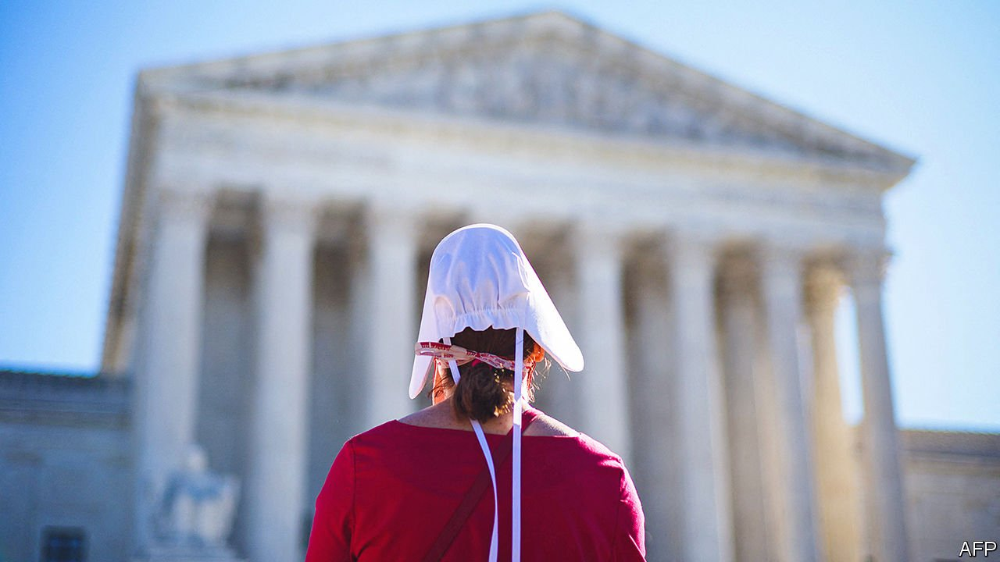

###### Lawyers, guns and babies

# The Supreme Court hears arguments on abortion and firearms 

##### The latter ruling may hinge on a 14th century British statute 

 

> Nov 4th 2021 

WHILE REPUBLICANS were triumphing in Virginia, on the other side of the Potomac Republican-appointed judges considered cases involving two priorities of the conservative legal movement: guns and abortion. On November 1st, the justices heard nearly three hours of argument involving Texas’s notoriously harsh law banning abortion at six weeks’ gestation with no exception for rape or incest. Two days later another searing controversy came to their courtroom: the scope of the constitutional right to keep and bear arms. With its transformation by Donald Trump’s three appointees, the court is primed to bolster gun rights and undermine the right to abortion.

Two of Mr Trump’s appointees, Brett Kavanaugh and Amy Coney Barrett, expressed dismay with Senate Bill 8, Texas’s law that incentivises ordinary citizens to bring lawsuits by promising $10,000 bounties payable by anyone who facilitates an abortion after six weeks. Their alarm, along with that of Chief Justice John Roberts and even arch-conservative Justice Clarence Thomas, stemmed from the Texas legislature’s ploy insulating the law from review in federal courts by taking enforcement out of state officials’ hands. Lawyers for Texas insisted that neither abortion clinics nor the federal government have anyone to sue, despite the dramatic chilling effect the bounty system has had on abortion providers—effectively erasing Roe v Wade—in the Lone Star state.


Early in the first hearing, Justice Barrett noted that defendants to potential lawsuits under SB 8 (anyone who “aids or abets” an illicit abortion) lack the opportunity to offer the “full constitutional defence” they are entitled to under Supreme Court rulings favourable to reproductive rights from 1992, 2016 and 2020. Even if such a case were to move all the way through to the federal Supreme Court, she added, the law is designed to circumvent vindication of a long-established right.

Here Justice Kavanaugh joined the critique. Citing a brief from the Firearms Policy Coalition warning that Texas’s approach could threaten other constitutional rights, he asked about states seeking to subvert speech, freedom of religion or the Second Amendment. What about a state that makes “everyone who sells an AR-15” subject to a $1m fine through private enforcement? Are these gun shop owners out of luck, too? When Texas’s lawyer said “yes”, the fate of Texas’s law seemed sealed. Justice Elena Kagan then piled on with a cutting response to his repeated comment that federal lawmakers could make it easier to bring cases in federal courts. “Isn’t the point of a right”, she said, “that you don’t have to ask Congress?”

Gun rights were top-of-mind for Justice Kavanaugh during the abortion hearings, no doubt, because November 3rd brought a major Second Amendment case to the Supreme Court. In 2008 the court struck down a handgun regulation in the District of Columbia, recognising for the first time an individual’s right to keep a gun at home for self-defence. But despite repeated entreaties in the ensuing decade from gun-rights organisations, the justices refused to weigh in on the constitutionality of other regulations. That drought ended in New York State Rifle &amp; Pistol Association v Bruen, a challenge to a 108-year-old gun-licensing regime in New York.

Since 1913 New York has permitted only those who show “proper cause” to carry concealed weapons. Although “restricted” permits are available to hunt or to tote a handgun to target practice (and one of the plaintiffs in Bruen had permission to carry his weapon between his home and his workplace), mere fear of crime does not suffice for a blanket licence. The rifle association argues that the state may not “reserve for a happy few a right that the constitution protects for all ‘the people’”. New York defends its law as consistent with a 700-year-long line of weapons restrictions dating back to medieval England.

The political debate over how to handle America’s epidemic of mass shootings found little air in court. Instead, finicky history guided the debate. One dispute involved the true meaning of the 1328 Statute of Northampton. New York pointed to the law’s prohibition on going “armed by night nor by day” in places like “fairs” and “markets” as a precedent, while the rifle organisation insisted that laws of that period only prohibited carrying arms “to the terror of the people”. Peaceful gun toters were welcome in the 14th century, the plaintiffs say, and should be today.

Several justices fretted over the prospect of more guns on the streets of New York City should the law be struck down. The challenger had a tough time explaining which “sensitive places”—from Yankee stadium and the New York University campus to the subway—could be declared gun-free. But he concluded on a note that seems very likely to attract six votes. Having to establish that you are an “atypical” member of the community in order to get a general-carry licence “describes a privilege”, the lawyer said, not “a constitutional right.”

Neither dispute will be the last word on these perennially hot topics. The days of Texas’s SB 8 may be numbered, but on December 1st a showdown focused on the nature of the abortion right comes up for argument. And if the justices treat Bruen as a stepping-stone rather than a sweeping opportunity to strike down gun regulations, they will have more cases to consider whenever they’re ready.■

An early version of this article was published online on November 1st 2021

