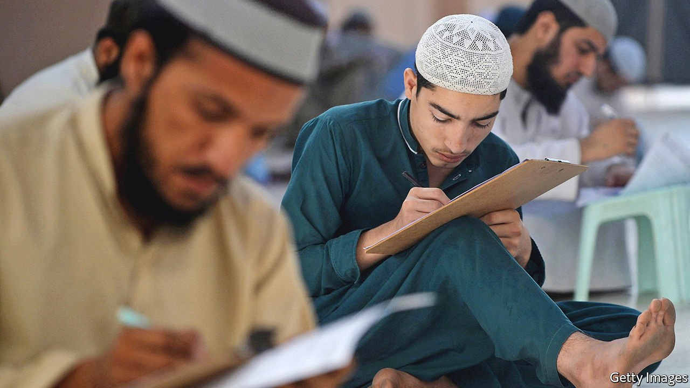

###### Levelling down

# A new national curriculum sparks a backlash in Pakistan 

##### Teachers and parents worry that English-language skills are being replaced by religious content 

 

> Nov 11th 2021 

FEW IN PAKISTAN would deny that something needs to be done to improve its education system. The country is well behind Bangladesh, India and Iran, and just barely above Afghanistan, in UN education rankings. Less than 60% of people over 15 can read and write, having attended school on average for 5.2 years. In Bangladesh, by contrast, the l is 74%, with 6.2 years of education.

The headline figures hide as much as they reveal. In the country’s elite schools, the children of the wealthy study in English for international exams and set their sights on the world’s best universities. At the other end of the spectrum, 23m children are not in school at all, with girls much less likely than boys to be enrolled. Government schools, where available, have a reputation for rote learning. Private schools of varying quality fill the gap. Many poor families send their children to madrasas, which tend to skip subjects like science and maths. Some are vehicles for extremist ideologies. Imran Khan, the prime minister, calls this divide “educational apartheid” and has vowed to get rid of it.


Such an aim is admirable, but the tool of choice has come in for criticism from academics, educators and parents. Earlier this year the government began rolling out a single national curriculum (SNC) for all schools, including madrasas. This set of minimum standards is meant to improve the quality of teaching and boost the prospects of pupils. But its ambitions are wider still. Among the objectives listed by the education ministry is to increase “social cohesion and national integration”.

The new curriculum has so far been rolled out only in primary schools, but already some of its dictates are causing a backlash. The SNC has increased the number of subjects, such as general knowledge, which must use textbooks in Urdu or other local languages rather than English. Mr Khan, himself an old boy of Aitchison College, the country’s most prestigious school, makes his case in punchy post-colonial terms. “When you acquire English-medium education, you adopt the entire culture,” he argues, adding that “you become [a] slave to that particular culture.”

Yet the resistance to the SNC’s imposition of local-language learning is not just an elite phenomenon. There have been reports of schools unwilling to implement it. And there is huge demand for English from parents who see it as a way for their children to stand out in the job market, according to teachers. Mariam Chughtai, the director of the national council drawing up the curriculum, says the aim is not to drop English but to elevate local languages. “When we think ‘multilingual’, we think French, German and English. But when you say bilingual in Urdu and English, the elites look down upon it,” she says. Still, “no one is denying the importance of English. It’s here to stay.”

A bigger complaint is that conservatives are using the curriculum to increase religious teaching in schools. Rather than turning madrasas into schools, it will turn schools into madrasas, charge critics. Indeed, the education ministry’s list of “key considerations” in drawing up the curriculum puts the teachings of the Koran at the very top. Non-Muslims need not take classes on Islam, but religious content is seeping into other subjects, such as Urdu-language lessons that include passages on Muslim caliphs. The government argues that there is nothing wrong with teaching religion in a religious country.

The third criticism may be the most pertinent. Pakistan’s abysmal learning outcomes are not so much the result of content as of access, says Jasir Shahbaz, an educationalist in Lahore. A new curriculum will do little to fix that. “The issue is not so much what the kids are studying, so much as how many kids are actually studying, or are actually understanding what they are studying,” he says.

The battles are likely to intensify as older pupils start the new curriculum next year. Ms Chughtai says it will take time for results to show. But the furore, she says, is because the changes affect even the elite: “Any time you try to bring a major policy change, for the small minority of people for whom even the broken system was working, they are going to get scared.”■

