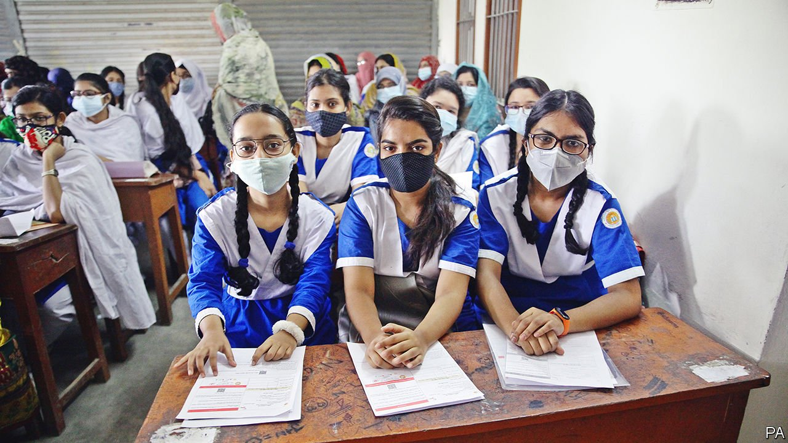

###### Levelling up

# Bangladesh is making a serious attempt to improve its schools 

##### It hopes to move away from rote learning and towards actual learning 

 

> Nov 13th 2021 

FEW IN BANGLADESH would deny that their country has had remarkable success at getting kids into classrooms. Four decades ago less than a third of children finished primary school. Today, 80% do. Before the pandemic, more Bangladeshi girls than boys attended high school. In .

Improving the quality of education has proved trickier. More than half of Bangladeshi ten-year-olds in school are not proficient in reading, according to the World Bank, and more than a quarter of those aged between 15 to 24 are not in education, employment or training. A year and a half of pandemic-related school closures have made matters worse.


In some respects, unimpressive outcomes have not held back Bangladesh. The economy has been growing at an annual rate of 6% for the past decade, reaching 8% before the pandemic. The two main drivers of growth, the garment industry and remittances from overseas Bangladeshi workers, have boomed. But that is because labour is plentiful and cheap, not because it is skilled. Bangladeshi labourers in the Gulf often earn less than their Indian brethren. Garment workers in Dhaka, the capital, toil for lower wages than rivals in China.

Sustaining growth will rely on moving from cheap to skilled labour, says Hossain Zillur Rahman of the Power and Participation Research Centre, a think-tank in Dhaka. “Those skills need to be created now,” he says. The government is shaking up the curriculum as a way to achieve that. The plans, which are due to be implemented by 2025, focus on shifting away from mindlessly memorising textbooks and regurgitating them during exams and towards building useful skills. All exams will be scrapped until third grade. Year-end public exams, which start in secondary school, will wait until tenth grade. Before that, students will be assessed on their knowledge and ability throughout the year.

The new curriculum, which comes after years of consultation, including with employers and workers, is designed to address the mismatch between education and the skills required in the economy, says Mohibul Hasan Chowdhury, the deputy minister for education. A choice of two vocational subjects from such options as woodwork, graphic design, car mechanics, child care and plumbing will be mandatory for high-schoolers. The government also plans to open more technical universities.

Though many education experts are in favour of the change, some worry parts of it amount to trying to run before learning to walk. How can coding be taught well when “we cannot ensure numeracy and literacy”, asks Niaz Asadullah, an economist who focuses on education inequality at the University of Malaya in Kuala Lumpur. Moreover, he says, tens of thousands of madrasas, which are unaffected by the changes, have no government oversight and teach little beyond the Koran.

Nor does changing the curriculum solve many of the other problems underlying Bangladesh’s poor learning outcomes, says Mr Asadullah. Teachers are poorly paid, inadequately trained and too few in number. Bangladesh has among the largest class sizes in the region, with one teacher to 45 pupils in secondary school.

Worse, the system is riddled with corruption. Many teachers bribe their way into staying in cities, ensuring that remote regions get fewer teachers. Appointments at all levels are often based on political influence or bribery, according to Transparency International, an advocacy group. Certificates are handed out on a similar basis. The bribe needed to secure a head-teacher job can be 1m taka ($11,660).

Public funds flow less easily. At 2.1% of GDP, Bangladesh spends less on education than any other South Asian country, and falls well short of the 4-6% recommended by UNESCO, the UN body responsible for education among other things. Mr Chowdhury says that a chunk of education spending comes from different ministries, and so is unaccounted for in this figure.

As a result of all this, many of the curriculum changes introduced over the past decade are yet to be implemented. The recently announced reforms are “on the positive trend”, says Mr Rahman. But only if they actually happen.■

