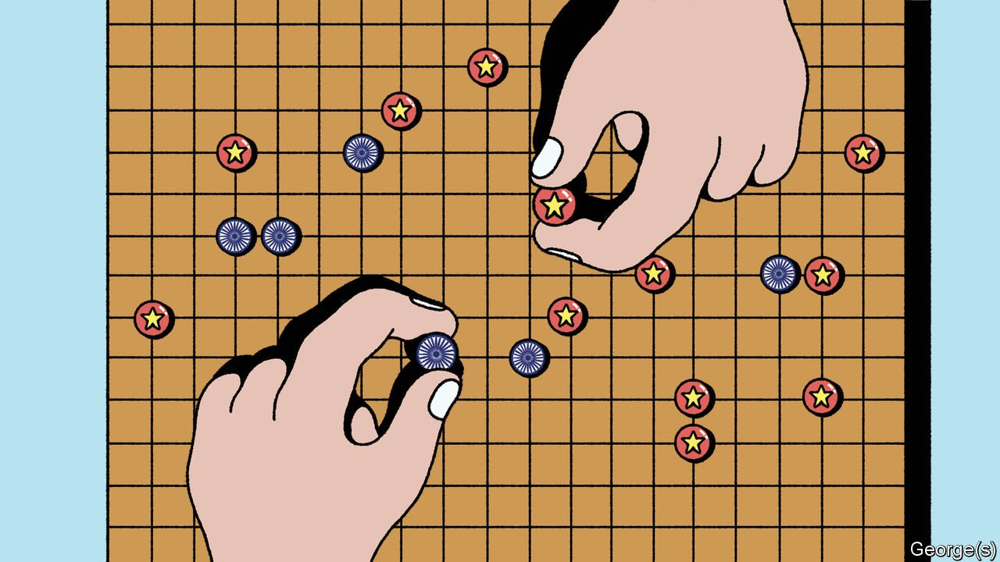

###### Banyan

# How the game of Go explains China’s aggression towards India 

##### Bide one’s time, then show strength 

 

> Nov 11th 2021 

IN THE ANCIENT Chinese game of weiqi, better known in the West as Go, the objective is not to knock out your opponent. Taking turns to add one stone at a time to the board’s 361 spaces, what players firstly seek is to build the largest, strongest structures, and only secondly to weaken and stifle enemy ones. Better players shun contact, preferring to parry threats with counter-threats. Such unresolved challenges multiply, the advantage shifting to whoever poses the sharpest ones. Only when more stones than empty spaces fill the board can resolution of these tactical matters no longer be avoided.

The contest between China and India has unfolded in similar fashion. The two have lately engaged in sabre-rattling and name-calling. But such tension has been rare during their seven-decade rivalry as modern nations. As in a game of weiqi, so long as India and China were focused on building their own core structures, each largely ignored the other.


Far from their crowded coasts and plains, the Asian giants’ 3,500km-long border region remained an empty section of the board. It contained not people or resources but the world’s coldest, driest deserts and its highest mountains. India and China maintained overlapping claims, and their forces sometimes clashed, as in a brief war in 1962. But they both also judged that there was not enough at stake to fight a big war over. So territorial limits continued to be defined in many areas by a “Line of Actual Control” rather than an internationally recognised boundary. By mutual agreement their border patrols went lightly armed. They mostly avoided contact.

As a democracy bound by rules, India has repeatedly sought to end the ambiguity by negotiating a permanent border. But perhaps because its strategists are steeped in the culture of weiqi, China has repeatedly rebuffed such efforts. For a player building formidable structures across the rest of the board, why foreclose on potential pressure points? Better to leave them open for use in the future, when you have more leverage and your opponent has more reason to fear you.

Under President Xi Jinping, China appears to have decided that this future is now. At several strategic spots along the border in the spring of 2020, Chinese troops marched into long-established patches of no-man’s-land, setting up permanent forward positions. When India sent in soldiers to challenge the intrusions, fisticuffs ensued. One clash left some 20 Indians and at least four Chinese dead. China has since refused any return to the status quo ante. This leaves it in control of lands India regarded as its own and, more seriously, in control of vantage points from which to threaten crucial roads and other Indian infrastructure.

From a weiqi perspective China’s boldness is understandable. In the 1980s its economy was roughly equal to India’s. It is now five times bigger, and churns out ever-more sophisticated weaponry while India relies on imports. China’s infrastructure has expanded towards its peripheries at a speed India has been unable to match.

As seen from Beijing, China’s southern neighbour looks weak in other ways. Its democracy is messy and inefficient. Narendra Modi, India’s prime minister, looks like a puffed-up bluffer. And even as China extends strength by tightening its alliance with India’s arch-enemy Pakistan, Mr Modi dithers. In his dream of a Hindu golden age India needs no allies, only weaker satellites or rich friends. Despite fanfare over defence agreements with America or Japan or Australia, these remain largely notional. India’s army has little functional interoperability with any other.

In short, as the board fills up and one player emerges dominant, there should be no surprise for it to push the advantage. But China has not yet won. Even if his opponent is erratic, the global gameboard may prove wider, and India may turn out to have better-placed assets than Mr Xi realises.

Despite Mr Modi’s failings India retains a big reserve of goodwill as a democracy and a decent global citizen; it would gain fast allies if it really tried to win them. India’s core strength may run deeper, too. Its relative smallness is deceptive: the eastern third of China, where 95% of Chinese actually live, is no bigger than India. As China’s economy matures, India’s remains packed with upward potential. Besides, unlike a game of weiqi this contest between two great and ancient nations will never simply stop. It will keep on going long after Mr Xi and Mr Modi finish playing.

