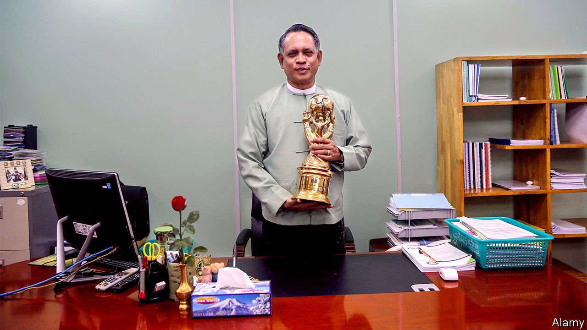

###### How to get a promotion

# Some civilian politicians are working for Myanmar’s murderous generals 

##### Even former supporters of Aung San Suu Kyi are now in the employ of the regime 

 

> Nov 11th 2021 

BEFORE THE Burmese army took power in a coup last February, Aung Naing Oo was a well-spoken civil servant widely praised for spearheading economic reforms under the governments of Aung San Suu Kyi, the country’s de facto leader until the coup, and her predecessor. When the army took over, it detained senior members of Ms Suu Kyi’s government. Yet Mr Aung Naing Oo did not just remain free. He was promoted by the junta to the role of investment minister.

Once a darling of the international community, Mr Aung Naing Oo, an ex-military officer, now speaks the junta’s language. He recently told Reuters that foreign executives of Telenor, a Norwegian telecoms firm, had been barred from leaving the country because of the regime’s need to meet them in person. Myanmar’s current economic crisis, he argued, was caused in part by “sabotage” backed by foreign states.


After previous coups, Myanmar’s generals did not immediately invite civilians onto their ruling councils. This time is different. Several civilians sit on their council, and in their caretaker government, too. Nine of 28 cabinet ministers are civilians. Six ministers were senior civil servants in the ousted government, suggesting the junta wants to project a sense of continuity. Eight cabinet members served under the presidency of Thein Sein, an ex-general who, between 2011 and 2016, created a “business-friendly but military-controlled state”, which the junta seems to want to recreate, write researchers at ISEAS, a think-tank in Singapore.

Why the top brass has included civilians in its government seems clear. Why civilians would want to work for the generals is less obvious. Some may not have had “much of a choice when asked by the military”, says Ye Salween, the pseudonym of a Burmese analyst based in Yangon. They may also not have expected the coup to meet with the overwhelming public opposition that it did.

There are more petty reasons, too. Several ministers hold grudges against the junta’s arch-rival, Ms Suu Kyi. In 2019 she reassigned Mr Aung Naing Oo from the government’s investment agency, which he ran, to the investment ministry, making him permanent secretary. This was widely regarded as a demotion—though apparently not by Mr Aung Naing Oo, who says that it was a promotion and that he bears no ill will towards Ms Suu Kyi.

Thet Thet Khine, the welfare minister, is a former lawmaker from Ms Suu Kyi’s National League for Democracy (NLD). She bears “hatred” for Ms Suu Kyi, a former friend says, because she was made to feel unwelcome by Ms Suu Kyi and the NLD over her past leadership of the country’s top business lobby, which engaged with previous military regimes. The party dismissed her in 2018, whereupon Ms Thet Thet Khine became one of Ms Suu Kyi’s most vocal critics, branding her a “control freak”. (Ms Thet Thet Khine denies that she hates Ms Suu Kyi but says she’s not a “huge fan”.)

The turncoats also claim to believe that the junta can do some good. The army justified the coup by claiming that the NLD stole the election in 2020, even though observers found no evidence of widespread fraud. Ms Thet Thet Khine says that she “witnessed personally that NLD cheated”. Days after the coup she justified working with the generals by arguing that the ousted government “did undemocratic things”, whereas the army “is doing democratic acts” by taking charge until it can hold a fair election. For his part, Mr Aung Naing Oo may have calculated that he could bring about more change from within government than outside.

The flaw in that argument is that the regime focuses not on good government, but on violently quelling resistance to its rule. It has killed more than 1,200 civilians so far, according to a local watchdog. The names of reformers like Mr Aung Naing Oo are now “manure”, says Mr Ye Salween. If they thought siding with the army would ensure their safety, they may be thinking again. Low-level officials are assassinated almost every day. ■

