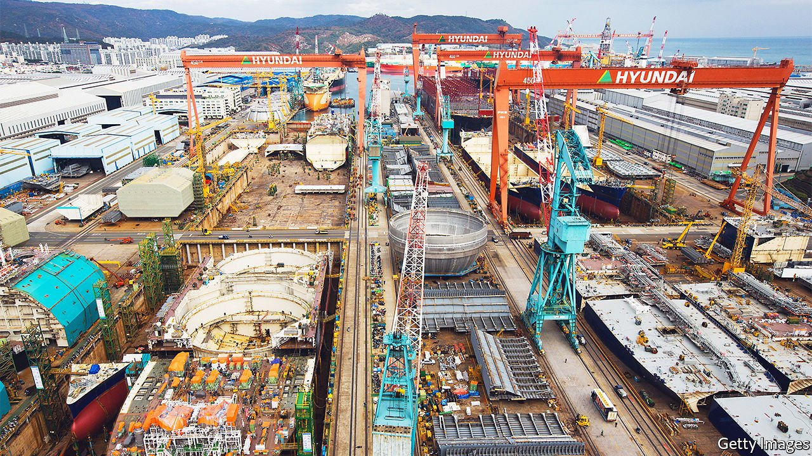
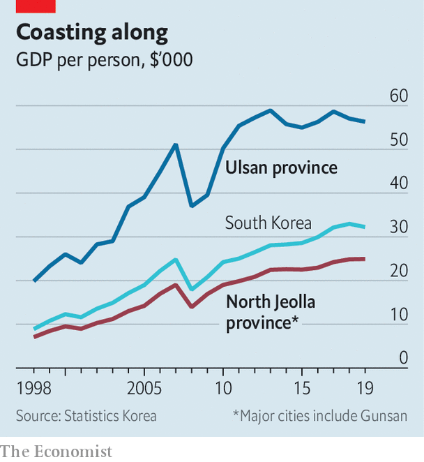

###### Manufacturing a green revolution

# South Korea’s climate targets will mean remaking its economy 

##### Its industrial centres will have to transform or disappear 

 

> Nov 13th 2021 

“IF WE DO well, the country does well, and if the country does well, that is the way for us to do well,” reads the inscription on the walls of the former Hyundai Heavy shipyard in Gunsan on South Korea’s west coast. The quote from Chung Ju-yung, the late founder of Hyundai, one of the country’s biggest conglomerates, is an apt summary of South Korea’s development strategy. Equating manufacturing prowess with the national interest drove the massive state-led investment in heavy industry that made South Korea rich.

Today the fading letters are an ominous sign of things to come. Four years ago the Hyundai shipyard and the GM car factory in Gunsan shut within ten months of each other, resulting in the loss of tens of thousands of jobs. There is a risk of more such devastation in the future. The country’s industrial behemoths have no clear plan to eliminate greenhouse-gas emissions by 2050, which the government has promised to do. How they do so will determine the future not just of South Korea’s industries but of its industrial cities, too.


South Korea’s coastal cities are the most visible markers of the country’s rapid industrialisation. Starting in the 1960s, sleepy fishing ports and trading posts turned into sprawling industrial centres, filled with shipyards, car factories, steel mills, oil refineries and container terminals. Industry generates 37% of GDP, compared with the rich-country average of 27%, and more than 80% of exports. GDP per person in Ulsan, the most important industrial city, is 75% higher than the national average. At a museum in the city you can wander around model versions of industrial installations to take in the story Ulsan wants to tell about itself. “We went from a GDP of $100 per person to this,” beams Shin Hyeong-seok, the museum’s director.

But as South Korea joins the rest of the world in the effort to curb climate change, its centres of heavy industry are turning from drivers of growth into liabilities. Their reliance on fossil fuels is one reason why South Korea is the world’s seventh-biggest emitter of greenhouse gases. President Moon Jae-in has promised to reduce emissions by 40% below 2018 levels by 2030, and that South Korea will be carbon-neutral by 2050, a target that was written into law in August.

 


Environmental groups point out that Mr Moon’s targets are still insufficient to meet South Korea’s commitments under the Paris agreement. The government itself freely admits that it is lagging behind other rich countries in reducing emissions. But the announcement has alarmed industry representatives. They warn of production cuts and large-scale job losses unless businesses are given more time and support to reach the targets.

The transition to a low-carbon economy, if pursued seriously, will be the biggest challenge for manufacturers since the transition from light to heavy industry in the 1970s, says Park Sang-in, an economist who focuses on South Korea’s conglomerates at Seoul National University. The fact that South Korea is so late to the game makes the task harder, because bigger reductions will now have to happen over a shorter period of time.

If the government is to achieve its targets, carbon-intensive manufacturing industries will have to reduce their emissions by as much as 80% over the next three decades (what carbon is still emitted will have to be captured and stored in facilities yet to be developed). De-industrialising and shifting towards less energy-intensive services would be one way to achieve that. But given the importance of manufacturing to the economy, the consequences for workers and the industrial centres where they live would be devastating. The only alternative is for industries to change. “We do not want to lose the role these industries play in the economic growth process, so it is critical that they be transformed,” says Kang Sung-jin, who studies industrial development at Korea University in Seoul.

What will this transformation look like? Factories that make petrol and diesel cars will have to switch to making batteries and electric vehicles. Shipbuilders will have to produce carriers that run on greener fuels, and the petrochemical industry will have to provide those fuels. Steel furnaces will have to run on something other than coke made from coal. Electricity for both industry and households, now produced mostly by coal-fired power stations, will have to come from renewable sources.

Just as during the switch from light to heavy industry, the change will be most visible in industrial cities. In the future the government envisions, places like Ulsan and Gunsan will be connected to huge offshore wind farms and covered in solar panels. Green hydrogen will power next-generation container ships and carbon-neutral steel furnaces.

Just reinvent yourself

The government’s most recent plans have spurred companies into action. Yet the lack of preparation means that the road to net zero is likely to be bumpy, with industries vulnerable to shocks. Moreover, there is no guarantee that the pledges will survive the next election. Climate change is not yet a big issue in the presidential-election campaign, and the next government may not feel the need to keep up pressure on the conglomerates.

That means that many of South Korea’s industrial centres could end up looking more like Gunsan, as investment in green tech yields results in other countries and higher emissions render some of South Korea’s industries obsolete. Government efforts to get Gunsan’s laid-off workers into new employment have progressed only sluggishly. Thousands have left the city.

At the site of the old colonial port, where city officials have launched a series of urban-regeneration projects, visitors to a large ship-shaped museum can relive the experience of trading rice in a 1930s version of the city. Unless South Korea’s green economy gets whirring, the museum in Ulsan on the opposite coast may soon acquire a similar old-timey vibe. ■

