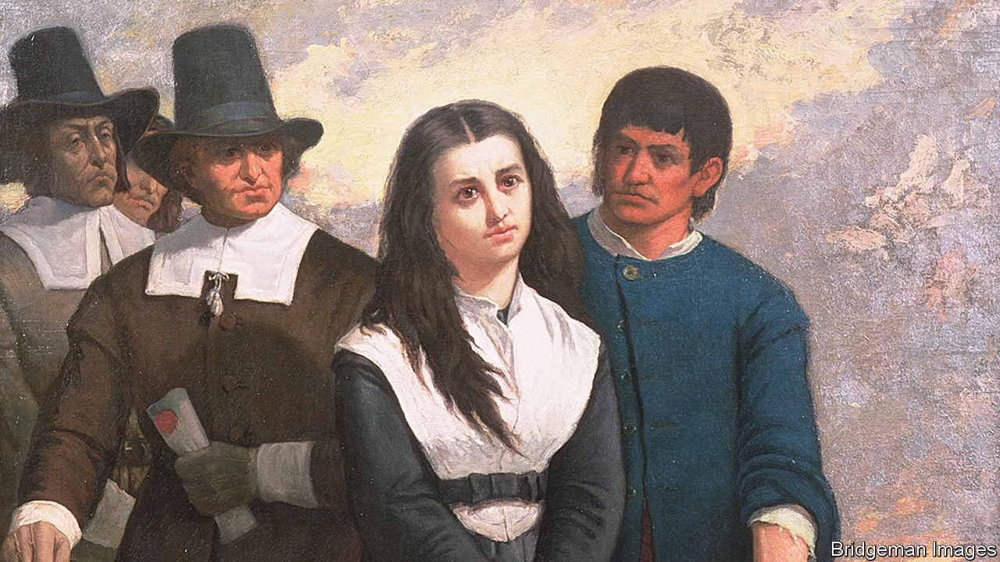

###### Toil and trouble

# A historian brings to life a 17th-century witchcraft panic 

##### Malcolm Gaskill paints a moving portrait of life in Springfield, Massachusetts 

 

> Nov 13th 2021 

The Ruin of All Witches. By Malcolm Gaskill. Allen Lane; 336 pages; £20

BY THE SPRING of 1651 the residents of Springfield, Massachusetts, were convinced Hugh Parsons was a witch. He and his wife, Mary, were a troublesome pair. Hugh, a brickmaker, was given to sleeping in the fields and quarrelling with neighbours. Mary was a highly strung gossip. Two years earlier she had been convicted of slandering Mercy Marshfield, a widow, by accusing her of cavorting with the devil.


More opaque happenings clung to the couple, too. A young man was thrown from his horse after arguing with Hugh; flickering lights were seen at night in the marshland south of the town where he was known to lurk. Worse, when Hugh was informed of the death of his infant son, he kept calmly puffing his pipe. Oppressed by the pair’s own vicious arguments, Mary whispered that her husband had murdered their child with magic so that she would be free to work and relieve his debts.

Malcolm Gaskill, a historian of witchcraft, traces the fortunes of this unhappy couple. Drawing on an extraordinary collection of testimonies against them, he reconstructs everyday life in their “precarious frontier town” with novelistic texture. The result is a portrait of a community during one of the first Puritan witch panics in the New World—and a timeless study of how paranoia, superstition and social unrest fuel fantasies.

The arduousness of Puritan life is arrestingly drawn. The winter of 1649 was so harsh that beer froze solid in barrels and carriages could be driven across Boston harbour. Torrid summers brought disease and Indian raids; sodden harvests presaged starvation. One in six pilgrims braved a second Atlantic crossing to return home.

God demanded spiritual as well as physical stamina from his new Israelites. The Puritan self was its own battleground, caught between salvation and sin, flesh and spirit, and forever under siege. Like their rude civilisation hacked from the wilderness, the elect had to be eternally vigilant against outside threats—and internal division. Fear of witchcraft, writes Mr Gaskill, “settled along boundaries, including the line separating body and soul”.

This fear did not arrive from nowhere. Instead, Mr Gaskill sees it as “a serious expression of disorder embedded in politics, religion and law”. The previous decade had involved civil war in England and the execution of its king; conflict, disease and famine rattled the transatlantic world. Other forms of heresy and blasphemy were flourishing in the cracks of the shattered civil realm. “The pillars of the land seem to tremble,” a writer of the time lamented.

Mr Gaskill’s immersive approach brings the fate of his subjects movingly to life. Neither was convicted of witchcraft. Not that it did them much good: in different ways their lives were destroyed by the accusations of “fearful men and women”. By comparison, his final chapter feels breathless, dashing from the trial to the post-Enlightenment sense of witchcraft as a figment of mental illness and superstition.

More successful is an uncanny epilogue in which the author revisits Springfield, dowsing the ghosts of its past in its run-down present. He finds that fear of witchcraft never truly fades. “I am counted but as a dreamer,” said another of Springfield’s supposed witches. “But when this dream is hanged, then remember what I said to you: this town will not be free yet.” ■

