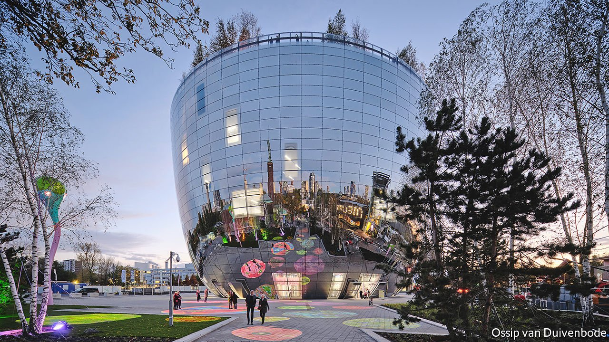

###### The mixing pot

# A museum in Rotterdam opens up its collection 

##### The Museum Boijmans van Beuningen’s new building is a marvel, inside and out 

 

> Nov 13th 2021 

THE NEW home for the collection of the Museum Boijmans van Beuningen, a gorgeous 40-metre-tall mirrored flowerpot that is set to become Rotterdam’s signature building, had its origins in an extremely Dutch emergency. The basement that held the museum’s undisplayed art—151,000 objects, among the Netherlands’ most important collections—was six metres below sea level, and kept flooding. The city had constructed a garage under an adjacent park which interfered with drainage. Sjarel Ex, the museum’s director, could have built a storage facility in a suburb, but wanted a way to keep the trove on site, and to open it to the public.

Mr Ex asked for ideas from Winy Maas of MVDRV, a leading Dutch architecture firm. The first concept was a gigantic table perched above the park, from which artworks could be lowered for spectators. This proved impractical, but during a brainstorming session Mr Maas plopped a tea cup onto a model of the park, then noticed a mirrored kettle nearby. The cup’s curve gave it a narrow base, which would leave more room for pedestrians; the reflective surface of the kettle melded with the surroundings.


More than a decade after that epiphany, the building known simply as “Depot” opened to visitors on November 6th. In Dutch “de pot” means “the pot” (as in the flowery kind), a lexical pun reinforced by the rooftop garden covered in birch trees. The mirrored exterior creates a fish-eye effect that reflects the city’s skyline, curving down to show the park and viewers themselves. Mr Maas compares it to the drawings of Giovanni Piranesi. Rotterdam was bombed flat during the second world war, and has since prided itself on its geometric modernity. Depot fits right in, but also provides the city with a focal point.

Yet it is the inside that is most important. The six-floor-deep atrium is criss-crossed by suspended staircases reminiscent of M.C. Escher prints. Glass etalages showcase eye-catching pieces: fluorescent dresses, inlaid furniture, abstract paintings by R.B. Kitaj. Along the sides are the storage halls. Canvases hang on rolling metal lattices in rows that can be pulled out for inspection. Sculptures and furniture are stacked on rolling motorised shelves. Organisation is alphabetical, chronological or by size and material. There are no labels; even with QR codes and the museum’s smartphone app, identification is rarely forthcoming.

It is all a bit dazzling. A lattice-wall slides out: there is Breugel’s “Tower of Babel”. Another emerges with what looks like a Jan Toorop, but who knows? On other floors photographers and restorers work in open labs. Visitors are led through by guides, not left alone to sample at random. But Depot still has an immediacy different from a curated museum.

Other institutions are also planning to open their collections: the Victoria and Albert Museum’s new facility is scheduled to open in London in 2024. Meanwhile, for a few years Depot will be the only place to see the Boijmans van Beuningen’s treasures, as the main museum is closed. They have to fix the basement. ■

